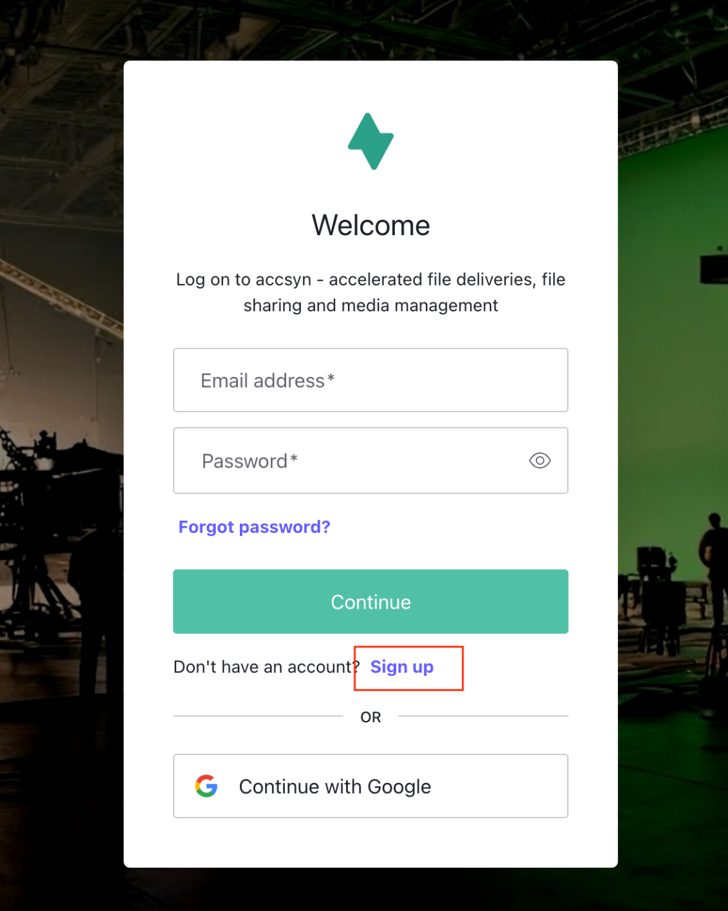
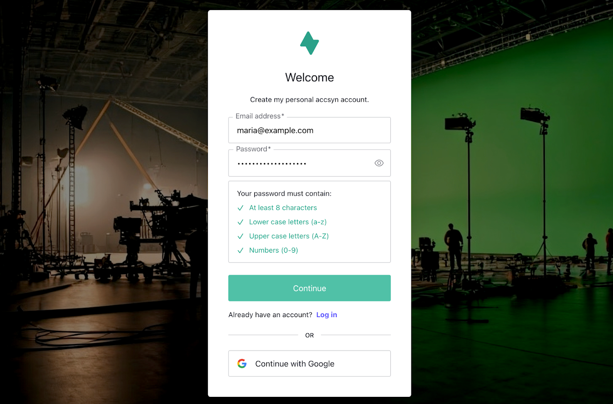

# Account

This guide describes how to sign up your personal accsyn account and have your user entity created in the platform.

### What is the personal accsyn account?

An accsyn account is a unique email address identifying a physical person within the platform.

When you are invited to a workspace, either with a delivery or through file sharing/media screening, the user entity is pre-created with pending signup status - which means that the personal account is not created yet and you cannot log in.

You can also sign up a personal account without an invitation, with the purpose of engaging a workspace trial.

  

By design, all access to the accsyn platform is restricted and you need to be logged in before you can perform any actions. 

  

*Note: There is one exception to that - anonymous deliveries,  this is the only context where a user can access files without needing to log in.*

## Register a new account

To sign up, open <https://accsyn.io/signup> in your browser. You can also reach the registration page by clicking the Sign up link at the login page:

Screenshot of accsyn login prompt

### Choosing identity provider

An identity provider is the actual database where your email and password are stored, accsyn currently supports these:

- accsyn email-password (Auth0); This is the default identity provider, accsyn uses an external upstream SOC II compliant service called "Auth0" ([https://auth0.com/](https://auth0.com))
- Google; accsyn supports logging in using Google as the identity provider, this is recommended where applicable.

  

### Signing up with accsyn email-password provider

Enter your email address and choose a strong password:

Screenshot of accsyn signup prompt.

Next you will be asked to verify your email, check your mailbox for the verification email and click the link provided.

### Sign up with Google

This requires you have an active Google account, click the Continue with Google button at the login screen.

This will take you to Google where you choose which account to use and then authenticate.

After you have authenticated, you will be requested to approve sharing your Google account information with accsyn.

  

Once logged in, you will land on your account page by default where a summary of deliveries, shared items and accessible workspaces are listed.

## Login

### Log in to browser

Open <https://accsyn.io> in your browser, this will take you to the login page.

  

### Log in with desktop app

For detailed information on this topic, refer to the [Desktop app guide](desktop-app.md)

## Manage your account

To manage your account, open <https://accsyn.io/profile> in your browser.

  

### Primary email

The primary email address associated with your account. This cannot currently be changed by the user, reach out to [support@accsyn.com](mailto:support@accsyn.com) to make an email change request.

  

### Identity provider

The underlying identity provider linked to the account.

  

### Multifactor authenticated

Flag if the current session is MFA authenticated or not.

  

### Account created

When your accsyn user was created

  

### Account activity

Shows log entries related to your accsyn user on a global level (outside workspace context)

## Developer

To create and manage API keys for accsyn workspaces you are a member of, open <https://accsyn.io/developer> in your browser.

## Troubleshooting

Common issues and actions to take:

  

### I have forgotten my password

accsyn email-password provider

If you have forgotten your accsyn password, open <https://accsyn.io> and when presented with the login prompt - click the Forgot password? link.

You will be brought to the password reset flow where you can set a new password through a link emailed to you.

External identity provider

If you are logging in with Google or a similar external service,  open <https://accsyn.io> and click on the external provider. From there you should be able to reset your password accordingly.

### My account is disabled

If the accsyn team identifies malicious behaviour that violates the Terms and conditions, your account might be disabled globally. 

If you believe this is wrongdoing, please reach out to [support@accsyn.com](mailto:support@accsyn.com) and present your case.

## Further resources

[Receive delivery](delivery/receive.md)

How to action a Delivery, Upload request or Stream

[Access Shared Files](file-sharing/access.md)

How to access folders and collections shared with you.

[Start a trial](trial.md)

Try out accsyn with your own Workspace trial
