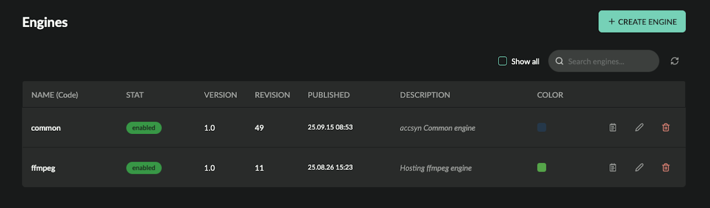

# Engine administration

NOTE: This feature is exposed to BYOS and Enterprise licensed workspaces only.

[BYOS](index.md)

This guide walks through how to create and configure engines within an accsyn workspace.

  

Prerequisites:

- Logged on as an administrator to <https://accsyn.io/admin/engines>.

Contents:

[What is an engine?](engine.md)

[Engine list](engine.md)

[Create a new engine](engine.md)

[Edit an engine](engine.md)

[Script](engine.md)

[Attributes](engine.md)

[Metadata](engine.md)

[Delete an engine](engine.md)

[Related resources](engine.md)

## What is an engine?

An engine is a definition of what kind of work should be performed when executing a process at a client.

  

By default, file transfers utilise the hidden built-in "builtin-accsyn-transfer" engine. There is also the "builtin-accsyn-utility" engine that is used for internal tasks such as compressing a web delivery ZIP.

The accsyn compute/render farm feature allows for creating additional engines to perform queued execution of long-running resource (CPU/GPU) intensive tasks.

## Engine list

Toolbar:

- Show all; Display hidden built-in engines.

  

The engine list shows active engines within your workspace:

- Name (code); The unique name of the engine.
- Status indicator; green is enabled, grey is disabled.
- Version - The major version of the engine script.
- Revision; The publish revision of the script.
- Published: The date engine was published.
- Description: Engine description.
- Colour: The engine colour.
- Log; View engine log.
- Edit (pen); Edit the engine.
- Trashcan; Delete the engine.

## Create a new engine

To create a new engine, click the NEW ENGINE button in the upper right corner.

- Code; Give a name for the engine, it must be unique within the workspace and contain letters a-zA-Z0-9\_.- with a maximum length of 32 chars.
- Enable; Define if engine should be created enabled or disabled.
- Python script; Input/paste the engine Python script here, it will be validated (Python 3.10).
- Description; (Optional) Give the engine a description, for display only.
- Vendor; (Optional) The company/organisation/person providing the script.
- Colour; (Optional) Give the engine a unique colour, for display only.

  

Click Create & Publish when you are ready, or Save Draft if you want to create the engine but not publish it yet.

  

When created, you can take the following actions:

- Assign engine to one or more lanes, go to [https://accsyn.io/admin/servers](https://accsyn.io/admin/servers/new).

## Edit an engine

To edit an engine, click on its pen button in the list.

  

### Script

Edit the script and click either Save Draft to continue editing later, or Update & Publish.

  

### Attributes

- Code; The name of the engine, click to edit.
- Status; The status of the engine.
- Description; Set the optional description the engine should have.
- Vendor; Update the vendor.
- Colour; Update the colour.

  

Settings

Engines currently have no settings.

  

### Metadata

Define metadata for this engine, which will be appended to upstream metadata and provided to jobs with Workflows - API calls, engine execution, hooks execution, and so on.

## Delete an engine

To delete an engine, click the red trashcan button on the engine in the listing.

  

NOTES: 

- No job(s) using the engine can be active, they have to be aborted.

- Engine will be de-assigned from lane clients.
- This cannot be undone.

### Related resources

[Server admin](server.md)

Install and assign engines to a  render/compute server.

[Tutorial | Remote Office Sync](../../tutorials/remote-office-sync.md)

Learn how to use the accsyn Python API to automate file synchronisation between your offices and/or cloud storage.
