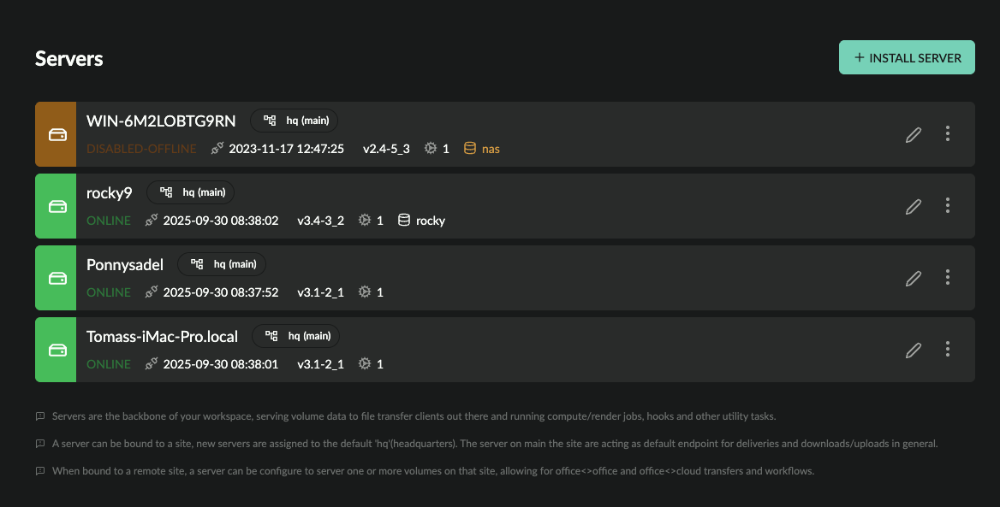

# Server administration

*NOTE: This feature is exposed to [BYOS](index.md) licensed workspaces only.*

This guide outlines how to install different types of servers and manage existing ones.

## What is a server?

A server is a physical or virtual machine that runs the accsyn app in background Daemon(Service) mode.

  

- A server is primarily designed to serve [volumes](../storage.md) - download and upload of files with associated file operations.
- A server can also execute hooks and compute/render jobs as part of [Workflows](../../developer/index.md).
- The daemon installer can be downloaded from <https://accsyn.io/getapp>.

  

### Server types

- Storage server; This is the default server and all new workspaces must have at least one.  The storage server serves one or more volumes and is located on the main ("hq") site by default, facilitating file operations. A storage server can also be configured to run compute/render jobs.
- Site server; A server that serves volumes on a site, enabling file synchronisation between physical locations and cloud.
- Compute/render server; A server that is designated to run compute/render jobs, having virtual lane sub-servers with engines assigned.

  

*NOTE: There is also the user server type, which is installed by end users as part of [hosts](../hosts.md), facilitating 24/7 unattended delivery and file sharing.*

## Server list

Prerequisites:

- Logged on as an administrator to <https://accsyn.io/admin/servers>.

The server list shows all active servers within your workspace:

- Status indicator; green is enabled, grey is offline, yellow is disabled, dark orange is disabled and offline.
- Hostname (code); The name of the server, as picked up from the operating system (hostname).
- Site - the site server is located at, default is main "hq" site.
- Description; The description of the server.
- Status:  (Second row) Shows the server status.
- Last checkin: The date the server was last seen online.
- Version: The accsyn daemon app version.
- Lane count; The number of compute lanes configured for the server.
- Volumes: List of volumes that the server is serving.
- Edit (pen) button.
- Menu button.

  

Server menu:

- Edit; Bring up the server editor.
- Disable; Disable the server.
- Enable; Enable the server.
- Logs; Show log events related to the server.
- Delete; Delete the server.

## Install a new server

### Requirements

You need suitable hardware or a virtual machine to run the accsyn server on, specifications vary depending on the role the server should have:

  

- Storage; Estimate 1 core/vCPU is needed for one continuous encrypted 1gbps(100MB/s) file transfer. Storage servers also need to be exposed to the Internet using NAT port forward rules, unless you plan to run all file transfers locally over a LAN/VPN.
- Site servers; Same file transfer requirements as the storage server, and need to reach the storage server having either Internet/WAN connectivity or LAN/VPN.
- Compute/render;  Depending on whether you plan to run CPU or GPU intensive tasks, deploy suitable hardware with the necessary specs.

### Preparations

Before you can install a new server, you will need to acquire a new BYOS server license - reach out to accsyn staff at [support@accsyn.com](mailto:support@accsyn.com) or [sales@accsyn.com](mailto:sales@accsyn.com). Free trials are available on request.

  

Storage server prep

- Set a fixed LAN IP address on the server, unless the firewall supports DNS port forward configuration.
- Allocate a TCP port range for accsyn file transfers, default is 45190-45220 and one or more low ports - typically 80 or 443.
- Configure your firewall to NAT port forward these to the server fixed IP or DNS address on your local network.
- Turn off any local firewalls on the server, or configure them to allow incoming TCP connections on the accsyn ports.

  

Compute server prep

- Windows; Python 3 available in PATH or at accsyn default location: C:\Python310 | C:\Python311 and so on.
- Unix (Linux/MacOS); Uses the default built-in Python 3 interpreter, make sure it is in the path.

  

The Python path can also be overridden if you need to point out a dedicated Python environment, set the environment variable ACCSYN\_PYTHON\_EXECUTABLE to point to the interpreter executable (full path).

  

Linux prep

The installer relies on Java being present at the host, as Java is not bundled with the installer:

- RHEL / CentOS (7) / Oracle Linux: sudo yum install -y java-17-openjdk-headless
- RHEL/CentOS 8 or later: dnf install java-17-openjdk-headless
- Ubuntu/Debian: sudo apt-get install -y default-jre-headless
- openSUSE: sudo zypper --non-interactive install java-1\_8\_0-openjdk-headless
- Fedora: sudo dnf install -y java-17-openjdk-headless
- Arch Linux / Manjaro: sudo pacman -S --noconfirm jre-openjdk-headless
- Amazon Linux 2 / 2023: sudo dnf install -y java-17-amazon-corretto-headless
- Alpine Linux: sudo apk add openjdk17-jre-headless

  

*Note: Mac and Windows installers come with Java bundled.*

  

### Installation

To create a new server, click the INSTALL SERVER button in the upper right corner.

First, choose the site the server should be at. Default is the main site ("hq").

Next choose the type of server:

- Serve one or more volumes at site; Server should act as a Storage server (if at main site) or Site server (if other site chosen), choose which volume(s) to serve.
- Compute/render server; The server should run compute jobs and/or hooks as part of [Workflows](../../developer/index.md).

Click Initiate installation to generate the server ID used with the installer. Installation instructions:

  

### Windows

1. Download the service installer for Windows on the server machine.
2. Make sure you have administrative privileges.
3. Run the service installer executable, approve the UAC prompt.
4. Click next on the introduction screen.
5. Enter the server ID, mind case sensitivity.
6. Finish the installer and launch the daemon at the end.

  

### Mac

1. Download the service installer for Mac on the server machine.
2. Make sure you have administrative privileges.
3. Run the service installer executable, enter your admin password when prompted.
4. Click next on the introduction screen.
5. Enter the server ID, mind case sensitivity.
6. Finish the installer and launch the daemon at the end.

  

### Linux

1. Download the service installer for Linux on the server machine.
2. Open a terminal on the server.
3. Make sure the installer has executable permissions: chmod 755 accsyn-daemon-unix.sh.
4. Run the service installer executable as root: sudo ./accsyn-daemon-unix.sh.
5. Click next on the introduction screen.
6. Enter the server ID, mind case sensitivity.
7. Finish the installer and launch the daemon at the end.

  

### Post actions

In order for the server to function properly, a set of post actions is required:

  

Windows

- If you are running Windows Defender Firewall, or other software firewall, make sure it allows outgoing traffic on port 443(tcp) from accsyn executables, specifically C:\Program Files\Accsyn\accsyn.exe.
- If you are running Antivirus software, make sure to whitelist the accsyn executables.
- If it is a Storage server, make sure the firewall accepts incoming TCP connections on the accsyn ports. Also make sure antivirus allows accsyn executables to access the disk having the volume to be exposed.

  

Mac

- Mac Gatekeeper by default prevents disk access, for accsyn to properly operate you will need to give /bin/bash full disk access (accsyn creates shell wrapper scripts when executing processes): Open System Settings > Privacy & Security > Full disk access.  Click the + sign and add /bin/bash (Hint: press Shift+Cmd+G to go to the /bin folder).
- If you are running Antivirus software, make sure to whitelist accsyn executables and /bin/bash.

  

When up and running, the web installation at [accsyn.io](http://accsyn.io) will finish up and bring you to the server edit page (see below) where you can finish up the newly installed server.

## Edit a server

To edit a server, click on it in the list.

  

### Toolbar

- Disable server; Click this button to disable the server, note that all ongoing processes such as file transfers, compute tasks, hooks will be interrupted.
- Enable server; Enable the server again.

  

### Serving

Displays a list of all volumes served by this server, go to the volume configuration by clicking on it in the list.

  

### Lanes & Engines

The accsyn compute feature is a part of [Workflows](../../developer/index.md) and enables you to run long-running resource-intensive computational tasks on your servers, e.g. render jobs in the context of media production.

Compute jobs can only run on lanes, a lane is a virtual sub-server allowing parallelism.

Here all compute lanes on the server are listed, numbered, together with the engines assigned.

  

Add a new lane

Adjust the Compute lanes setting above, increasing it by one. This will spawn a new lane at the bottom having the next free lane number.

  

Disable/enable a lane

- Click the checkboxes to enable/disable multiple lanes.
- Right click the lane and choose Enable/Disable from the context menu.
- Click the lane menu (three dots) button on the right hand side of each lane and choose Enable/Disable.

  

Assign an engine to a lane

Right click the lane, choose the engine to assign and then choose Available.

  

De-assign an engine from a lane

Right click the lane, choose the assigned engine and then choose Unavailable.

  

Temporarily disable/enable an engine on a lane

Right click the lane, choose the assigned engine and then choose Enable/Disable.

  
  

*NOTE: Compute/render servers require additional BYOS licences.*

  
  

### Attributes

- Site; The site the server is at can be changed as long as it is not serving any volumes. De-configure any volumes @  [https://accsyn.io/admin/volumes/](https://accsyn.io/admin/volumes) to enable site change.
- Description; Set the optional description the server should have.

  

### Settings

  

File transfers

- Ports; Configure the accsyn ports this server should listen to during file transfers with the high speed encrypted built-in accsyn protocol (ASC) and web browser transfers (HTTPS). Storage servers need this port.
- WAN IP; The WAN IP this server is reachable at. By default accsyn backend detects the WAN IP and reports this to clients out there, override this with a custom IP here.

For servers serving volumes, the state of the most recent connectivity test is displayed. This status is reset every time ports or WAN IP are reconfigured. To have the test run again, click the button on the right hand side. As part of the test, accsyn will start TCP test servers on the machine and try to validate each configured port.

  

Compute

- Compute lanes; The number of lanes, e.g. virtual compute servers, that this server should have. Allows for parallelism, executing different resource consuming engines/apps at the same time.

  

Advanced

- Client config; Advanced client configurations - IP overrides.

  

### IP Overrides

By default, accsyn routes traffic using the detected WAN IPs of each endpoint (see WAN IP setting above). If a client fails to connect to the WAN IP, it automatically tries the server's LAN IP addresses, this usually solves problems where both client and server are behind the same router.

To permanently add a route between server and client, add an IP override here. An IP override defines which IP address a client should be able to reach the server at, overriding the default WAN connection behaviour.

  

Enable IP overrides; Enable or disable this feature, keeping the config.

  

List of IP overrides; Use the delete/trashcan icon button to remove an override.

  

Add override:

- Client; The client that the override applies to.
- Local IP: The IP that the server should have when communicating with the client.
- Remote IP: (Optional) The IP that the client has.

  

### Metadata

Define metadata for this server, which will be appended to upstream metadata and provided to jobs with Workflows - API calls, engine execution, hooks execution, and so on.

## Manage the server installation

Guidelines on how to manage the accsyn daemon running on the server.

### Log file location

- Windows: C:\ProgramData\accsyn\log
- Mac & Linux: /var/log/accsyn

  

### Stopping and starting the server

Windows

Alternative 1 - using GUI tool

- Open Services (run services.msc)
- Locate accsynDaemon service.
- Right click and run stop |  start.

Alternative 2 - using a command prompt

- Open windows command prompt (run cmd.exe)
- To stop the daemon: scstop accsyndaemon
- To start the daemon: scstart accsyndaemon

Mac

- Open a terminal, with a user that has admin rights on the system
- To stop the daemon: sudo launchctl start com.accsyn.daemon
- To start the daemon: sudo launchctl start com.accsyn.daemon

Linux

- Open a terminal, with a user that has admin rights on the system
- To stop the daemon: sudo systemctl stop accsyndaemon
- To start the daemon: sudo systemctl start accsyndaemon

*NOTE: This might vary on different Linux distros.*

  

### Running server as a different user

By default, the accsyn daemon will run as an elevated user (local system account on Windows, root on Mac/Linux). This can be changed during installation before first run.

If you need to change this afterwards,  you need to re-configure the daemon and set permissions accordingly:

Windows

- Open Services (run services.msc)
- Locate accsynDaemon and stop the service
- Change the ownership of the local configuration & log folder to the new user (C:\ProgramData\accsyn)
- Repeat for C:\Windows\TEMP\.accsyn if exists.
- Open service properties and go to Log on tab
- Change to This account
- Enter the username and password, finish by clicking OK.

The user will be granted Log on as a service rights, which is required.

Mac

- Open a terminal and switch to root: sudo -s
- Stop and unload accsyndaemon: sudo launchctl stop com.accsyn.daemon && sudo launchctl unload /Library/LaunchDaemons/com.accsyn.daemon.plist
- Edit /Library/LaunchDaemons/com.accsyn.daemon.plist and add the UserName key, see example below.
- Change ownership to new user for /var/log/accsyn, /Library/Preferences/com.accsyn and /var/tmp/.accsyn (if exists).
- Load and start daemon again: sudo launchctl load /Library/LaunchDaemons/com.accsyn.daemon.plist

  

Example launchdaemon plist for configuring  accsyn to be run as user "anna":

<?xml version="1.0" encoding="UTF-8"?>

<!DOCTYPE plist PUBLIC "-//Apple Computer//DTD PLIST 1.0//EN" "http://www.apple.com/DTDs/PropertyList-1.0.dtd">

<plist version="1.0">

<dict>

    <key>Label</key>

    <string>com.accsyn.daemon</string>

    <key>ProgramArguments</key>

    <array>

        <string>/Applications/Accsyn/accsyndaemon</string>

        <string>start-launchd</string>

    </array>

    <key>KeepAlive</key>

    <false/>

    <key>RunAtLoad</key>

    <true/>

    <key>UserName</key>

    <string>anna</string>

</dict>

Linux

- Open a terminal and switch to root: sudo -s
- Stop accsyndaemon: systemctl stop accsyndaemon
- Edit /etc/systemd/system/accsyndaemon.service and add the user, see example below.
- Change ownership to new user for /var/log/accsyn, /var/lib/accsyn and /tmp/.accsyn (if exists).
- Start daemon again: systemctl start accsyndaemon

  

Example systemd config file for having accsyn run as user "anna":

  

[Unit]

Description=AccsynDaemon

Before=multi-user.target graphical.target

After=network-online.target remote-fs.target time-sync.target

Wants=network-online.target

  

[Service]

Type=simple

ExecStart="/usr/local/accsyn/accsyndaemon" start-launchd

User=anna

SuccessExitStatus=0 143

KillMode=process

  

[Install]

WantedBy=multi-user.target graphical.target

  

### Setting environment variables

To have environment variables passed on to the accsyn daemon/service process, make these configurations:

Windows

- Edit the system environment variables and make the update required.
- Restart the "accsyndaemon" service.

Mac

- Stop the daemon: sudo launchctl unload /Library/LaunchDaemons/com.accsyn.daemon.plist
- Edit the launchdaemon plist and add the keys:

<dict>

    <key>EnvironmentVariables</key>

    <dict>

        <key>MY\_VAR</key>

        <string>my\_value</string>

</dict>

</dict>

- Load & start the daemon again: sudo launchctl load /Library/LaunchDaemons/com.accsyn.daemon.plist

Linux

- Edit /etc/systemctl/system/accsyndaemon.service and add the environment, one line per item:

[Service]

..

Environment="MY\_VAR=my\_value"

- Reload daemons: sudo systemctl daemon-reload
- Restart accsyn daemon: sudo systemctl restart accsyndaemon
- Verify: sudo systemctl show accsyndaemon --property=Environment

  

### Enabling low port file transfers

To be able to have the server bind to a port < 1024, permission needs to be granted in the operating system. Launch a terminal as root and run:

setcap 'cap\_net\_bind\_service=+ep' /usr/lib/jvm/jre/bin/java

*Note: the Java path might be different based on your Linux distribution, find out the executable path by running "ps aux" while the accsyn daemon is running.*

 Combined with running as a standard non-privileged user account, Java can refuse to start with this error:

/usr/lib/jvm/jre/bin/java: error while loading shared libraries: libjli.so: cannot open shared object file: No such file or directory

If that is the case, add the libjli location as a trusted runtime loader path by creating /etc/ld.so.conf.d/java.conf with the content:  

[JRE\_HOME]/lib/amd64/jli

Then restart the machine to have configuration take effect.

  

### Background watchdog

accsyn also installs a watchdog that checks the daemon every 5 min and restarts it if it has not responded. The watchdog also restarts the daemon upon a remotely initiated update, if daemon is configured to run as a different user than the default.

  

 To disable this behaviour, set environment variable ACCSYN\_DISABLE\_WATCHDOG=1. You can also uninstall the watchdog using the CLI (as root/elevated): accsyn daemon check\_uninstall

### Update server

Major updates to accsyn, that require all servers/clients to be re-installed and might break backward compatibility, are called a major version upgrade. For example going from version 2.x to 3.x. This upgrade action will be planned together with you as the domain admins, with the built-in safety that clients will be warned and forced to upgrade directly when launching the desktop app. 

  

*Note: Before doing an upgrade, older versions will be saved and can be restored if the upgrade fails.*

  

Minor updates and bug fixes are deployed regularly and announced by email after they complete, including changelog and links to updated installers, for example updating from v3.2 to v3.3.

  

IMPORTANT NOTE: We constantly update accsyn backend and make sure it is compatible with the servers and clients deployed within your organisation, and if we perform a major upgrade with breaking changes we give a heads-up far in advance enabling you to plan an upgrade date with our support team - to minimise downtime and production outage.

  

To update the server, perform the same routine as when updating the desktop app in general.

1. Make sure no critical file transfers or compute tasks are executing on the server.
2. Download the corresponding daemon installer from <https://accsyn.io/getapp>
3. Run the installer and start the daemon, see platform specific instructions above.
4. Perform some basic tests to make sure the server is functioning as expected.

  

Backend/cloud database and backups

The accsyn underlying database is backed up every hour and can be restored on request. A backup of the database is also taken prior to upgrade and will be restored if an update is rolled back.

  

*Note: No passwords or other user personal data is stored in the database/cloud instance. accsyn utilises Auth0 which is GDPR compliant.*

## Delete a server

To delete a server, open the server's menu (three dots icon) on the right hand side and choose Delete.

  

*NOTES:*

- *A server must be shut down and be offline in order to be deleted.*

- *The default server, e.g. the server serving the default volume, cannot be deleted. You must first configure another server to serve the default volume, or change default volume.*
- *This cannot be undone.*

  

The server will stop serving volumes, no data will be touched on physical storage on deletion.
