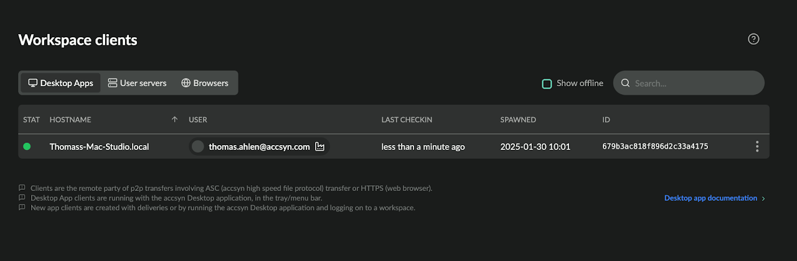

# Client administration

This guide shows how to administrate your workspace clients.

  

Prerequisites:

- Logged on as an administrator to <https://accsyn.io/admin/clients>.

## What is a client?

A client is the remote party in a p2p accsyn client file transfer.

  

This involves the high speed accsyn file protocol (ASC) and web browser transfers (HTTPS).

New clients are created automatically when:

- One or more files/deliveries are decided to be up-/downloaded in the web browser.
- When logging on to the desktop app GUI.

The client launches with the Desktop App, runs in the tray (Windows), menu bar (Mac) and is independent of the GUI - you do not need to log in to have the client running file transfers.

  

Hint: accsyn servers are also actually client instances internally, they just have a different type.

## Client list

The client list shows all clients within your workspace: 

- Client select; Select one or more clients to perform enable/disable batch processing actions.
- Status indicator; Green is enabled, empty is offline. Disabled clients are rendered with an orange ban icon.
- Hostname (code); The hostname the client has, as picked up from the underlying host/operating system.
- User; The user that spawned and owns the client.
- Last checkin: The last time the client was seen.
- Spawned; The date the client was created.
- Menu button.

  

Client menu:

- Disable; Disable the client - ongoing jobs involving client will be interrupted.
- Enable; Enable the client.
- Logs; Show log events related to the client.
- Delete; Delete the client.

## Delete a client

To delete a client, open the client menu (three dots icon) on the right hand side and choose Delete.

*NOTE: This cannot be undone.*

Any job(s) that reside in the queue will be moved to the default queue. If this is the only queue left, deletion will fail.

Related articles

[Desktop App](../desktop-app.md)
