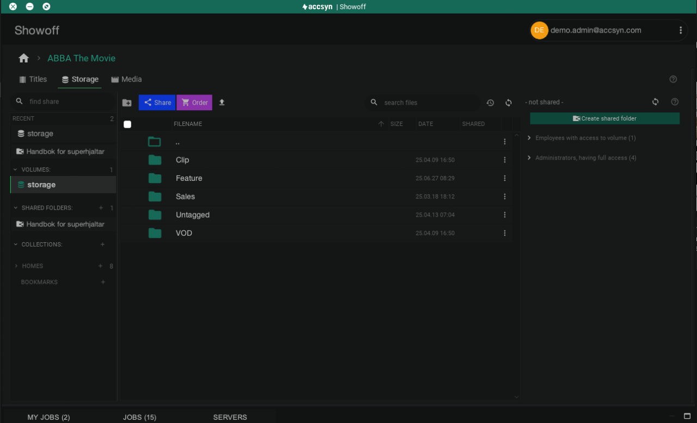

# accsyn Desktop App

[What is the accsyn Desktop app?](desktop-app.md)

[When do I need to use the desktop app?](desktop-app.md)

[Where to download](desktop-app.md)

[Windows install](desktop-app.md)

[Mac install](desktop-app.md)

[Linux install](desktop-app.md)

[Linux desktop launchers](desktop-app.md)

[Manage](desktop-app.md)

[Updating](desktop-app.md)

[Log file location](desktop-app.md)

[Local preferences](desktop-app.md)

[Troubleshooting](desktop-app.md)

[I have trouble logging in, it never gets past the login screen](desktop-app.md)

[I am getting java.lang.UnsupportedOperationException: Setting a system-wide Policy object is not supported](desktop-app.md)

[Related articles](desktop-app.md)

## What is the accsyn Desktop app?

  

The accsyn app is a desktop application primarily for providing accelerated accsyn p2p file transfers running in the background (tray), but also has a GUI enabling advanced functionality that includes extended [Delivery](../delivery/index.md), [File Sharing](../file-sharing/index.md) and [Media Vault](../vault/index.md) management.

Screenshot - manage title projects.

## When do I need to use the desktop app?

The app is required to facilitate accelerated and resumable file transfers - the core of the accsyn platform.

  

When creating a [delivery](../delivery/index.md), or actioning a delivery on the web, the app installation is guided from the browser - no manual installation is required. The app will then run in the background (system tray / menu bar) as needed during transfer, and can then be closed.

  

Besides this, the app is mandatory when:

  

- Detailed monitoring and audit of jobs (deliveries, transfers, queues).
- Managing [file sharing](../file-sharing/index.md) on your cloud or on-prem storage.
- [Access](../file-sharing/access.md) shared folders.
- Manage the accsyn [Media Vault](../vault/index.md) - ingest and manage your media, as a manager.
- Submit render jobs and publish files in BYOS configurations - part of [workflows](../developer/index.md).

Note: the desktop app is also included in the accsyn Daemon(service) installation, used for setting up [BYOS servers](byos/server.md).

## Where to download

The app is written in Java and requires Java installed on Linux platforms, Windows & Mac installers have Java bundled. The desktop app is included in the accsyn daemon installation, there is no need to install it separately.

  

Find the links to the app installer below, log in with your personal accsyn account:

[DOWNLOAD APP](https://www.google.com/url?q=https%3A%2F%2Faccsyn.io%2Fgetapp&sa=D&sntz=1&usg=AOvVaw347DVoq0Wwbl4tjIp_nP7D)

## Windows install

There are two options for installing the desktop app:

  

- Install only for the current user (default); Requires no administrator privileges, the app will be installed in your account profile @ %LOCALAPPDATA%\Programs\Accsyn by default.
- Run installer as administrator, making it available for all machine users; Will install the accsyn app in C:\Program Files by default.

  

Hint: Pin it to your task bar for easy access in the future.

## Mac install

Open the installer DMG and then drag-n-drop the app to where you want to install it.

  

Hint: Keep it in your dock for easy access in the future.

## Linux install

You can install accsyn on most major Linux distributions using the appropriate package format:

•.deb for Debian-based systems (like Ubuntu, Linux Mint)

•.rpm for Red Hat-based systems (like Fedora, RHEL, CentOS, openSUSE)

1. Install Java:

- RHEL/CentOS 7 and earlier; sudo yum install java-1.8.0-openjdk-headless.
- RHEL/CentOS 8 or later: dnf install java-17-openjdk-headless.
- Ubuntu: sudo apt install openjdk-17-jdk.
- OpenSUSE: sudo zypper --non-interactive install java-1\_8\_0-openjdk-headless.

2. Download the installer;  For .deb (Debian-based): accsyn\_3.6-5\_5.all.deb, for .rpm (Red Hat-based): accsyn-3.6-5\_5.x86\_64.rpm (replace the version with the current release)
3. Install

- Debian/Ubuntu (.deb):  sudo apt install ./yourapp\_1.2.3.deb (or extract and then move to a folder of choice: sudo dpkg -x accsyn\_3.6-5\_5.all.deb && sudo mv usr/local/accsyn <folder>.
- Fedora (.rpm): sudo dnf install accsyn-3.6-5\_5.x86\_64.rpm.
- RHEL (.rpm): sudo yum localinstall accsyn-3.6-5\_5.x86\_64.rpm.
- OpenSUSE  (.rpm):  sudo zypper install accsyn-3.6-5\_5.x86\_64.rpm.

  

Verify the application by running it and logging on to accsyn.

  

### Linux desktop launchers

These are normally created by the installers, but can be manually created as required.

  

Ubuntu:

Create  ~/.local/share/applications/accsyn.desktop (system wide: /usr/share/applications)

[Desktop Entry]

Name=accsyn

Comment=Launch accsyn

Exec=/usr/local/accsyn/accsyn App

Icon=/usr/local/accsyn/accsyn\_icon\_512.png

Terminal=false

Type=Application

Categories=Utility

## Manage

### Updating

To stay on top of bug fixes, and get the latest features and improvements, update the accsyn desktop app regularly.

  

If installed for current user:

- Log on to the desktop app
- Click on the user account button in upper right corner.
- Choose "Check for updates" in the dropdown menu.

  

Note: if the in-app update fails, download the installer using the link presented and re-install using the instructions above.

  

If installed for all users (administrative rights required):

Download the installer and re-install using the instructions above.

  

### Log file location

The log files can contain useful hints during troubleshooting:

Windows

%APPDATA%\accsyn\log

Mac

~/Library/Logs/com.accsyn/log

Linux

~/.accsyn/log

  

### Local preferences

The app stores local preferences and user data at these locations: 

Windows

%APPDATA%\accsyn\data

Mac

~/Library/Logs/com.accsyn/data

Linux

~/.accsyn/data

## Troubleshooting

General/platform independent

### I have trouble logging in, it never gets past the login screen

Cause: the accsyn local preferences might have become corrupt. 

Solution: try removing these preference folders manually and retry the operation. 

  

Linux

### I am getting java.lang.UnsupportedOperationException: Setting a system-wide Policy object is not supported

Cause: You are trying to install the accsyn desktop app on a system that has the accsyn daemon installed.

Solution: Download and update using the daemon instead.

  
  

Having further issues? Please reach out to support providing your logs folder compressed together with screenshots and a detailed description of your issue.

### Related articles

[Daemon(service)](byos/server.md)

[File Sharing](../file-sharing/index.md)

[Media Vault](../vault/index.md)
