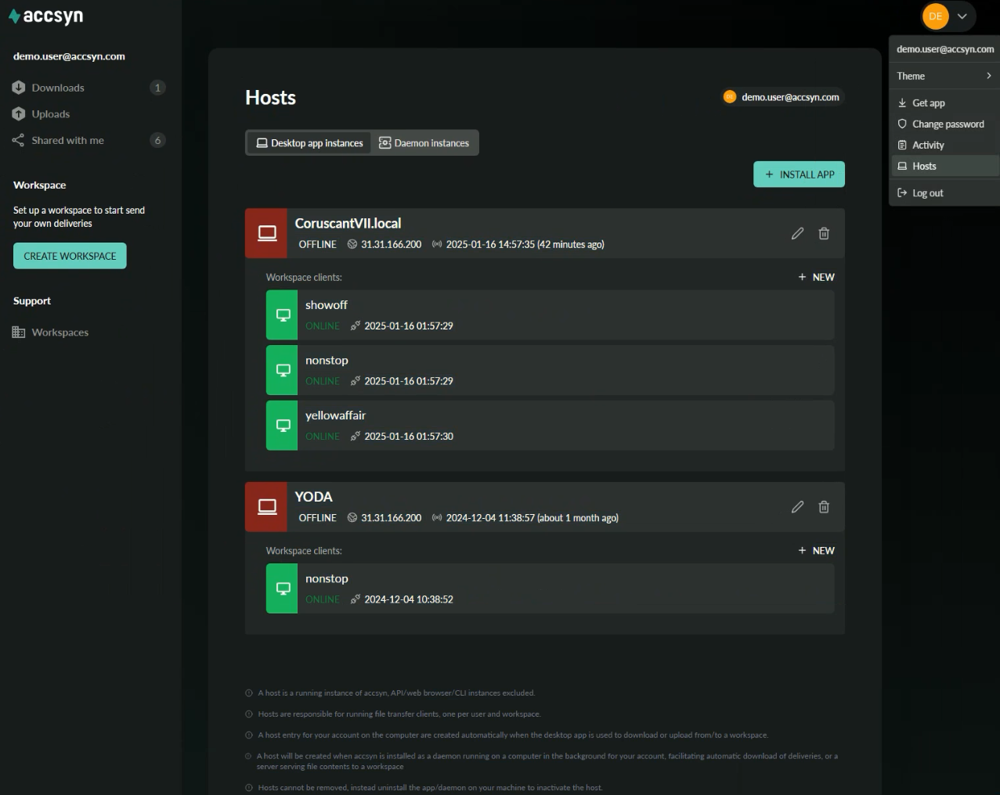
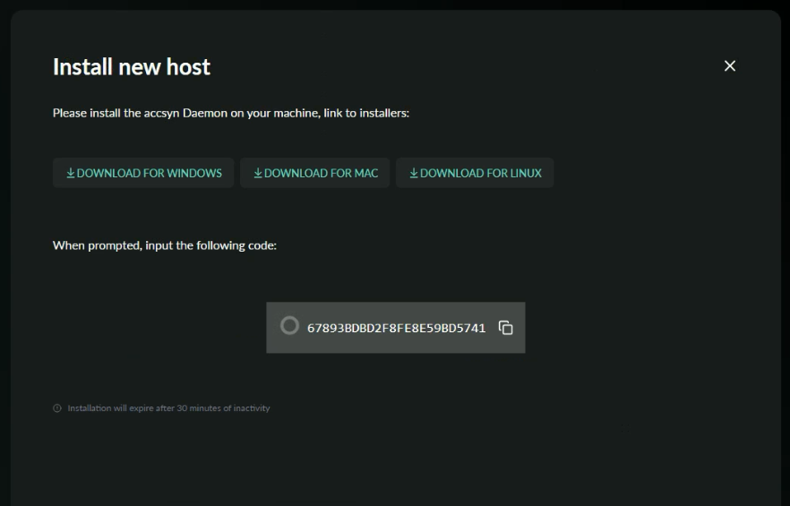
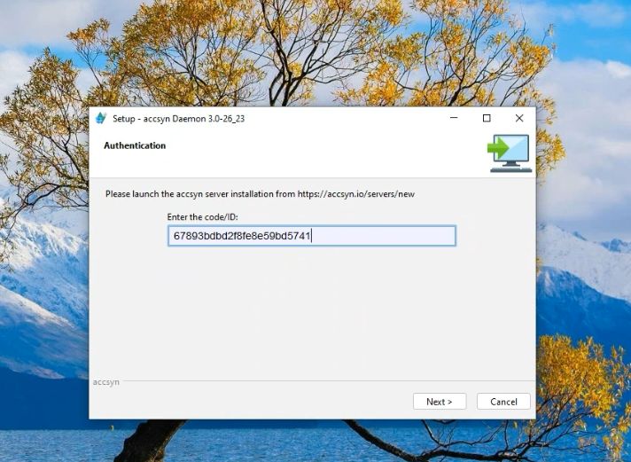
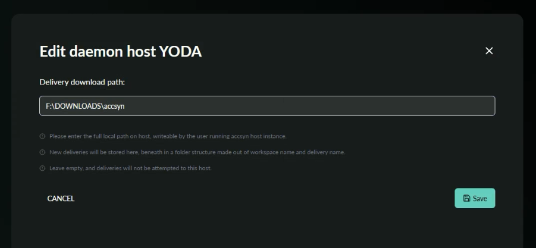
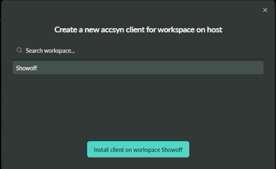
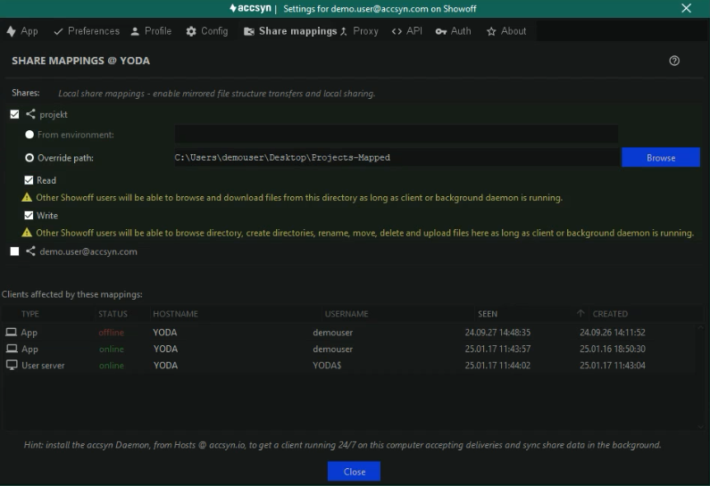

# Hosts

This guide explains how to use hosts and servers to enable automated deliveries and expose local shared storage with accsyn.

### What is a host?

A host is a running instance of accsyn (API/web browser/CLI instances excluded) on behalf of your personal accsyn account. There are two types of hosts:

- App; An app host is automatically spawned when running the accsyn Desktop app on a computer. Further on, when you access a workspace with the app or download/upload a delivery in the web browser through the app, a file transfer client is spawned.
- Daemon; A daemon host is installed to be running in the background 24/7 on the computer, outside of the current logged in desktop. On Windows it runs as a Service, on Mac as a Launch Daemon and on Linux through systemd.

  

### What is a client?

A client is an endpoint of a p2p high speed encrypted accsyn file transfer, and is bound to a user account and a workspace - for each user and host there is a set of clients, one for each workspace that the user is a member of. The following types of clients are defined:

- App client (app host); The app client is automatically created when a file transfer is initiated using the desktop app, or when logging in with the app in order to access shared files and storage.
- Server (daemon host);  The server is installed by a workspace admin, to act as a cloud, on-prem or remote site file transfer endpoint. It can also act as a render server running custom engines.
- User server (daemon host); The user server is spawned automatically if the host has been configured for automatic deliveries (see below). It can also be installed manually (see file sharing below) to provide 24/7 local file sharing as long as the computer is running, regardless of whether a user is logged in or not.
- Lane (daemon host); The lane is a virtual server beneath a server, where engine processes are run. Having multiple lanes provides multiprocessing on a computer - allowing multiple engines to process at the same time.
- Web browser (browser host); A client created in the web browser to facilitate browser (https) transfers.

  

For daemon hosts, local file sharing requires that a client is manually installed for the given workspace, to facilitate file transfers independent of the desktop app.

  

### Automatic deliveries

A host can be configured to automatically download deliveries to a folder, this is very useful for providing automatic deliveries without any user intervention. This is done by configuring a local download path for the host.

  

### Local file sharing

By mapping shared folders locally,  and exposing them as readable and writeable, elevated workspace users can get access to your local storage for both downloading material to you and uploading from your computer. This is useful in a working from home scenario or for vendors that need to provide a local work area for storing file assets, with the same folder structure as on your cloud or on-prem accsyn storage.

## The Hosts page

The hosts page in accsyn displays all hosts associated with your account and the workspace clients for each host, open it by choosing Hosts from the user menu in top right corner:

Example screenshot of the hosts page in accsyn webapp.

The page is divided into two tabs:

- Desktop app instances; The list of hosts running with the desktop app out there, and their workspace clients.
- Daemon instances; List of running hosts with the background daemon, and their workspace clients.

Click  INSTALL APP to manually install the accsyn desktop app, in order to access shared storage. Otherwise leave it to the delivery system to install and run the app from the browser.

## Host installation

To facilitate automated deliveries and local file sharing, you need to set up an accsyn host for the user account on your computer:

1. Go to the hosts page and switch to the Daemon instances tab.
2. Click INSTALL DAEMON:

3. Download the suitable daemon installer for your platform - Windows, Mac or Linux.

4. Run the installer as an elevated administrator user, required for installing background services on operating systems.

5. When prompted, enter the ID displayed in the web page:

6. Background services/daemons run as the system user by default, and that account does NOT in general have access to mounted storage volumes and such. If you reckon you will need to change the user, follow the next step below but DO NOT launch the daemon/service yet when asked. Then follow the instructions in the corresponding Running the host as a specific user section  below before proceeding with the launch.

7. Conclude the daemon setup, launch the daemon/service and validate that it is running as the correct user with access to local storage.

Hint: On Mac, Gatekeeper might prevent accsyn from accessing removable media although you are running the daemon as the same user as yourself. In that case, give /bin/bash full disk access in Security preferences and then restart your computer.

8. The web page should tell you that the host is installed.

  

### Running the host as a specific user on Windows

  

You will need to reconfigure the Windows service to run as the user account:

1. Open services as an administrator.
2. Locate "accsyndaemon" service.
3. If running: stop the service, also change ownership of the C:\ProgramData\accsyn & C:\Windows\TEMP\.accsyn folders to the user account that should run the service.
4. Edit it and go to the Log on tab, click This account.
5. Enter the user account and password, it will grant the user rights to run the service at the same time, which is required.
6. Then start the service again, or conclude the installation if you were performing this step during installation.

  

Check the accsyn log that it is running properly, log location: C:\ProgramData\accsyn\log\accsyn-daemon-log.txt

  
  

### Running the host as a specific user on Mac

  

You will need to edit the launchctl config to have it run as the specific user account:

1. Stop and unload the accsyn daemon: sudo launchctl stop com.accsyn.daemon && sudo launchctl unload /Library/LaunchDaemons/com.accsyn.daemon.plist
2. Edit the config file and add the user (find out your login name by running: whoami):

/Library/LaunchDaemons/com.accsyn.daemon.plist:

<?xml version="1.0" encoding="UTF-8"?>

<!DOCTYPE plist PUBLIC "-//Apple Computer//DTD PLIST 1.0//EN" "http://www.apple.com/DTDs/PropertyList-1.0.dtd">

<plist version="1.0">

<dict>

    <key>Label</key>

    <string>com.accsyn.daemon</string>

    <key>ProgramArguments</key>

    <array>

        <string>/Applications/Accsyn/accsyndaemon</string>

        <string>start-launchd</string>

    </array>

    <key>KeepAlive</key>

    <false/>

    <key>RunAtLoad</key>

    <true/>

    <key>UserName</key>

    <string>myloginname</string>

</dict>

Example launchctl configuration for running accsyn daemon in user space as system user "myloginname"

*Note: If you have been running accsyn service elevated and switch to a non-elevated user, you will need to open up permissions / set ownership for the account in question on these folders: /var/log/accsyn, /Library/Preferences/com.accsyn, /tmp/.accsyn*

3. Load the config file: sudo launchctl load /Library/LaunchDaemons/com.accsyn.daemon.plist

  

Check the accsyn log that it is running properly, log location: /var/log/accsyn/accsyn-daemon-log.txt

  
  

## Setup automated deliveries

*Note: Skip this step if you seek to only setup local file sharing.*

When the host has been installed you will be brought to the host edit page, if not click the pencil icon on the host when it appears to bring up the editor:

1. Enter the local path on your computer where you wish to have deliveries be downloaded to. A subfolder will be created for each sending workspace on transmit:

2. Click Save when done.

From now on, all deliveries sent to your account (email address) from any accsyn workspace, will be downloaded in the folder you configured as long as the computer is powered on and the accsyn background daemon executable process is running. If the user server instance does not exist, one will be created.

## Map shares locally

Prerequisites:

- Have an accsyn personal account.
- Access to shared folders on at least one workspace.
- Have a running host daemon/service\* on the machine, see installation instructions above.

\*) if you are not able to install the daemon, you can still facilitate local file sharing but it will be run with the desktop app - remember to log on to your computer and have it running in the background (no GUI needed) in order for it to work.

  

Here is how to get going with local file sharing on your computer, for unattended 24/7 access:

1. Go to the hosts page and switch to the Daemon instances tab and install the daemon following the same steps as outlined above. If you do not need automated deliveries, skip the step where you configure the download path.
2. Go back to Hosts page and the Daemon instances tab. Click on NEW button beneath the newly installed machine host:

3. Choose the workspace to install the client for, the same that has shared folders with you in case you have access to multiple workspaces.

4. Click the green button to install the client. The client is now being installed in the background, it might take a minute or so for it to finish up. 

5. Wait for the client to show up before you proceed.

6. On the same machine, logon to the accsyn Desktop app as the same user.

7. Switch to the workspace you installed the client for.

8. Open app settings by clicking the user button in upper right corner.

9. Go to Share mappings tab. You should see a User server entry in the client list at the bottom.

10. Choose the shared folder you want to map locally, where you want to map it and if remote elevated workspace users should be able to read (upload from your mapped folder, pull material) or write (download to your shared folder, push material):

11. A list of all clients on the same machine (matching host ID -  network card MAC addresses) is presented, your daemon client should be present there and the share mapping should apply to them all.

12. Click close when done.

  

Test the setup by initiating a download from the workspace and that share, it should suggest mirroring paths and the transfer should happen in the background daemon client instead of the accsyn Desktop app client.

  

### Mapping an entire volume as user

A standard user can only map shared folders and homes - they are the only shares visible for configuration.

If the user should have the entire volume folder structure mirrored locally, it can be configured through a system-wide environment variable:

1. Reach out to the workspace admins and request the volume API code attribute, default: storage.
2. Shut down all accsyn processes (desktop app and background daemon/services).
3. Set this environment variable globally, or by configuring the accsyn client startup environment: ACCSYN\_STORAGE\_PATH=/Path/To/Local/Storage. "STORAGE" should match the volume API code attribute in this example, /Path/To/Local/Storage is the local path where the volume should be mapped.
4. Start the background daemon/service and desktop app again. From this point on, downloads of files from the volume will be preset to the local path with mirrored paths enabled and the same applies for uploads from that path - if it matches a shared folder or home path.
5. In desktop app share mapping preferences, the volume should now appear. Enable "Read" and "Write" permissions, this will now enable workspace operators (admins and employees with access to volume) to push and pull files to/from the local path [/Path/To/Local/Storage].

  

For information on how to set environment variables so they apply to the accsyn daemon running process, see [Server admin](byos/server.md) page.

## Troubleshooting

The host does not show up after I finished installation?

  

Check the log file for clues, start at the bottom and iterate backwards until you find error or warning messages.

  

Log file locations:

- PC log file location: C:\ProgramData\accsyn\log\accsyn-daemon-log.txt
- Mac & Linux log file location: /var/log/accsyn/accsyn-daemon-log.txt

  
  
  

I changed the user the daemon is running as but it will not start?

  

Most likely it is a permission error, due to previous run causing files to have different ownership than the new user.

  

To remedy this, change ownership of these files:

  

MAC:

sudo chown -R <UserName> /var/log/accsyn "/Library/Application Support/com.accsyn" /tmp/.accsyn

Hint: Replace <UserName> with the user account ID as configured in the daemon plist (e.g. myloginname from the plist example above)

  

PC:

Set ownership of these folders to the same user account that is running the accsyn service:

- C:\ProgramData\accsyn
- C:\Windows\TEMP\.accsyn

  

LINUX:

sudo chown -R <UserName> /var/log/accsyn /etc/accsyn /tmp/.accsyn

Hint: Replace <UserName> with the user account ID that is configured for the systemctl service.

  
  

I had local share mappings configured in the app, but after installing the user server it does not appear as a transfer destination?

  

This is a known issue and is subject to be fixed in the future, meanwhile launch the app on the same machine and reconfigure the share mappings in settings - just change something, and the configuration will be migrated also to the newly installed server.
