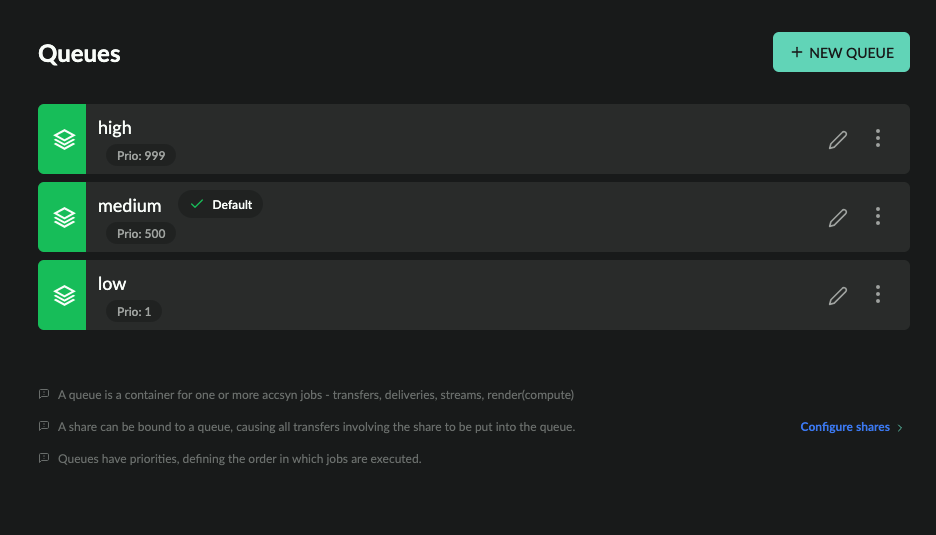

# Queue administration

This guide shows how to administrate your workspace queues.

  

Prerequisites:

- Logged on as an administrator to <https://accsyn.io/admin/queues>.

Contents:

[What is a queue?](queue.md)

[Queue list](queue.md)

[Create a new queue](queue.md)

[Edit a queue](queue.md)

[Attributes](queue.md)

[Hooks](queue.md)

[Metadata](queue.md)

[Delete a queue](queue.md)

## What is a queue?

A queue is an accsyn job entity acting as a container for ordered jobs having a fixed priority.

  

- A workspace can have multiple queues, by default three queues are created from start: High, Medium and Low.
- Priority is a number between 0 and 1000, jobs in higher priority queues get executed before those in low priority.
- One queue must be designated as the "default", the default queue is where new jobs are put when no queue constraints are given at submission.

## Queue list

The queue list shows all active queues within your workspace:

- Status indicator; Green is enabled, orange is disabled.
- Name (code); The workspace unique name of the queue.
- Default indicator - points out the default queue where jobs/deliveries are assigned if no queue constraints are given on submit.
- Priority: Dictates which priority job(s) beneath the queue should be given, defined as a positive number between 0-1000.
- Description; (Optional) The description of queue.
- Edit (pen) button.
- Menu button.

  

Queue menu:

- Edit; Bring up queue editor.
- Disable; Disable the queue.
- Enable; Enable the queue.
- Logs; Show log events related to the queue.
- Delete; Delete the queue.

## Create a new queue

To create a new queue, click the NEW QUEUE button in the upper right corner.

  

- Code (name); The workspace unique name to give the queue, can contain letters, numbers, dot(.), underscore(\_) or hyphen(-).
- Priority; The priority to give queue.
- Description; (Optional) The description to give queue.

  

When done, click CREATE to have the queue created. Click the cross (X) icon in upper right corner to cancel creation.

## Edit a queue

To edit a queue, click on it in the list.

  

### Attributes

Edit queue attributes such as code, priority and default.

  

Transfer settings

Override global accsyn copy protocol (ASC) file transfer settings for the queue.

NOTE: Transfer settings can be further overridden on individual job level.

  

Job settings

Override global job settings for the queue.

NOTE: Job settings can be further overridden on individual job level.

  

Email Settings

Override global email rules for jobs within this queue.

  

### Hooks

Define additional hooks, complementing workspace global hooks.

  

### Metadata

Define metadata for this queue, which will be appended to upstream metadata and provided to queue jobs with Workflows - API calls, engine execution, hooks execution, and so on.

## Delete a queue

To delete a queue, open the menu (three dots icon) on the right hand side and choose Delete.

NOTE: This cannot be undone.

Any job(s) that reside in the queue will be moved to the default queue. If this is the only queue left, deletion will fail.
