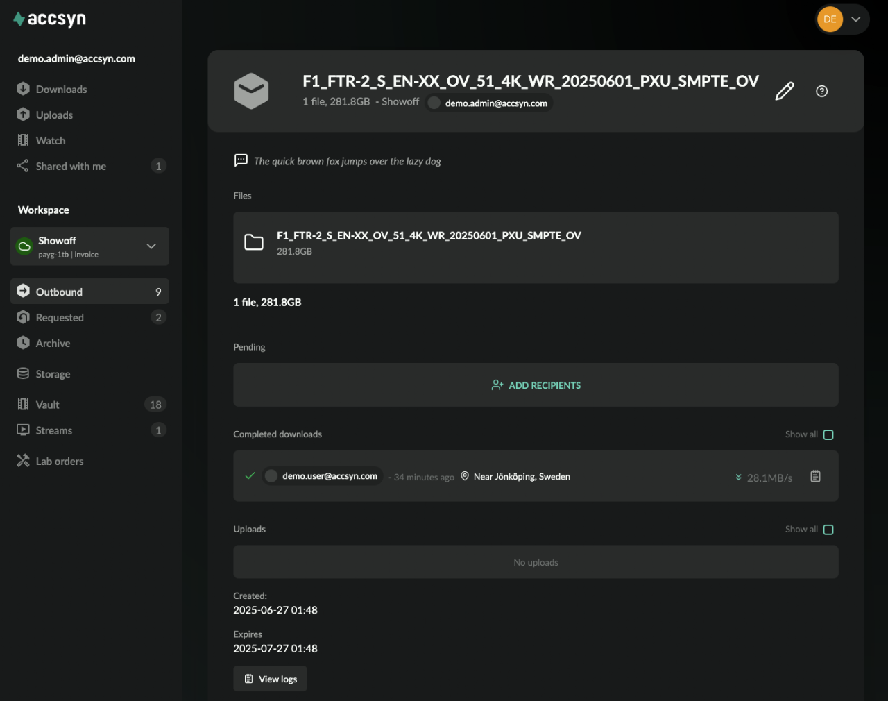

# Monitor and manage deliveries

This guide explains how to manage your deliveries - check if recipients have responded and modify them.

### Prerequisites

- An active accsyn workspace trial or subscription.
- A web browser, preferably Google Chrome.

## Monitor delivery

Log on to accsyn in your web browser and go to the Outbound section and then click the delivery you want to monitor.

Screenshot of the delivery status view.

A delivery is presented in the following way:

  

- Files; A list of files or folders in the delivery, with size.
- Public link; (If a public delivery) The link to the delivery/upload request.
- Transfers in progress; The file transfers that are running right now - e.g. a list of recipients that currently are downloading a delivery, or uploading to an upload request.
- Pending; List of recipients that have not addressed the delivery/upload request yet, with the ADD RECIPIENTS button (see below).
- Failed or aborted; Failed or aborted transfers.
- Done; Completed deliveries.
- Uploads; The initial uploads performed when the delivery was created.
- Created: The date the delivery was created.
- Expires: The expiry date of the delivery.
- View logs; Monitor job logs, see below.

  

Each user is displayed with email and when they last logged in. Actioned deliveries also have an estimated geographical location, ETR and speed notation.

### Logs

The delivery has a log that can be investigated in order to find out what has happened within the lifecycle of the delivery, useful for debugging purposes and security audits. 

To access the log from the Outbound page, click on the three-dot icon on the right hand side of the delivery and choose Log from the menu. On the delivery status page, the log can be opened by clicking the View logs button.

Each file transfer also has an associated log, it can be viewed by clicking the log icon on the right hand side of each recipient.

## Manage delivery

### Notify recipients

By default, recipients that have not actioned deliveries are notified automatically twice:

- A first reminder when 2/3 of the time has passed up until expiry.
- A second reminder three (3) days before expiry.

Note: When the delivery expires, the files will be kept on storage for another 4h after which they will be permanently deleted. This applies to standard deliveries uploaded to a temp space, when delivering permanent files residing on the accsyn Cloud storage or BYOS storage, files will not be touched.

To manually notify a recipient, click the paperplane button on the right hand side of the recipient in the Pending section. A reminder email will be dispatched to the user, if they do not receive it - have them check their spam filters.

### Add more recipients

At any time, more recipients can be added to a delivery/upload request. Open the delivery and click the ADD RECIPIENTS button in the Pending section. A prompt will be displayed where you can enter one or more email addresses, press TAB to add and enter the next address and so on. Finish up by clicking INVITE RECIPIENTS.

New recipients will be sent an email with a link to the delivery, with clear instructions on how to download or upload files.

### Remove recipients

To remove a recipient, click the cross button on the right hand side of the recipient, a confirm prompt will be displayed.

### Edit delivery

To edit a delivery, click Edit from the delivery context menu or click the pen button in the upper right corner of the delivery status page.

Files cannot be added once a delivery has been created, but you can change:

  

- Message; Enter a new message that recipients will get in their email and displayed when they open the delivery.
- Expiry date; Give a new expiry date.

### Troubleshoot a delivery

Usually, deliveries go smoothly. But sometimes users need help getting their files downloaded, or uploaded to a request:

  

- They have not received any delivery email; Sometimes, the accsyn delivery emails get caught by spam filters. Ask users to check their spam mail. Another thing is that you have not sent the delivery yet, recall that you need to actively Submit a new delivery before users can download/upload. If emails cannot be dispatched, ask them to log in to <https://accsyn.io> with the same email as you have added as recipient, they should be able to locate their delivery in the Downloads section (or Uploads section, if an upload request).
- The file transfer will not start, keeps failing; Have the user check their antivirus and firewalls, so the accsyn desktop app is whitelisted and traffic is allowed (TCP ports 45190 and upwards need to be allowed towards the Internet and accsyn infrastructure servers).
- The transfer goes for a while but fails or just stops; Make sure they have not logged out and/or shut down their computer, it is needed for transfers to complete. If they are transferring in the web browser, they cannot reload or close the accsyn web page before the transfer is completed. Also, their disk might be full - have them check free space.

  

If you have further issues with deliveries that cannot be resolved, do not hesitate to reach out to our support team either through Chat or email.

### Delete/abort delivery

To delete a delivery, either choose Delete from the delivery context menu (three-dot icon on Outbound page) or click the trashcan icon when editing the delivery.

## Archived deliveries

Finished deliveries and upload requests are listed under the Archive section accessible from the workspace menu on the left.
