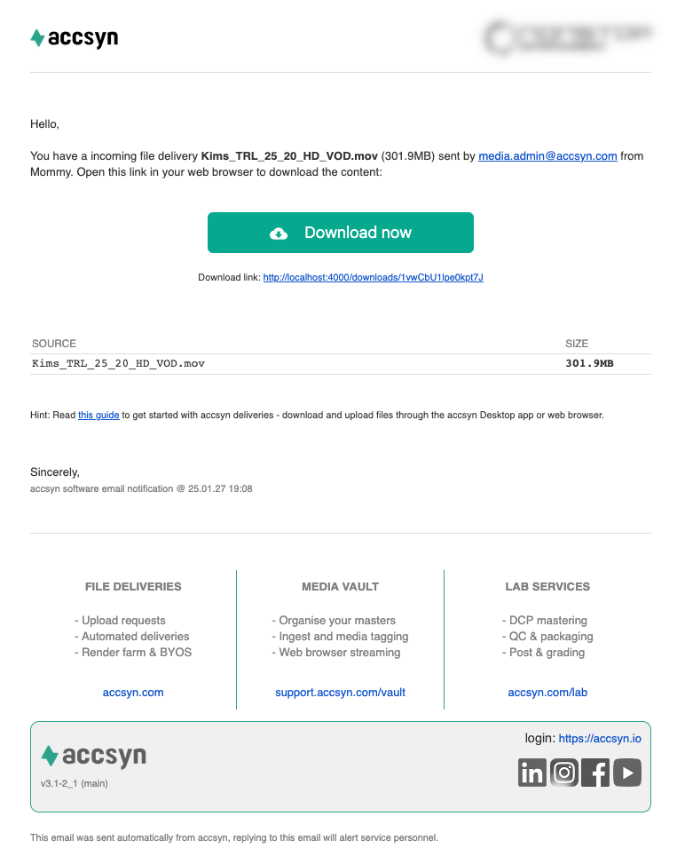
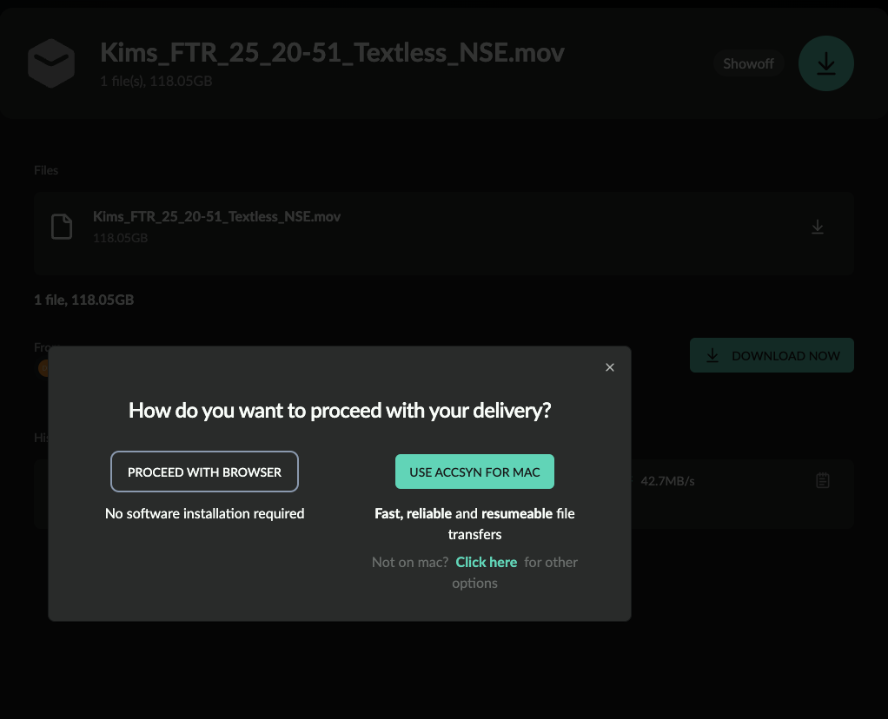
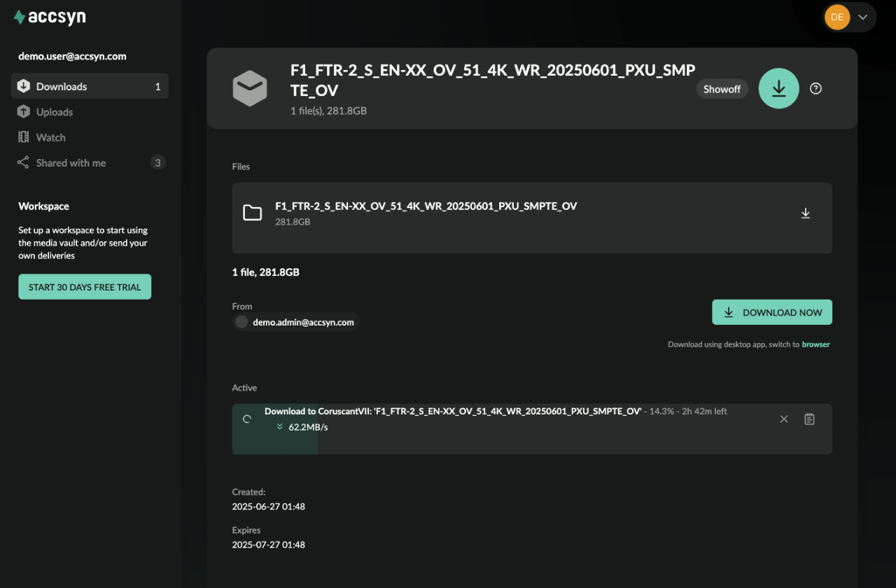
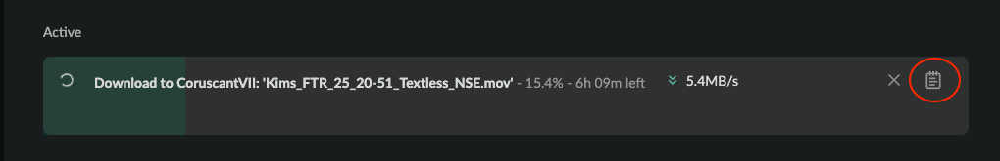

# Receive a delivery

This guide is for you that are expecting a delivery or upload request sent with accsyn.

  

*Note: If you have been granted access to a shared folder or collection, please head over to this guide:*

[Access Shared Folders](../file-sharing/access.md)

This video shows how to download a delivery:

If you are expecting a delivery, a first step is to check your email and look for a delivery email coming from accsyn:

Click the Download now (or Upload now, if it is an upload request) button to open the delivery in your standard web browser.

If you have not received an email, check your spam filters to make sure it has not been caught there. Also, you can open <https://accsyn.io> in your web browser and log in with the email that the delivery has been sent to - it should be listed in the Downloads section.

### Using accsyn for the first time

If you have no accsyn account, you will need to register one. 

*Note: Anonymous access to the platform is not allowed due to security reasons and if you believe you need access to a delivery - reach out and ask the sender to be added as a recipient.*

You can choose to sign up with email or log in with Google (recommended if applicable)

### Downloading the delivery

Once registered, you will be presented with the delivery view with information about the files in the package. The delivery can also be found by clicking Downloads in the menu on the left hand side of the accsyn web page.

Click the DOWNLOAD NOW button:

Screenshot of a delivery and the options for download.

A prompt will be displayed with two options:

- USE ACCSYN FOR MAC; As accsyn is designed to provide stable, secure and accelerated deliveries, we recommend installing and using the desktop app to download the delivery in the background. Downloads through the app go much faster and also support folders and resume where left off if interrupted.
- PROCEED WITH BROWSER; Download the file(s) in browser - secure but not accelerated and resumable.

Important note: Web browsers do not support download of multiple files or folders, if the delivery is not a single file accsyn will attempt to compress (ZIP) the delivery first. This can take considerable time, instead switch to using the desktop app to get a much smoother experience.

  

Once the download method is chosen, a prompt will ask you where to save the file. Once confirmed, the download will initiate and run in the background:

Screenshot of a delivery being downloaded.

*Notes:*

- *If downloading through the web browser, remember to not close or reload the browser until finished.*
- *If downloading with the app, you can safely close the web browser and open it later to check for progress. But if you log out of your computer and/or quit the desktop app, the transfer will be interrupted but resume again as soon as you log in and start the desktop app again.*

### Upload to a request

In a similar way, if you receive an upload request, you will be displayed a view with files uploaded so far by yourself or other users, and the UPLOAD NOW button. Click it to go through the same procedure of choosing browser or app method, the same rules apply here with the difference that browser upload is somewhat accelerated and supports multiple files.

Upload requests can also be found in the Uploads menu on the left hand side.

Watch this video that shows how to action an upload request:

### Watch a stream

Streams are part of the accsyn Media Vault feature, allowing recipients to watch a movie in their web browser without any additional software needed. Follow the email dispatched to open the stream shared with you and click the green play button located on the VOD media file. 

  

You can find all streams shared with you by clicking the Watch menu item on the left hand side.

  

Files supplied with the stream can also be downloaded, in the same way you would download files from a normal delivery, if they are made available by the sender.

### Troubleshooting a delivery

If you have issues with a delivery and it cannot download/upload, a first step is to examine the log - it will give clues on what the issue could be. The log can be opened by clicking the log icon on the right hand side of the transfer:

Common problems that can  occur with file transfers:

- Cannot install the app due to lack of permissions or local policies: The accsyn desktop app does not require administrative permissions to install, nevertheless local policies can block the app installation. Check with your IT department to try to whitelist the application so you can utilise it properly. If that is not an option, you might need to switch to the web browser delivery method.
- The app has problems connecting to accsyn,  or it connects but traffic gets interrupted: This can occur when you have a local antivirus and/or firewall software that interferes with the communication between the app and accsyn infrastructure servers. Talk to your IT department to whitelist the accsyn executable and/or allow accsyn to communicate over the Internet. accsyn uses TCP ports starting from 45190 and upwards for its communication.
- The app reports that it has problems writing the file: This can happen when either your local disk is full, or there is a permissions error - your user cannot write to the folder or antivirus software blocks the accsyn app from writing to the destination folder. Check free disk space and check with your IT department to have the accsyn app whitelisted when it comes to writing to the download locations.

Having further issues with file transfers? Do not hesitate to reach out to our support team through chat or email.
