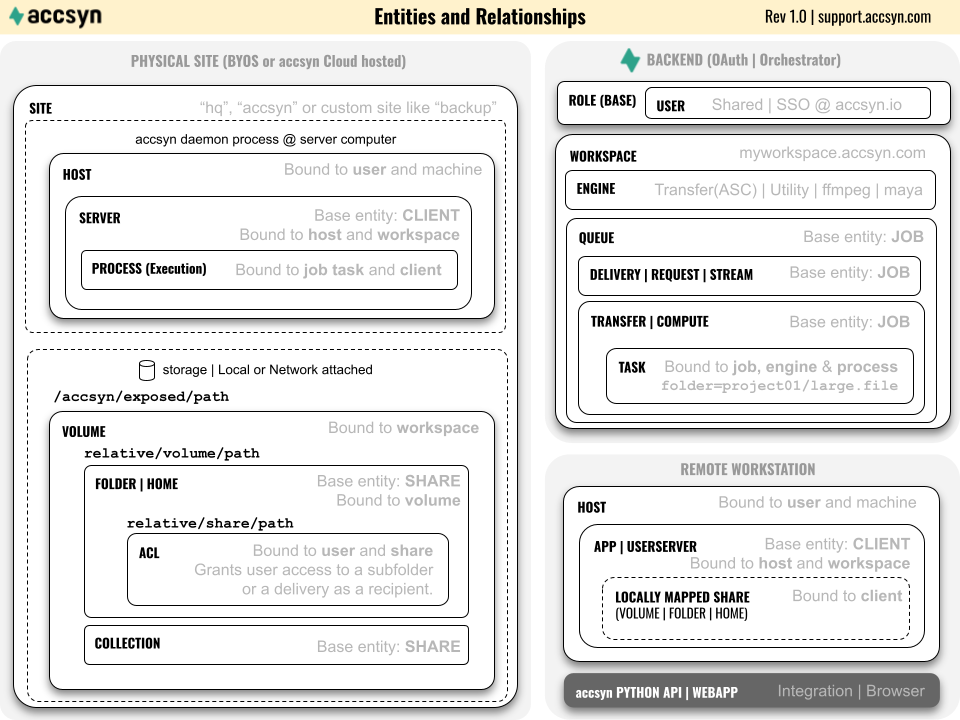

# Developer Hub

This section guides you through how to develop with accsyn.

## Introduction

accsyn is designed from the ground up to facilitate API-driven file transfers and compute workflows, enabling advanced automated workflows and integration into third-party tools.

  

This developer hub covers four main areas:

- The accsyn Python API; Being API-first, all you can do within an accsyn GUI can be done through the API; in fact, all internal communication within accsyn is API-driven.
- Hooks; Have scripts run on your server on specific events (BYOS only)
- Publish; Set up a publishing workflow, facilitating ingestion of remote work into your production pipeline (BYOS only)
- Rendering/compute; Use accsyn for heavy compute processing, such as 3D image rendering, 2D compositing render, GPU processing (ML) or any custom resource-intensive calculation that needs to run in the background (BYOS only)

## Developing with accsyn

Before diving into the accsyn API, we recommend learning about the terms and definitions used in accsyn. Here is a schematic covering the basic internal accsyn entities and their relationships:

For a complete list of accsyn terms, please refer to the [API glossary page](https://accsyn-python-api.readthedocs.io/en/latest/glossary.html).

## Python API

[Python API](python-api.md)

Learn how to programmatically launch and manage file transfers, create deliveries and manage file sharing.

### Job JSON specification

[Job JSON Spec](job-specification.md)

Learn the accsyn job JSON format, for use with the Python API and workflows in general.

*Note: the following features are currently only available for BYOS Workspaces.*

## Hooks

[Hooks](hooks.md)

Configure scripts that will be executed by an accsyn server on events such as job submit and job done.

## Publish

[Publish](publish.md)

Enable controlled validation and ingest of data into your production pipeline.

## Rendering/compute

[Compute](farm.md)

Set up a render farm driven by highly configurable Python scripted engines, multi-site enabled.
