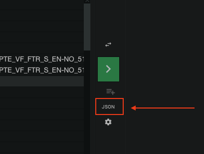

# Job JSON specification

This document provides accsyn job JSON  (JavaScript Object Notation) payload examples and describes best practices for using the accsyn API or CLI.


## Job JSON specification
  

### When is the job JSON used?

  

accsyn jobs are internally submitted in JSON format, from desktop app, web and CLI.

When submitting a job through the API or using a file with the CLI, the correct job JSON must be provided as specified throughout the rest of this document.

  

Hint: the job JSON payload can be inspected from within the accsyn Desktop app, by clicking the "JSON" button beneath the green submit button in NC mode:



### Structure of transfer job JSON payload

The general structure:

```json
{
    "tasks": <dict or list or task defintiions>,
    <additional job attributes>
    "settings": {},  // Optional
    "metadata": {}   // Optional
}
```

  

- Job attributes; (optional) Typically name of job, queue, initial status and so on. For detailed information, please refer to the [accsyn Python API documentation](https://accsyn-python-api.readthedocs.io/en/latest/transfers.html).
- Tasks: List or dictionary of tasks - files and directories to transfer, see party and path notation below.
- Settings; (optional) Additional job settings, see [accsyn Settings documentation](../settings.md) for a complete listing.
- Metadata; (optional) Additional job metadata.

  
  

### Transfer tasks

A task is a file or folder to transfer, a job can contain multiple tasks but must at least contain one. accsyn supports different methods of supplying tasks within the payload:

  

A) Relaxed structure of transfer job payload (single file):

```json
{
    "source": "<party>:<path>",
    "destination": "<party>:<path>",
    <additional job attributes>
}
```
  

B) A list of one or more tasks:

  
```json
{
    "tasks":[
        {
            "source": "<party>:<path>",
            "destination": "<party>:<path>"
            <additional optional task attributes>,
        },
        <additional tasks>

    ],
    <additional job attributes>
}
```
  

C) Or as a dictionary (the internal accsyn notation):

  
```json
{
    "tasks":{
        "0":{
            "source": "<party>:<path>",
            "destination": "<party>:<path>",
            <additional optional task attributes>,
        }, 
        "1": {
            <second task attributes>
        },
        <additional tasks>
    },
    <additional job attributes>
}
```
  

*Notes:*

- *Nested tasks are allowed, these are defined by a "tasks" sub key. It is used with compute jobs, see examples below.*
- *"0" and "1" above are called task "uri"s and must be unique (within the tasks locally at that level).  Tasks are also assigned a unique ID that can be used to further modify the job.*

  

### Source and Destination notation

  

An accsyn source/destination should be passed on as a combination of a party and a path similar to standard rsync and scp notation, using this template:

  

<party>:<path>

  

- Party; Identifies the sending or receiving endpoint entity.
- Path; The path to the file or directory to transfer, either in accsyn path notation or an absolute path.

  

For a detailed breakdown of parties and paths, please refer to the [accsyn Python API documentation](https://accsyn-python-api.readthedocs.io/en/latest/transfers.html). 

  

Example party definitions:

- myworkspace; Denotes the workspace side as source or destination - the main site (hq), resolves to the [Server](../admin/byos/server.md) hosting the file (through volume) identified by the path.
- john@user.com; Denotes a user as a source or destination, they must have a (running) client ([Desktop App](../desktop-app.md) or [User Server](../admin/hosts.md) instance) that can be resolved by accsyn. The most recent online client will be chosen.
- john@user.com@Hostname; A user source and destination resolving to a client having a specific hostname. 
- site=london; Denotes the site with (unique) API "code" identifier "london".
- client=6611fbca3f8c4d3e7a3b678a; Denotes an explicit client, for example if a user is running multiple clients.

  

Path examples:

- C:\Users\john\Desktop\image.png; A local path at the user end.
- ~/Document.pdf; A relative path on user's Home share at workspace.
- /Volumes/projects/reference.tif; An absolute path on a volume, can be used with workspace/site parties if they match configured volume paths.
- volume=projects/reference.tif ; Same notation,  but references the volume "projects" by its unique API "code" attribute and leaving accsyn to resolve the absolute path using the configured prefix for the server platform. This is also called the accsyn path notation.
- volume=(default)/reference.tif ; Same notation but specifying the default volume directly.
- share=myproject/assets.zip ; Relaxed share definition - unspecified share type, resolves to the volume, shared folder, home or collection "myproject" by its unique API "code" attribute.
- folder=6734b3ca8c3592a922bdb0de/TO\_ACME/source.rar; File is located in the shared folder identified by the explicit id, in subfolder "TO\_ACME".
- home=[john@user.com](mailto:john@user.com)/UPLOAD/test.abc; File is located at Home share [john@user.com](mailto:john@user.com) , in subfolder "UPLOAD".
- myproject/reference.jpg ; Assumes file paths being relative to the default volume, equivalent to share=projects/myproject/reference.jpg.
- racing2019\_grade/test.abc; Used in conjunction with a user as target, delivers the file into the relative folder "racing2019\_grade" at the user end.

  

*Notes:*

- *The "default volume" is the volume having the default attribute set to true, and is assigned the first volume created for a workspace. At least one default volume must be assigned within an accsyn workspace.*

- - *A folder cannot be given as destination unless a "/" (or "\" for Windows) is added. For example downloading a file "x.jpeg" to destination "/Volumes/nas/TEMP" will store the file as "TEMP", not inside folder TEMP. Correct destination notation in this case is: "/Volumes/nas/TEMP/", or even better: "/Volumes/nas/TEMP/x.jpeg".*
  - *Destination paths can be left out if other party is a site or a user's locally mapped share, this is called "path mirroring", and is suitable for keeping servers and/or workstations in sync when it comes to file structure.*
  - *If the party is omitted, accsyn interprets this as the workspace party - the file is to be sent to or from hq.*

  

### Client resolve

When submitting a job, accsyn tries to resolve a client-server combo based on the party and path given. The rules vary depending on the type of party:

- Workspace; Here accsyn tries to resolve the server that serves the volume pointed out by the path, or indirectly by paths on a shared folder or collection.
- User; accsyn tries to find a file transfer client belonging to the user, this might be the default client created when using the desktop app or a user server. For more information, see [Hosts](../admin/hosts.md).
- Site; accsyn tries to find a site server, that serves the volume pointed out by the path at the remote site, or indirectly by paths on a shared folder or collection.

  
If no server or client can be resolved, an error will be given with appropriate feedback. Once resolved, the resolve remains static which means that if a new server endpoint is deployed or the user launches another client, the mapping is NOT updated - a new transfer job must be submitted.

*Note:  The accsyn Python API does not provide a built-in p2p ASC client - it can only be used to control transfers.*

  

### User permissions - upload and download

A user is only allowed to access files and folders on an accsyn site (workspace/main hq premises or remote site) given explicit access through ACLs.

When downloading or uploading a file, only the user owning the API/CLI session is allowed to specify local absolute paths (e.g. C:\Users\ John\Downloads); to send a file to a user you must create a Delivery where the user then chooses where to download (or what to upload if it is an upload request). For more information, see [Delivery](../delivery/index.md).

There is an exception to this: if the user has mapped a share locally and has given explicit write permissions to it, an elevated user is allowed to push files to the user's client using mirror path option or explicit path notation (see examples below). Same goes for upload - an elevated user can pull files from a remote user's computer and upload them to a workspace volume if the user has given explicit read access to the corresponding locally mapped share. For more information on how to set up locally mapped shares, see [Hosts](../admin/hosts.md).

  

### User permissions - site transfers

When transferring files between sites, the user has to have the admin role, or be an employee with full access to the involved volume(s).

## Example transfer job snippets

  

### Workspace drop-off

Prerequisites:

- The user needs to have a Home share and write access to it (entire share or a subfolder)
- The user needs to have a registered accsyn client (Desktop App or User Server) instance.

  

Drop off the file "Prototype.zip", short simplified single task notation:

```json
{
    "source":"/home/Adrian/pitches/Prototype.zip",
    "destination":"~"
}
```

- "~" resolves to the home share.
- No destination path was given, leaving it for accsyn to resolve the destination folder. This includes adding any delivery dropoff date subfolder (default in the form: YYYYMMDD)

  

With target subfolder and providing a name, letting accsyn append the source filename to destination path:

```json
{
    "source":"/home/Adrian/pitches/Prototype.zip",
    "destination":"~/preproduction/",
    "name": "Prototype send"
}
```

With a different filename for destination:

```json
{
    "source":"/home/Adrian/pitches/Prototype.zip",
    "destination":"~/Prototype\_260703.zip"
}
```
  

### User share download

Prerequisites:

- The user needs to have a Home share and read access to it (entire share or a subfolder)
- The user needs to have a registered accsyn client (Desktop App or User Server) instance.

  

Download folder "Material" from workspace home share:

```json
{
    "source":"~/Material",
    "destination":"/Users/Adrian/Downloads/"
}
```

- The destination party client will resolve to the most recently online client.

  

Download two files, with an explicit client specified:

```json
{
    "tasks":[
        {
            "source":"~/Material",
            "destination":"client=6a479e243bed6009ac9d6763:/Users/Adrian/Downloads/"
        },
        {
            "source":"~/Legal",
            "destination":"client=6a479e243bed6009ac9d6763:/Users/Adrian/Downloads/"
        },
    ]
}
```
  

Specify target endpoint by hostname:

```json
{
    "source":"~/SketchesFinal",
    "destination":"emma@compers.com@PCLocal-001:/Users/Emma/Downloads/"
}
```

- Be aware of ambiguity in case two computers share the same name!

  
### Operator upload

Sync the folder "deployment" to a subfolder on accsyn workspace storage:

```json
{
    "source":"D:/dev/pipeline/build/deployment",
    "destination":"\_PIPEINE/live/deployment"
}
```

*Notes:*

- *A relative path is given as destination, this resolves to the default\* volume on the workspace.*
- *The operator needs to have write access to the volume.*
- *Operator is another name for elevated users - having either admin or employee roles. Operators have access to volumes, standard users does not.*

\* Default volume is the volume having the "default" attribute set to true.  

### Operator download

Download the file "Fireflies\_001" from volume "assets" going into the High priority queue, storing locally:

```json
{
    "source":"volume=assets/Flies/Fireflies\_001",
    "destination":"D:/work/ASSETS/Fireflies\_001",
    "queue":"High"
}
```

*Notes:*

- *The term operator means an elevated accsyn user - administrator or employee with read access to the (default) volume*
- *The workspace party is omitted here, this is allowed since the other user party is clearly stated and no ambiguity exists when it comes to the source party.*
- *Neither is the source volume given here as source, just a relative path. When no source volume or share is given, the default volume is assumed to be the source.*

  

Corresponding full expanded syntax for reference, assuming the workspace code/name is "thecompany":

```json
{
    "source":"thecompany:volume=assets/Flies/Fireflies\_001",
    "destination":"john@thecompany.com:D:/work/ASSETS/Fireflies\_001"
}
```
  

### User home share upload

Upload folder "/Users/john/Desktop/delivery" to Shared Folder "thefilm" into subfolder "from\_john/20180413":

```json
{
    "source":"/Users/john/Desktop/new\_scans", 
    "destination":"folder=thefilm/from\_john/20180413/"
}
```

*Note: Shares are identified either by their unique ID, or by their unique API "code" identifier.*

  

### Operator download to site

Sync a folder on volume "projects" @ main site (default: "hq") to site "berlin":

```json
{
    "source":"share=projects/thefilm/SCENES", 
    "destination":"site=berlin"
} 
```

- The operator needs to have read and write permissions to the volume.
- No destination path is given, accsyn will mirror the path structure on the receiving end.

  

### Operator transfer between sites

Corresponding transfer of a folder from site "cloud" to site "berlin":

```json
{
    "source":"site=cloud:share=render/got/sc01/sh01/render/got\_sc01\_sh01\_comp\_v012",
    "destination":"site=berlin"
}
```
  

### Operator push to user

Push (download) a folder to the locally mapped share "thefilm" at the remote user, storing in a different folder:

```json
{
    "source":"share=thefilm/\_OUTSOURCING/Paint\_and\_cleanup-Compers-260703",
    "destination":"emma@compers.com:share=thefilm/\_FROM\_THECOMPANY/"
}
```

- The user must have mapped the share locally (configured through the app or through ACCSYN\_\*\_PATH envs), write access enabled.

  

### Operator pull from user

Pull a file from remote user´s locally mapped share "thefilm" back to workspace storage:

```json
{
    "source":"emma@compers.com:share=thefilm/DELIVERY/WIP-260703.zip",
}
```

- No destination is given, accsyn will resolve to the workspace default volume and also apply mirrored paths.


### Metadata

Sync a folder on share "projects"  from site "berlin" back to hq, deleting files that do not exist on the receiving end. Supply metadata that can be picked up by hooks:

```json
{
    "tasks":[
      {
        "source":"site=berlin:projects/racing2019\_grade/davinci\_files",
        "destination":"myorg",
        "metadata":{"app":"davinci\_resolve"}
      }
    ],
    "metadata":{"artist":"malcolm"},
    "settings":{"transfer\_mode":"onewaysync"}
}
```

- Settings are always supplied as strings, please refer to [Settings documentation](../settings.md).

  

### Skip existing files

Upload file "final\_export.mov", at share "projects"  from user to share "racing2019\_grade", but not overwriting it if it exists and size or modification date differ:

```json
{
    "tasks":[
      {
        "source":"E:\racing2019\_grade\davinci\_files\final\_export.mov",
        "destination":"mycompany:share=racing2019\_grade/FROM\_EDIT/final\_export.mov",
        "settings":{"transfer\_ignore\_existing":"file"}
      }
    ]
}
```
  

### Exclude files

Upload a large folder, excluding all files ending with "tmp" and files that are only numbers:

```json
{
  "tasks":[
    {
      "source":"F:\BIGGIE",
      "destination":"mycompany:share=projects\\_\_UPLOADS\BIGGIE",
      "settings":{"transfer\_exclude":"\*tmp\,re('[0-9]')"}
    }
  ]
}
```

*Note: multiple exclude statements are separated by an escaped comma - \, . This means that an escaped comma cannot be used in exclude expressions.*

  

### Priorities

Tasks (files) can have different priorities, enabling pre-delivery of some important files. Here is an example of downloading two files with the PDF prioritised:

```json
{
  "tasks":[
    {
      "source":"share=bidding/LFM/brief\_v001.pdf",
      "destination":"lisa@"mail.com:/Volumes/media/\_TO\_BID,
      "priority":999
    },{
      "source":"share=bidding/LFM/material.rar",
      "destination":"lisa@"mail.com:/Volumes/media/\_TO\_BID,
    }
  ]
}
```

In this case, the file brief\_v001.pdf will be sent first, then material.rar. accsyn priorities range from 1000 (highest) to 1 (lowest) and the default value is 500.

  

### File sequences

accsyn supports sending a subset of a numbered file sequence, this is handy when you do not want to send an entire directory with a huge amount of files but instead want to do a selection.

Transfer a part of a file sequence from one site to another, mirrored paths (requires a VPN direct connection or both servers set up with NAT port forwarding of accsyn protocol ports):

```json
{
  "tasks":[
    {
      "source":"site=berlin:myproj/images/movie.%04d.jpg[100-167]",
      "destination":"site=london" 
    }
  ]
}
```
  

### Placeholder jobs

In some situations, a job needs to be created beforehand, to enable tasks to be added shortly after. To achieve this, a placeholder job can be submitted:

```json
{
  "tasks":[
    {
      "source":"site=cloud:null",
      "destination":"site=hq",
      "status":"excluded"
    }
  ]
}
``` 

*Note: Soure and destination parties must match the upcoming task parties.*

The job will immediately be set to done, with no files actually transferred.

## Compute/render job examples

### Nested compute jobs and dependencies

accsyn not only supports rendering for example a single Houdini scene, splitting a frame range up in buckets, over a pool of render servers. Nested jobs with dependencies are also supported. Here is an example of a pipeline job, that runs tasks through a custom "pipeline" engine:

  
```json
{
  "name": "Mocap shoot pipeline job - 260217",
  "engine": "pipeline",
  "settings": {
    "task\_bucketsize": 1
  },
  "filters": "",
  "description": "Daily shoot post processing pipeline job.",
  "tasks": {
    "EP000\_SC0110\_SL02\_PS01\_TK01": {
      "tasks": {
        "pickup": {
          "compute": {
            "parameters": {
              "action": "shoot-pickup"
            }
          },
          "tasks": {
            "0": {
              "compute": {
                "parameters": {
                  "file": "mocap.tak"
                }
              },
              "description": "Pickup and name Mocap take."
            },
            "1": {
              "compute": {
                "parameters": {
                  "file": "ref-camera.mov"
                }
              },
              "description": "Pickup and name floor reference camera."
            },
            "2": {
              "compute": {
                "parameters": {
                  "file": "sound.wav"
                }
              },
              "description": "Pickup and name studio recorded audio."
            }
          },
          "description": "Pickup and name files for take: EP000\_SC0110\_SL02\_PS01\_TK01"
        },
        "notify-pickup-done": {
          "description": "Notify someone that we are done.",
          "deps": [
            "EP000\_SC0110\_SL02\_PS01\_TK01/pickup"
          ]
        }
      },
      "metadata": {
        "take\_name": "EP000\_SC0110\_SL02\_PS01\_TK01",
        "take\_metadata\_path": "Z:\\HFSUR\\06\_Harvest\\260217\\EP000\_SC0110\_SL02\_PS01\_TK01.json"
      },
      "description": "Post process take: EP000\_SC0110\_SL02\_PS01\_TK01"
    }
  },
  "metadata": {
    "daily\_path": "Z:\\HFSUR\\06\_Harvest\\260217"
  }
} 
```
  
Explanation of the job JSON:

- Top level engine attribute;  tells accsyn to run all tasks using the engine "pipeline" (API code identifier).
- Task EP000\_SC0110\_SL02\_PS01\_TK01; The main parent task to execute, in this example it relates to a take in a motion capture studio pipeline.
- EP000\_SC0110\_SL02\_PS01\_TK01 "tasks" attribute; Tells accsyn that this task has sub tasks (nested), that will be executed instead of the task itself.
- EP000\_SC0110\_SL02\_PS01\_TK01/pickup; Sub-task of EP000\_SC0110\_SL02\_PS01\_TK01, its compute parameters will be aggregated and made available to all subsequent tasks.
- EP000\_SC0110\_SL02\_PS01\_TK01/pickup/0; Leaf task, will be executed first (bucket size = 1)
- EP000\_SC0110\_SL02\_PS01\_TK01/pickup/1 & 2; Subsequent sub tasks.
- EP000\_SC0110\_SL02\_PS01\_TK01/notify-pickup-done; Has a dependency on the "pickup" task, and will not execute until the pickup task (and all its sub tasks) have executed successfully.
- Metadata; Are aggregated upstream and supplied upon execution, the same way compute data is.

## Best practices and limitations

  

### Source and destination party

accsyn is a p2p file transfer protocol which means that each transfer job can only have one unique source and one unique destination party.

A source or destination party can be:

- The workspace (organisation); on-prem servers at the main site (hq), running the accsyn daemon app in server mode.
- A user; Identified by the email, running the accsyn desktop app or daemon app in user server mode.
- A site; Identified by a unique name, running the accsyn daemon app in server mode.
- Web browser; For downloads and uploads using a web browser.

  

For the workspace party, source or destination files can reside on multiple volumes within the same job:

```json
{
  "code":"My download",
  "tasks":[
     {
       "source":"share=share1/file.001",
       "destination":"john@user.com/X:/download"
     },{
       "source":"share=share2/file.002",
       "destination":"john@user.com/X:/download"
     },
  ]
}
```

Example: Transfer one file from share1 and another from share2, that can reside on different servers.


### Job count limit

Although no limits on the amount of jobs are enforced by accsyn, when the amount reaches 500+ a substantial degradation of performance occurs and the UI will become unusable. 

The recommended approach is to reduce the amount of jobs and instead have multiple tasks within each job. 

Giving an example where the API in an automatic workflow submits a sync job for each file updated every day, if thousands of files are updated accsyn will soon reach its limits and the job listing in the desktop app/web app will be overflowed.

A better approach would be to let the API load a daily sync job for each source-destination pair (create if not exists) and add tasks to that job instead. This would reduce the amount of jobs drastically, and will make the job listing much more readable when it comes to finding other important jobs that otherwise would totally drown.

  

### Large jobs with a lot of files

accsyn transfers files using the same algorithm as \*NIX rsync which means that a list of files with size and modification dates is sent to the receiving end in order to determine which files need to be sent.

For very large file transfers containing a lot of smaller files in deep lengthy folder structures, accsyn might run out of RAM during file transfer init and in those cases it is recommended to split a job into multiple tasks. 

For example, when doing a project backup with accsyn, instead of sending the entire root share or directory - send each project directory as individual tasks and set the "task\_bucketsize" setting to "1":

```json
{
  "code":"Daily backup",
  "source":"share=raid01/projects",
  "destination":"site=backup"
}
```

=>

```json
{
  "code":"Daily backup",
  "tasks":[
     {
       "source":"share=raid01/projects/PROJ001",
       "destination":"site=backup"
     },{
       "source":"share=raid01/projects/PROJ002",
       "destination":"site=backup"
     },
  ],
  "settings":{"task\_bucketsize":"1"}
}
```