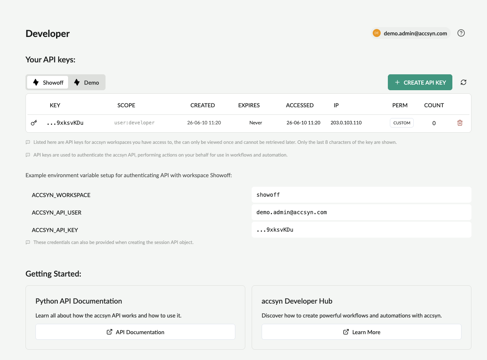

# Python API

The accsyn Python API facilitates programmable file transfers with Python (v3).

Contents:

[How to create and manage API keys](python-api.md)

[Manage user API keys](python-api.md)

[Manage workspace API keys (administrators)](python-api.md)

[Install the Python API](python-api.md)

[PIP](python-api.md)

[Poetry](python-api.md)

[From source](python-api.md)

[Using](python-api.md)

[Create a new API session](python-api.md)

[Example - download a file](python-api.md)

[Documentation](python-api.md)

[Source code](python-api.md)

[Further resources](python-api.md)

## How to create and manage API keys

To create a new API key, open <https://accsyn.io/developer> in your browser. This page is available from the user menu in the top right corner, "Developer" menu entry:

1. Click Create API Key button.
2. (Optional) Choose the lifetime of the key, the IP(s) to restrict it to and permissions.
3. The API key will be presented once; copy and store it in a safe place - treat it like a sensitive password!

### Manage user API keys

At <https://accsyn.io/developer>, your API keys for each accsyn workspace are listed. Delete an API key by clicking the trashcan icon on the right hand side of each entry.

  

### Manage workspace API keys (administrators)

API keys for each user can be managed from <https://accsyn.io/admin/users> (Workspace button > Users):

- Click on the user you want to manage.
- Go to API keys tab.
- Here you will see all active API keys for that particular user.
- Delete an API key by clicking the trashcan icon on the right hand side of each entry.

## Install the Python API

We recommend setting up and activating a virtual environment for development;  [pyenv](https://github.com/pyenv/pyenv) is a fluid tool for creating and managing Python envs.

  

### PIP

This is the default and recommended way to install the accsyn Python API with dependencies:

  

- Install Python 3.8 or higher
- Make sure pip is installed.
- Install using pip:

  

pip install accsyn-python-api

  

### Poetry

- Download the source code from GitHub (see link below).
- Install with Poetry:

  

poetry install

  

### From source

- Download the source code from GitHub (see link below).
- Copy the "accsyn\_api" folder from within the "source" folder to your PYTHONPATH.
- Install dependencies: [requests](https://pypi.org/project/requests)

## Using

### Create a new API session

  

session = accsyn\_api.Session(workspace='acmefilm',username='john@user.com', api\_key='BlrPCfxLIRZEdhL6LXotwXRmDWbPRsPgLYcpa7ubyu97gxpqSC4130Adfh968Low')

  

### Example - download a file

  

job = session.create("transfer",{"source":"volume=projects/A001\_C064\_09224Y\_001.mp4","destination":"client=664f53b16aa9149860da9d9c:/tmp/A001\_C064\_09224Y\_001.mp4"})

  

Note: the accsyn API does not run any file transfers itself, it can only queue file transfers that then get resolved and dispatched to the involved server and client p2p endpoints.

## Documentation

Find full Python API documentation here:

[accsyn-python-api.readthedocs.io/en/latest/](https://www.google.com/url?q=https%3A%2F%2Faccsyn-python-api.readthedocs.io%2Fen%2Flatest%2F&sa=D&sntz=1&usg=AOvVaw0_5CXRsktK7y-oUlru4v5r)

## Source code

Access source code on GitHub:

[https://github.com/accsyn](https://www.google.com/url?q=https%3A%2F%2Fgithub.com%2Faccsyn&sa=D&sntz=1&usg=AOvVaw11YcTk5PDkFMqd5ZfYzKXI)

## Further resources

[Job JSON Spec](job-specification.md)

Specification of accsyn job JSON format

[Tutorial | Remote Office Sync](../tutorials/remote-office-sync.md)

Learn how to use the accsyn Python API to automate file synchronisation between your offices and/or cloud storage.
