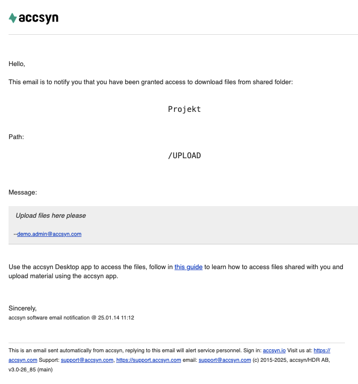
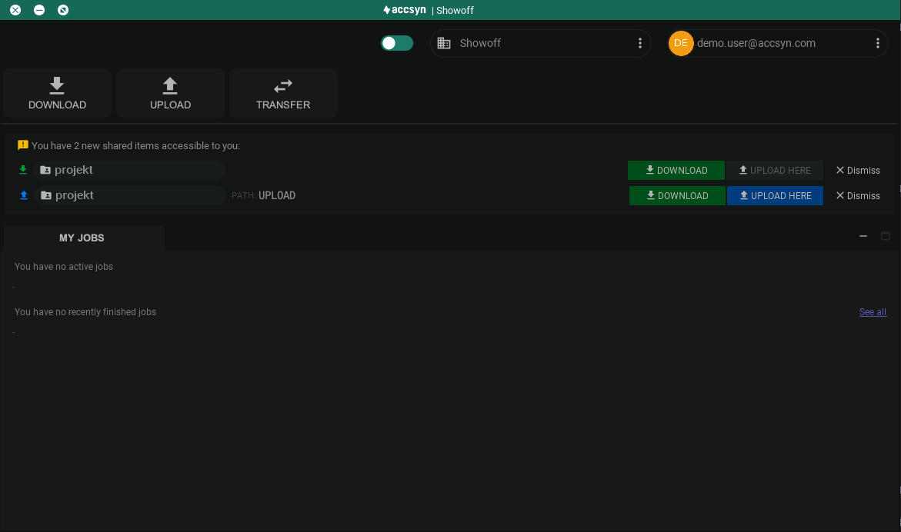
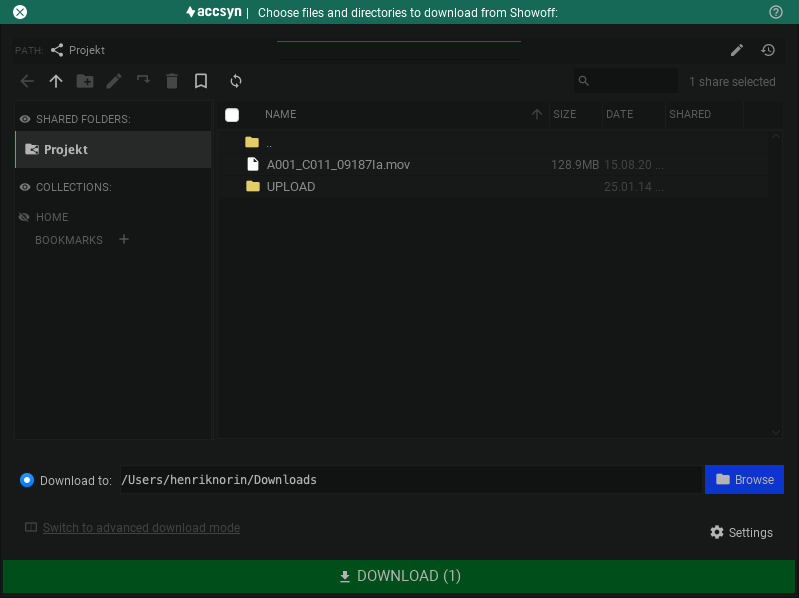
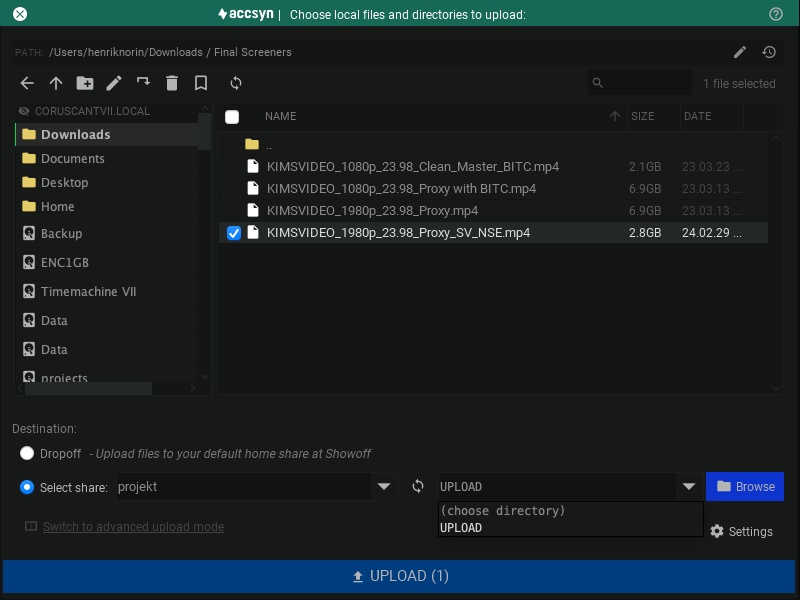
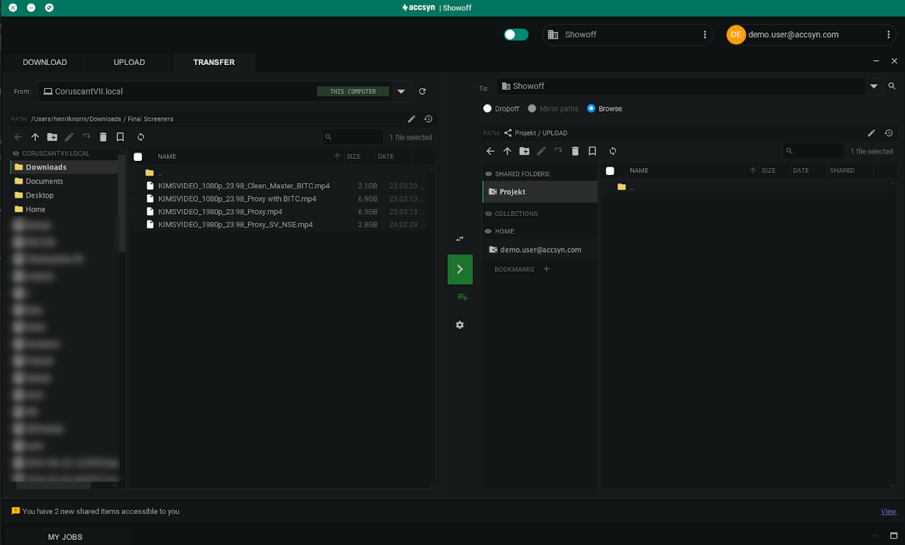

# Access shared folders

This is a guide for you as an end user, being granted access to download and/or upload to an accsyn shared folder or collection, using the accsyn Desktop app for the first time.

Important note: If you have received a delivery, follow the link provided in the delivery email to access the delivery in your web browser. The desktop app is solely for the purpose of accessing permanently shared files and folders @ accsyn storage.

For more information on how to action a delivery, head over to this guide:

[Receive Delivery](../delivery/receive.md)

## Email notification

When someone gives you access to a folder within an accsyn workspace, you should have received an email notification:

Example of a file sharing email notification

If it is the first time using the accsyn platform, you will also receive an invitation email telling you how to activate your personal accsyn account.

*Note: If you cannot find these emails, make sure to check your filtered spam inbox for emails. Search for the sender "[noreply@accsyn.com](mailto:noreply@accsyn.com)".*

If you did not get any email, you can still get going by signing up at <https://accsyn.com/signup> using the same email address that files were shared to. When signed in, you will be redirected to the Shared with me web page giving you full instructions on how to proceed from there.

## Installing the accsyn Desktop app

Follow this guide to install the accsyn Desktop app on your computer:

[Install Desktop App](../desktop-app.md)

## Downloading files

Once installed, downloading files is a very streamlined process:

1. Launch the accsyn Desktop app.
2. Log in using the email account that was used when they shared the files with you - the email address the notification above was sent to. The window will display and notify you that you have accessible items:

Example screenshot of the desktop app with two new accessible shared folders.

3. To download files from a folder, click the green Download button. 

*Note: If you do not see the notification(s), or you have dismissed them, click on the Download button in the upper area to launch the download tool.*

4. The download tool will appear, giving you the option to select which files and folders to download, and where to download them to locally:

Example screenshot of the accsyn download dialog.

5. Click the green Download button to initiate the file transfer.

Monitor the transfer by opening the My jobs view available at the bottom of the app interface, there you get an estimation of how long the transfer will take and get clues if anything goes wrong like the disk gets full or there are permission/network errors.

## Upload files

The upload process is similar - launch the desktop app, log in and click the Upload button to bring up the upload tool:

Example screenshot of the upload tool.

Choose the file(s) and/or folder(s) you wish to upload, under Destination choose the shared folder you wish to upload to. When done, click the Upload button to initiate the upload.

## Advanced mode - transfer

If you are used to working with FTP clients, accsyn provides the Transfer view for this:

On the left hand side you choose the source file(s) and/or folder(s) to transfer, on the right hand side the destination folder.

When you have made the selection, click the green arrow button in the middle to initiate the transfer.

## Manage app

### Installation location

The accsyn app is installed in these default locations for standard users without administrative rights:

- Windows; C:\Users\<user account>\AppData\Local\Programs\Accsyn
- Mac; Chosen by user, recommended location: /Users/<user account>/Applications
- Linux; Chosen by user, recommended location: /home/<user account>/.local

If you run the installer as administrator on Windows, or have superuser privileges on Mac and Linux, these are the default installation locations:

- Windows; C:\Program Files\Accsyn
- Mac; Chosen by admin, recommended location: /Applications
- Linux; Chosen by admin, recommended location: /user/local/accsyn

  

### Data files location

accsyn stores its data in these locations:

- Windows; C:\Users\<user account>\AppData\Roaming\accsyn\data(based on %APPDATA% environment)
- Mac: ~/Library/Application Support/com.accsyn
- Linux: /home/<user account>/.accsyn/data

If you run the app as administrator on Windows, or with superuser privileges on Mac and Linux, these are the default data locations:

- Windows; C:\ProgramData\accsyn\data (based on %APPDATA% environment)
- Mac; /Library/Application Support/com.accsyn
- Linux; /var/lib/accsyn

  

Hint: make a backup and migrate this location to new computers, in order to preserve app configuration such as login and file transfer client credentials.

  

### Log files location

accsyn stores the log files in these locations:

- Windows; C:\Users\<user account>\AppData\Roaming\accsyn\log(based on %APPDATA% environment)
- Mac: ~/Library/Logs/accsyn
- Linux: /home/<user account>/.accsyn/log

If you run the app as administrator on Windows, or with superuser privileges on Mac and Linux, these are the default data locations:

- Windows; C:\ProgramData\accsyn\log (based on %APPDATA% environment)
- Mac; /var/log/accsyn
- Linux; /var/log/accsyn

Hint: ZIP this folder and send with support ticket email, when having app stability issues.

  

### Uninstall app

To uninstall the app as a standard user:

- Windows; Run: C:\Users\<user account>\AppData\Local\Accsyn\uninstall.exe.
- Mac; Move the accsyn .app bundle to Trash.
- Linux; Remove the accsyn application folder.

To uninstall accsyn installed as an administrator on Windows, or with superuser privileges on Mac and Linux:

- Windows; Run: C:\Program Files\Accsyn\uninstall.exe.
- Mac; Move the accsyn .app bundle, typically located in /Applications, to Trash.
- Linux; Remove the accsyn application folder, typically located in /usr/local.

  

*Note: The uninstaller does not remove data and log files, these have to be manually removed.*

## Troubleshooting

Having issues accessing shared material with accsyn, here are some initial pointers:

I am not allowed to install apps on my computer, how do I proceed? 

To access shared content with accsyn, it is mandatory to use the accsyn desktop app. Try to have your IT department assess and whitelist the application and try again, another alternative could be to install it on another computer - for example a private laptop, access the files and then transport files using a USB stick or removable hard drive.

I tried downloading a file but the job turns red and fails? 

- A first check is to see if you have enough free space on your hard drive where you chose to download the files/folders.
- Also check antivirus software and firewalls, so they are not blocking the executable or the default accsyn network ports - outgoing TCP traffic on ports 45190 and above.
- Make sure the accsyn app has permission to write to the folder you chose for download, or can read the files you are about to upload.

Can I download files many times from different machines?

Yes, files and folders are permanently shared with you until someone revokes your access. And you are free to install the accsyn app on as many machines as you require.

Is the file transfer encrypted?

Yes, accsyn facilitates standard AES-128 encryption as part of the SSL standard by default. File transfers are also accelerated using accsyn's proprietary network protocol, enabling fast and smooth deliveries for large file packages.

The desktop app freezes and/or crashes, what to do?

If you are having stability issues with the desktop app, please reach out to us by sending an email with your log files attached to [support@accsyn.com](mailto:support@accsyn.com). Find information in the Manage app section above on where to find the application logs on your local disk.

Having further issues or simply have a question, please reach out to the accsyn support team through chat or by sending an email to [support@accsyn.com](mailto:support@accsyn.com).

Related articles:

[File sharing](index.md)

- learn how to share files and folders with your employees and external users.

[Hosts](../admin/hosts.md)

- learn how to set up your computer to automatically receive deliveries, and expose locally mapped shares.
