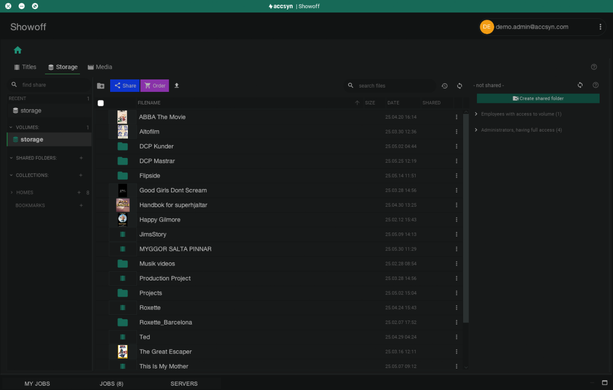
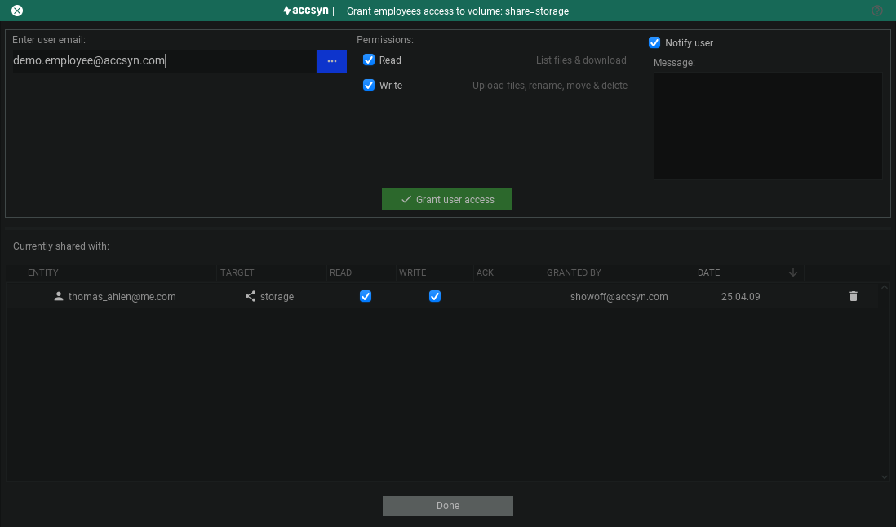
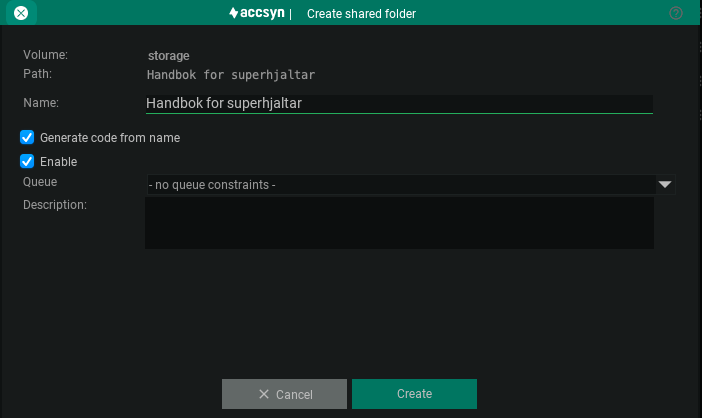
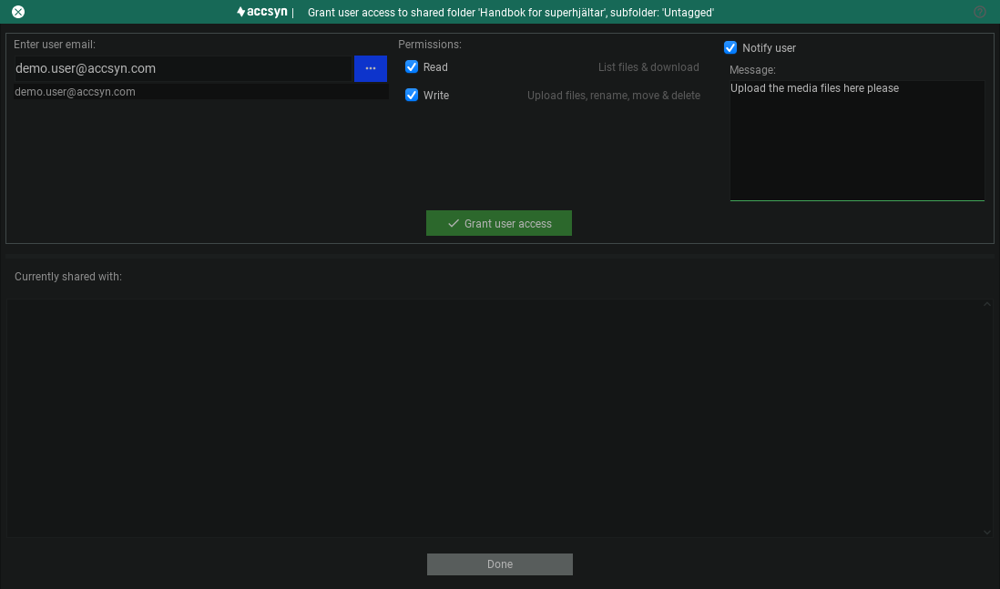

# File sharing - Working with

This guide explains how to utilise accsyn as a file sharing service, similar to a standard FTP server, giving users permanent access to files and folders on your BYOS or cloud hosted storage. 

  

*Note: File sharing is currently not available in the web browser, this is subject to be improved in future versions of accsyn.*

## Storage view

Preparations

1. To manage your accsyn Storage, you will need to download and [install the accsyn Desktop app](../desktop-app.md).
2. Log in with the desktop app as an elevated user - admin with full access or as an employee with access to at least one volume.

  

File sharing happens within the Storage view:

Example screenshot of the storage view within the accsyn Desktop app.

Here you can browse your storage and find out who has access, the view is divided into three areas:

  

### Share list

On the left hand side you find the Share view, it displays:

- Recent; The five (5) most recently visited shares.
- Volumes; Root folders/drives exposed to accsyn, the default cloud hosted volume is named "storage". In a BYOS setup, you are free to create and configure as many volumes as needed.
- Shared folders; A folder beneath a volume that can be shared with other users.
- Collections; Virtual folders containing files and folders collected from one or more volumes.
- Homes; Shared home folders for users.

To modify a share, right click it to bring up a context menu with options. 

Click the eye icon to show/hide a share type section, by default user homes are hidden.

  

### File list

The middle area contains the file and folder listing for the selected share on the left hand side. This file browser behaves the same as a normal file browser, having context menu options and a toolbar for basic file operations such as directory creation, move, rename and delete.

  

### Access info

On the right hand side, you find the access info panel displaying info about which user(s) have access to the current share and path.

## Sharing a volume with employees

*Note: to give administrators access to your workspace, invite them using the INVITE USER tool in the desktop app or go to <https://accsyn.io/users>.*

  

Here are the steps to give employees access to a volume:

1. Select the volume on the left hand side (this cannot be done while browsing a Shared folder/Collection/Home).
2. In the access panel, click the blue Share button and choose Grant employees access or click the green + button in the "Employees with access to volume" header. This will bring up the accsyn ACL dialog:

3. Enter the user email or click the blue list icon to select an existing employee within your workspace. New employees can be invited here.

4. Choose which permissions they should have - only download files (Read), or also be able to upload and modify files (Write).

5. (Optional) Notify employee; Enter a message to the user, de-select this to prevent an email notification from being dispatched.

6. Click the green Grant access button to give access.

An entry will be added to the ACL beneath "Currently shared with:". It lists the ACL bound to the volume, the "ACK" column signals that the user has seen and dismissed the notification in the app.

To revoke access for an employee, click the trashcan button on the right hand side of each ACL entry.

## Sharing a folder with users

*Note: accsyn does not support sharing single files as of current version, this might be subject to change in future versions. To share a single file, add it to a collection (see below).*

The base is a shared folder, ACLs are then applied to this folder, granting users access to the entire folder (/ path) or a subfolder for either downloading files and/or uploading files.

### Create a shared folder

1. In the Storage view, select the volume and browse to the folder you wish to share.
2. Click the blue Share button in the toolbar and select Create shared folder, or click Create shared folder in the access panel to the right.
3. Give the share a name:

4. (Optional) Define the share code - the API identifier the share should have when performing API operations.

5. (Optional) Bind a queue to the share - have all file transfers involving the share go to a certain queue.

When done, click Create to create the shared folder.

The folder is now a Shared folder, but no user has access to it yet - no ACLs exist.

  

### Share folder with users

1. In the Storage view, select the shared folder you created on the left hand side.
2. Browse to the subfolder you want to share, or stay in the root to share the entire folder.
3. Click the blue Share button and choose Grant user access, or click the green Grant access button on the share in the access info panel to the right.  This will bring up the accsyn ACL dialog:

4. Enter the email address of the new user you want to invite, or select an existing one by clicking the blue list button.

5. Choose which permissions the user should have; Read means they will be able to list files and download, Write means they will be able to upload files, and alter files on storage - create directories, rename, move and delete files and folders.

6. (Optional) Check Notify user to have an email dispatched, notifying the user of the new shared folder. You can supply a custom message if you want.

Click Grant access to create the ACL entry, it should appear in the ACL list below "Currently shared with:". The ACL entry will also appear in the access info panel while browsing your storage.

To revoke access for a user, click the trashcan button on the right hand side of each ACL entry.

### Modify a shared folder

Right click the share in the share list and choose edit.

### Removing a shared folder

Right click the shared folder in the share list and choose delete. If you wish to keep the shared folder for audit later, choose inactivate (archive). To bring back inactive collections later, go to the share settings page (<https://accsyn.io/shares>).

## Creating a collection

To create a collection, browse and select the file(s) and/or folder(s) to add and either:

- Click the blue Share button and choose Create new collection
- Right click and do Share>Create new collection.
- Click the NEW button in the collections section within the share list.

The Create collection dialog will appear, give the collection a name and then click Create to have it created.

You can proceed adding more files and folders to the collection by selecting them and doing Share>Add to collection>(your collection). Remove files from a collection by either right clicking and choosing Remove or clicking the trashcan icon on the right hand side of the file entry.

### Share a collection with users

Sharing collections, for users to download the files within, is very similar to sharing a folder: Select the collection and then choose Grant access to bring up the standard ACL dialog.

### Removing a collection

Right click the collection and choose delete. If you wish to keep the collection for audit later, choose inactivate (archive). To bring back inactive collections later, go to the share settings page (<https://accsyn.io/shares>).

## Accessing a shared folder

For standard users, there is a separate guide on how to access a shared folder with the accsyn Desktop app [here](access.md).

  

For elevated users like administrators and employees, open the Download tool from the top menu bar.

The basic download dialog will appear, allowing you to select the file(s) and folder(s) you wish to download and where to download them (Download to). To configure the download, click the Settings button. To use the more advanced NC (Norton Commander)-like mode, click Switch to advanced download mode.

The same applies to uploads - open the Upload tool from the top menu bar.

You can also download/upload from/to shares using the Transfer tool.

## Remove access for a folder / collection

To stop a user from accessing a folder, follow these steps:

1. Select the shared folder or collection in the Storage view.
2. In the access info panel on the right hand side, click the trashcan icon on the folders you want to revoke user access to.
3. You can also click the Grant access button and revoke access by clicking the trashcan icon on the entry in the ACL list view.

The user will not get a notification when access has been revoked.

*Note: If a user does not have access to any shared folder or collection anymore, they will not be able to log in to the Desktop app and access your workspace anymore.*

## Create a home

Creating a shared home folder is a convenient way to quickly get users into your workspace and upload files to a place of their own.

To create a home share, click the NEW button beneath the homes section or click the + icon in the home section header:

1. The create share dialog will appear, prompting for user.
2. Choose the user from the list or invite a new user.
3. Click next.
4. (Optional) Give a description of the share.
5. When done click Create to have the home created.

The home folder will be created on the default volume and the default home folder as configured in accsyn.

ACLs will be automatically created, giving the user read(download) and write(upload, modify files) permission to the home folder on storage, and a notification email will be dispatched.

## Modify a share

To modify a share, right click it in the share list and choose Edit.

*Note: If you change the share code attribute, update your API workflows accordingly.*

## Removing a share

To remove a share, right click it in the share list and choose Delete.

*Note: files on storage will NOT be affected, and will have to be manually deleted in the file browser.*

### Related articles

[BYOS](../admin/byos/index.md)
