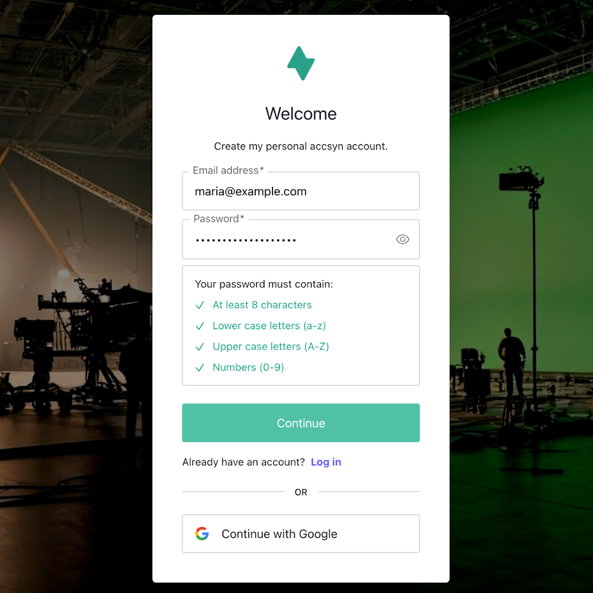
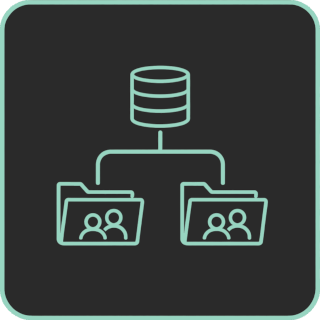
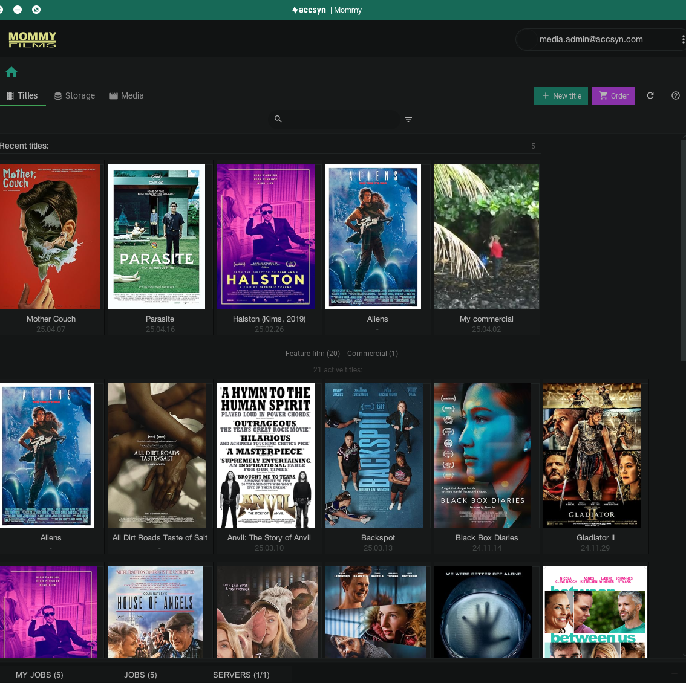
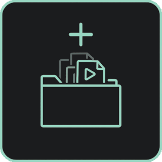
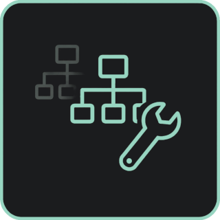
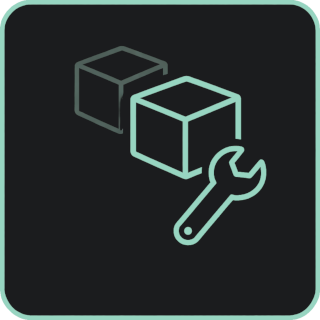

# Home

## Status

-   ONLINE

-   **Ongoing incidents**

    ---

    \-

-   **Upcoming planned maintenance**

    ---

    \-

-   **Uptime**

    ---

    99.94% - 5h outage recent year

-   **Guaranteed uptime**

    ---

    99.3% - Max 61h outage a year

-   **Recent outages**

    ---

    - 26.04.22 (10min); Auth0 DNS outage.
    - 26.01.28 (5min); Cloud accsyn server outage.
    - 25.08.13 (5h); Certificate upgrade issues.

Identity provider status: [Auth0 status page](https://status.auth0.com/)

## Contact support

### Guidelines

Please respect our support guidelines:

- We are a small company without a huge support organisation, support is currently answered by our lead developer during office hours and we intend to only have developers with full insight into the code base as a first point of contact - this is to ensure the fastest possible problem solving.
- Answers to common questions can usually be found in our knowledge base below, please try to have a look there before you attempt to contact our support channels.
- Use a descriptive subject, "Need help" is a bad example of an email subject. A good subject looks like "Crash when trying to write file to my disk".
- Supply screenshots and log files when possible, this speeds up the support ticket handling. Find standard log file locations below.
- We answer support emails in the order they come in. If you have an urgent matter that has put your production to a stop - begin subject with the word "URGENT" in capital letters and we will prioritise the matter.
- We answer support emails during office hours (see below), outside these times we answer sporadically without any guarantee on response times.

  

### Office hours

We typically answer within one (1) business day,  office hours:

  

08.00-18.00 CET+1 ([Swedish holidays](https://www.officeholidays.com/countries/sweden))

  

### Chat support

The quickest way to get help is using the live chat located in the bottom right corner. 

### Email support

Feel free to drop an email to our support team:

[support@accsyn.com](mailto:support@accsyn.com)

### Premium Support user or Enterprise Workspace

As an Enterprise customer or if subscribing to our Premium Support service, you are entitled to prioritised support through email, a private chat channel and by telephone. We use Slack as our chat solution and you will be invited to your Slack channel during sign on. 

*Note: If you cannot use Slack and/or have your own chat solution we are open to other arrangements.*

For urgent matters, if chat/telephone does not respond in time, please also send an urgent email to [support@accsyn.com](mailto:support@accsyn.com). Find more information about our email support below.

  

### Log file locations

Server (daemon/service):

- Windows: "C:\ProgramData\accsyn\log"
- Mac OS X: "/var/log/accsyn"
- Linux: "/var/log/accsyn"

Desktop app:

- Windows: "%appdata%\accsyn\log"
- Mac OS X: "~/Library/Logs/accsyn" directory.
- Linux: "~/.accsyn/log"

%appdata% usually points to the AppData\Roaming folder beneath your system account. "~" means your system account folder.

### Terms

accsyn SaaS is provided "as is" which means it is a best effort service. If you have questions regarding our support obligations, have a look at our [terms and conditions](https://accsyn.com/terms).

  

### Login - access personal accsyn account and your workspace

## <https://accsyn.io>

  

### Web page- general information and resources

## <https://accsyn.com>

## Knowledge base

Documentation targeting end users, employees, administrators and developers

### For end users

-   

    **[Account](account.md)**

    ---

    How to sign up and manage your personal accsyn account.

-   

    **[How to download a delivery](delivery/receive.md)**

    ---

    Learn how to action an accsyn delivery.

-   

    **[Access shared material](file-sharing/access.md)**

    ---

    Learn how to access shared folders using the accsyn Desktop app.

-   

    **[Automated deliveries](admin/hosts.md)**

    ---

    Learn how to set up the accsyn app for automated deliveries and locally mapped shares.

### Introduction and specifications

-   

    **[Introduction](introduction.md)**

    ---

    Learn about accsyn.

-   

    **[Specifications](specifications.md)**

    ---

    Detailed list of accsyn features.

-   

    **[Changelog](changelog.md)**

    ---

    What is new in the latest version.

### Operating

#### Deliveries

How to deliver files and folders to external users, or request an upload.

-   

    **[Introduction](delivery/index.md)**

    ---

    Learn about the accsyn high speed file Delivery subsystem.

-   

    **[Create delivery](delivery/create.md)**

    ---

    Learn how to create a file delivery / upload request.

-   

    **[Manage deliveries](delivery/manage.md)**

    ---

    Learn how to monitor and manage a file delivery / upload request.

#### File sharing

How to share folders with users.

-   

    **[Introduction](file-sharing/index.md)**

    ---

    Learn about File sharing in accsyn, leveraging the accsyn high speed file transfer protocol.

-   

    **[File sharing](file-sharing/filesharing-workingwith.md)**

    ---

    Learn how to share files and folders on your accsyn storage.

#### Media Vault

How to manage your master media

-   

    **[Introduction](vault/index.md)**

    ---

    An introduction to the accsyn Media Vault feature

-   

    **[Create title project](vault/create.md)**

    ---

    Getting started creating your first title and uploading media to accsyn.

-   

    **[Log title media](vault/log-media.md)**

    ---

    Getting started logging your first media beneath your title.

-   

    **[Work with media](vault/work.md)**

    ---

    Learn how to manage your titles and associated media.

-   

    **[Deliver title media](vault/deliver.md)**

    ---

    Learn how to deliver title media, and request upload to a title.

-   

    **[Transcode media](vault/process.md)**

    ---

    Learn how to transcode title media using the accsyn Media Processor.

-   

    **[Stream title](vault/stream.md)**

    ---

    Learn how to create web streamable deliveries from a title.

-   

    **[Media lab services](vault/media-lab.md)**

    ---

    Learn about our media lab services.

#### General Management

-   

    **[Job monitoring & management](manage/job.md)**

    ---

    Inspect and manage jobs.

-   

    **[Troubleshooting](troubleshooting.md)**

    ---

    Learn how to find and resolve errors that occur in runtime.

### Administrating

#### Trials & General Administration

-   

    **[Start a free trial](trial.md)**

    ---

    Get started with accsyn - try it out with your own business.

-   

    **[Users](admin/user.md)**

    ---

    Learn how to manage your workspace users.

-   

    **[Queues](admin/queue.md)**

    ---

    Learn how to set up and manage workspace queues.

-   

    **[Clients](admin/client.md)**

    ---

    Learn how to audit registered workspace file transfer clients.

-   

    **[Storage](admin/storage.md)**

    ---

    Learn how to configure your accsyn volumes and shared folders.

-   

    **[Workspace settings](admin/settings.md)**

    ---

    Learn how to configure your workspace global settings.

#### BYOS

Bring Your Own Storage

-   

    **[Setup BYOS](admin/byos/index.md)**

    ---

    Set up accsyn servers on your own office or cloud premises.

-   

    **[Servers](admin/byos/server.md)**

    ---

    Learn how to install and manage accsyn servers.

-   

    **[Sites](admin/byos/site.md)**

    ---

    Learn how to set up and manage accsyn sites.

-   

    **[Engines](admin/byos/engine.md)**

    ---

    Learn how to create engines enabling render farm functionality.

### For developers

-   **[Developer hub](developer/index.md)**

    ---

    Automate file transfers and compute within your production pipeline.

-   

    **[Python API](developer/python-api.md)**

    ---

    Learn how to develop with accsyn, using the default Python API.

-   

    **[Hooks (BYOS)](developer/hooks.md)**

    ---

    Learn how to have accsyn execute custom applications/scripts upon file transfer events.

-   

    **[Render farm (BYOS)](developer/farm.md)**

    ---

    Learn how to set up accsyn as a render farm across one or more remote sites.

-   

    **[Publish (BYOS)](developer/publish.md)**

    ---

    Learn how to set up accsyn to validate and ingest material produced by external users/vendors.

-   **[Job JSON specification](developer/job-specification.md)**

    ---

    Explore the accsyn job create JSON payload syntax.

## Codes and settings

-   **[Warning codes](warnings.md)**

    ---

    Learn about the different warning codes that appear within accsyn.

-   **[Error codes](errors.md)**

    ---

    Learn about the different error codes that appear within accsyn.

-   **[Internal settings](settings.md)**

    ---

    Documentation of accsyn internal entity settings

## Tutorials

-   

    **[FTP server replacement](tutorials/ftp-server-replacement.md)**

    ---

    Learn how to set up accsyn in a similar way as an FTP server with superior performance and security.

-   

    **[Outsourcing pipeline](tutorials/outsourcing-pipeline.md)**

    ---

    Learn how to build a fully automated outsourcing pipeline, sending work files to a remote vendor unattended and ingesting published assets back into the production management tools.

-   

    **[Remote office sync](tutorials/remote-office-sync.md)**

    ---

    Learn how to use the accsyn Python API to automate file synchronisation between your offices and/or cloud storage.

-   

    **[Film festival](tutorials/film-festival.md)**

    ---

    Learn how to set up accsyn as your main Film Festival file management platform.

## Terminology

- Learn about the different terms and notations used with accsyn

- accsyn Cloud backend; The part of the software running in the cloud, scheduling transfer jobs and hosting media. Each customer has its own isolated backend  instance and database which are totally separated from other customers.
- accsyn daemon app; The Java application installed at your file server, or other computer with direct access to the network share/disk that data is to be copied to and from. Can also be installed on a remote office - "site" for office-to-office sync, or by a user for a more stable experience. This is also called the "server" in file transfer context, and provides a daemon type host instance.
- accsyn desktop app; (Or simply the "accsyn app") The Java desktop app, available on PC, Mac and Linux, run by accsyn users for downloading and uploading files to your organisation. This is also called the "client" in file transfer context, and provides an app host instance.
- accsyn server TCP ports; The data ports used by processes, usually in the range 45190-45210 plus one or more low (<1024) ports. Required to be forwarded to the server running on your premises, and allowed to reach the Internet/corporate WAN IP @ client side.
- accsyn server proxy; A server running in a DMZ or in the cloud acting as a file staging area, for either faster intercontinental delivery of files using Google/Amazon/Azure or for high security corporate LANs that would not allow ports being forwarded to the internal server but rather to a server in the DMZ zone.
- accsyn network proxy; Have a server also act as a network proxy for accsyn clients/API endpoints not having Internet access.
- ACL; Access Control Lists - telling what subdirectories, on a given share, a user has access to.
- ASC; accsyn Copy Protocol - the fast and secure proprietary file transfer protocol used by the accsyn platform.
- Cloud storage; The volume provided by default by accsyn, available to standard Cloud Workspace deployments.
- Compute app; A Python wrapper script defining and executing an accsyn compute app in a render farm/compute setup.
- Delivery; One or more files and/or directories, packaged as a single unit, for delivery using ASC or HTTPS protocol to one or more recipients.
- Download; The term for initiating a file transfer from a workspace server to a client.
- Dropoff; Term used for uploading a file or directory without browsing a destination - to a default shared folder.
- Hook; A configurable application to be run when a job has reached a certain state, allows for advanced workflow features.
- Host; An instance (process) of the accsyn app or daemon running at a physical computer (web browser sessions not included).
- HQ (headquarters); A term used to identify your main office site where your central storage available to accsyn is located.
- Job; A transfer package of one or more files/directories(tasks) to be sent from a client to server or server to client. May involve multiple servers on the organisation side.  A job can carry custom metadata stored as JSON.
- Media; A file or folder on the cloud storage tagged as media content, having a proxy and additional metadata including quality.
- Metadata; A JSON dict that can be attached to all entities of accsyn, merged together and supplied when hooks are run.
- Process; Temporarily spawned instances of the accsyn app, one running at server and one running at client, initiated to copy a list of files/folders from one computer to another, utilising the accsyn fast file copy TCP protocol.
- Path; A local absolute standard file system path or the "accsyn path" notation used to identify a file residing on accsyn storage, on the form "volume=storage/path/to/file" for a volume path or more generic: "share=myshare/path" for any type of share - volume, folder, home or collection.
- Pull; The term for sending files from a site server back to the hq main server, paths mirrored.
- Push; The term for sending files from the hq main server to a site server, paths mirrored.
- Queue; A container for jobs that can have a priority number assigned [1..1000]. Three queues: low@prio 1, medium@prio 500 & high@999 are always created initially. New jobs are submitted to  the "medium" queue by default.
- Roaming site; The built-in "roaming" site, assigned to standard user clients and elevated clients by default if they are not assigned a specific site (physical location).
- Server; The computer serving a share (configurable). The computer serving the default share is also running configured job hook scripts. Needs to have the TCP port range (default: 45190-45210) forwarded from the gateway in order to be reachable from the Internet/remote network.
- Shared folder; A subfolder beneath a volume that can be given read and write access to clients, using ACLs. It can also be abbreviated "workspace" or "workarea" and is suitable for giving a set of users a collaborative space to upload to and download from.
- Site; A site is a remote office, having its own infrastructure. A site is typically connected to the main office through VPN, dedicated Internet connection or by other means.  The site being the "main" site is designated your main premises and is named "hq" by default, all clients are assigned to the hq site if not stated otherwise. A server can be installed and assigned to serve a volume for a given site, allowing transfers to/from main office servers to a site server.
- Stream; A variant of a delivery, containing streamable media that recipients can watch in their web browser - no additional software required.
- Transfer; The term for sending a package between two endpoints, not necessarily the main hq server involved. Currently accsyn supports transfers between sites.
- Upload; The term for sending a file from a client to a workspace storage server.
- Upload request; A reversed delivery, requesting users to upload file(s)/folder(s) to a temporary or well-defined location on your workspace storage.
- User/username; An accsyn account identified by an E-mail address. (For example: "john@mail.com"). Three different user roles are defined: admins (full access+invite employees), employees (full access to volumes+invite users) and standard users (access to ACL defined shares only & homes).
- Volume; The network share/disk at your premises which accsyn users can get access to. Identified by a code (For example "nas" or "projects") and at least one absolute path prefix assigned (For example "/Volumes/RAID" or "\\server\data").  At least one share must be the default share(configurable), this is where A) files get uploaded by default if no share specified as destination B) user home shares are created by default.
- Volume path prefix; The leading part of a path for a file residing on a share. (For example: "/Volumes/nas", "P:" or "\\10.10.10.1\raid").
- Workspace(Domain/Organisation); Your company, possessing an accsyn licence. Identified by a unique short domain name and a full length descriptive name (For example: "acmefilm"/"Acme Film Productions").
