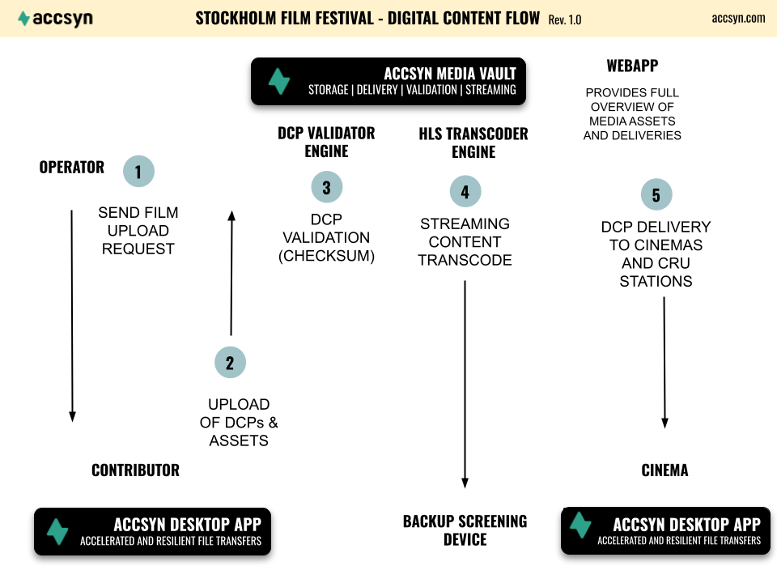
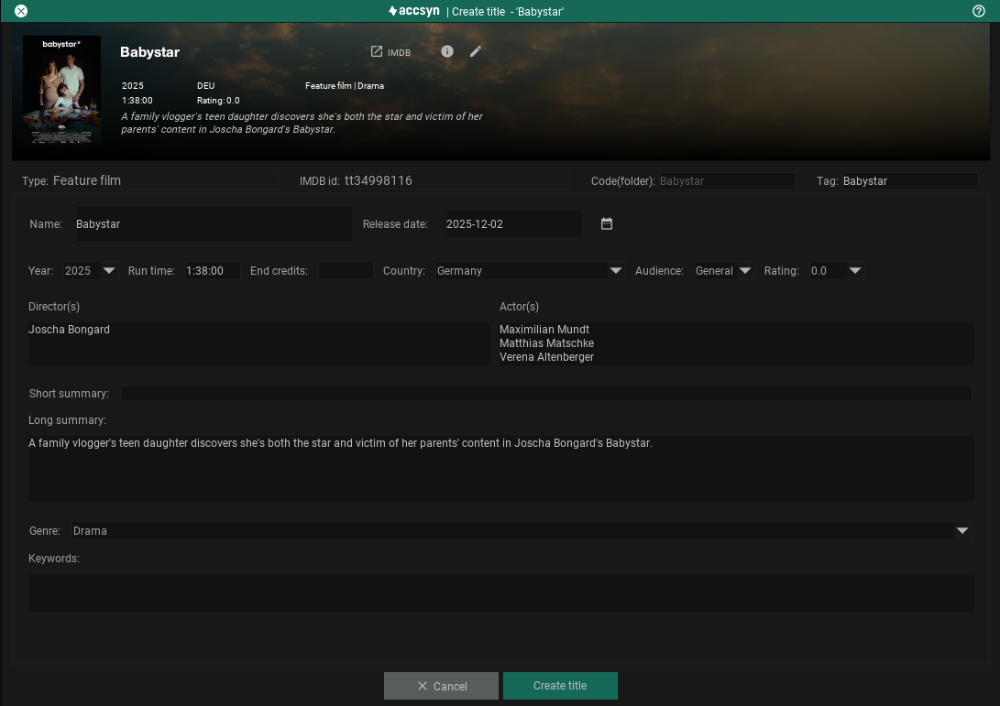
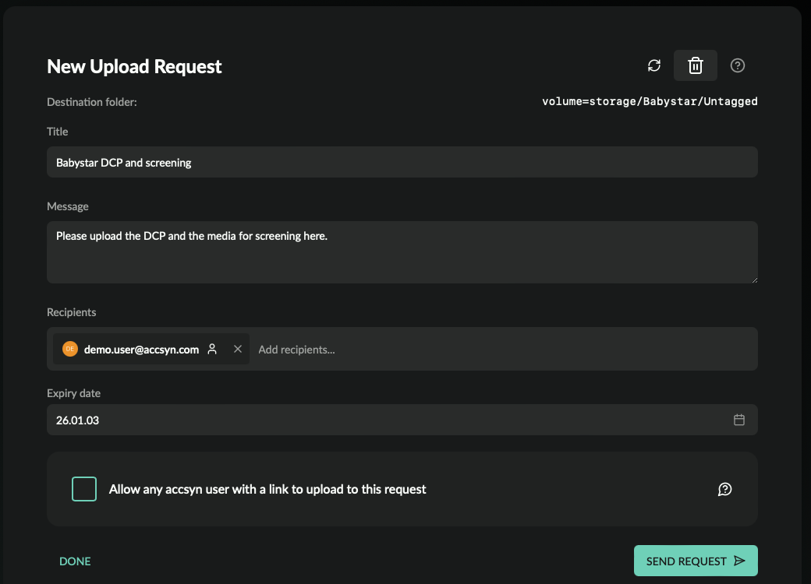
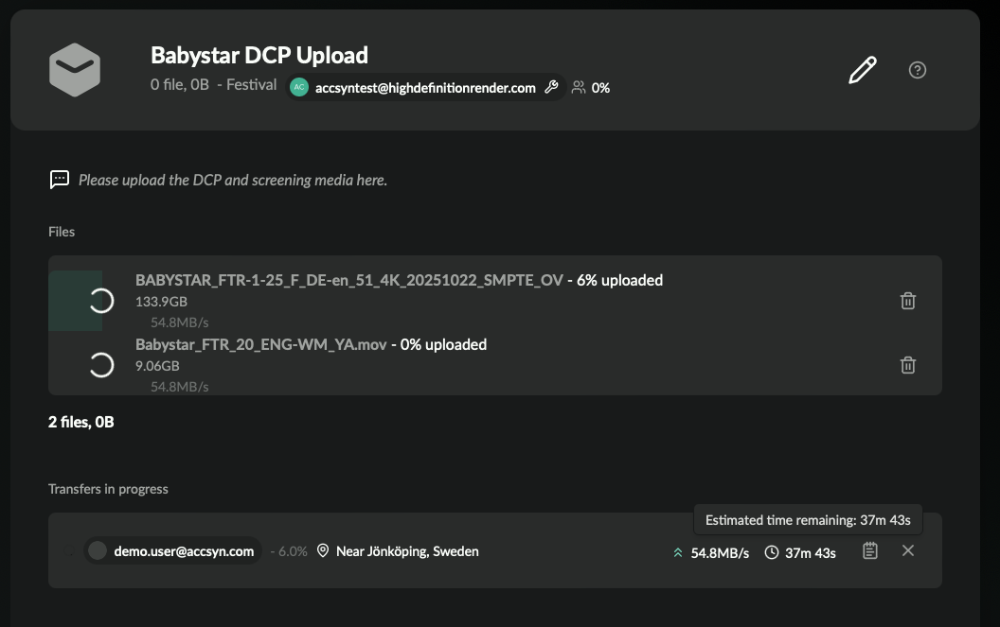
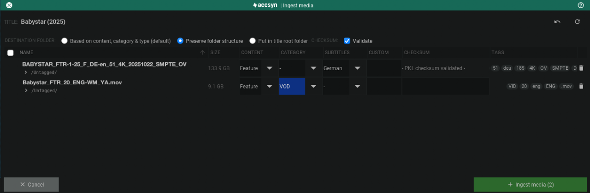
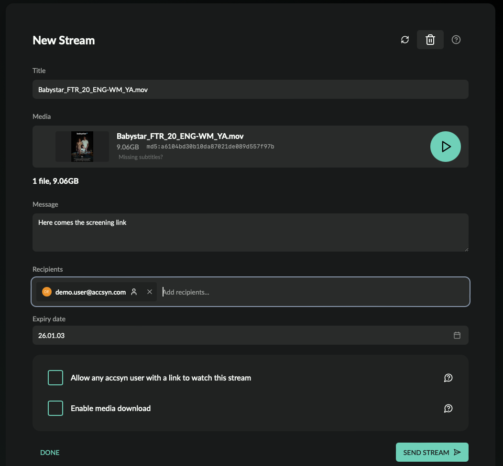

# Tutorial - Film Festival

This tutorial is targeting Cloud Workspaces (Media Vault) and is not applicable for on-prem BYOS workspaces.

## Introduction

This tutorial will walk through how to set up accsyn for acting as the central file transfer and media management platform for a film festival:

- Creating the accsyn workspace.
- Creating a movie title project.
- Requesting upload of contribution from creator.
- Ingesting the material to the title and validating DCP.
- Creating a stream.
- Deliver to cinema.

Example film festival workflow from Stockholm Film Festival.  

*NOTE: Made-up example data is provided in [brackets] throughout this tutorial.*

## Creating your new accsyn workspace

The first step would be to create an accsyn Cloud Workspace, detailed instructions can be found [here](../trial.md):

- Open <https://accsyn.io/trial>.
- You will first be asked to sign up for your personal accsyn account. If you already have one, click Log in link.
- When logged in you will land on the trial page, click Start my free trial button.
- Enter a name for your workspace, typically the name of your film festival or company/organisation [Festival]
- Select Media Vault as the feature you intend to try out primarily.
- Click Create workspace when done, to have your workspace created.

It will take a minute or so for your workspace to be created.

## Create your first movie title

### What is a title?

An accsyn title is a project folder beneath the default cloud storage volume designated to contain one or more media files, with the accsyn Media Vault feature. A title can be linked to an IMDb ID, making deployment easy as accsyn uses an API internally to fetch movie metadata including cover image thumbnail.

  

### Install the accsyn Desktop app

To start managing your festival titles and media, download the accsyn desktop app. Go to <https://accsyn.io/vault> and you will be given download links and clear directions. If you have problems installing or using the app, find more detailed assistance [here](../desktop-app.md).

*NOTE: Currently, the accsyn web app does not support managing media. This is subject to change in the near future.*

  

### Creating a title

- Log on with the accsyn Desktop App as an administrator (or an employee with default storage volume access).
- Go to Titles tab.
- Click New title button in upper right corner, or New title project card in title area.
- Choose the type of media title/project.
- If the title exists on IMDb, copy the URL and paste it beneath the IMDb input. Otherwise choose New title/project - not linked to an IMDb title [https://www.imdb.com/title/tt34998116]
- Click Next.
- [IMDb] A folder name will be suggested based on the IMDb title, adjust as needed. Note that folder name must be unique, and will be created at the root of the default cloud storage volume.
- [Non IMDb] Enter a name of the project folder, try to avoid using non-US letters such as å, ô and so on to maintain compatibility with transcoding software and file systems. The folder can be renamed afterwards. [MyShortFilm]
- Check Apply title template folder structure to have a set of well-defined subfolders created (recommended). Click Next.

- Enter/check the full Name of the movie [Babystar]
- (Optional) Fill in more title metadata as needed, this can be changed at any time.
- Set a title cover image by clicking the Pen icon on the black cover placeholder, ideal aspect ratio is 35:48 (h = w\*1.37)
- (Optional) Set a title banner image by clicking the pen icon on banner image - upper right corner, this image will be displayed in app and on deliveries.
- Click Create title button when all information has been entered.

  

You will be redirected to the title view in app, here you can switch between two main tabs:

- Files; Show file contents within the title folder.
- Media; Show files that have been ingested as media beneath the title.

  

### Explaining accsyn media management

Media in accsyn are files that are ingested into the accsyn Media Vault beneath a title - an internal database in the accsyn platform holding media metadata, proxies and other related information.

*Note: Media cannot exist outside titles - these files must reside beneath a title folder on storage.*

Files that are imported in the media view are always suggested to be ingested. 

Files uploaded in the storage or files view can be kept as raw files, which is suitable during production/asset refinement. An uploaded file can be ingested later into the Media Vault as needed.

## Requesting upload of film festival contribution

Now you want the contributor to upload the movie to you - DCP and Master, here we utilise the accsyn Delivery subsystem and the fast and secure ASC protocol.

### Request upload using the app

- Open the title Babystar in app and go to Files tab
- Go to Untagged folder, this is the default production/upload area in the vault.
- Click Request Upload in toolbar.
- You will be redirected to your web browser to finish up the request.

### Request upload using the browser

- Log on to <https://accsyn.io> as an employee or admin in your web browser.
- Go to Requested in the workspace menu on the left hand side.
- Click New request button
- When asked, choose Upload to folder on accsyn storage.
- Enter the title folder [Babystar]
- Choose the Untagged folder.

### Finishing up the request in browser

- Enter a name for the request [Babystar DCP Upload]
- (Optional) Enter a message for the contributor [Please upload the DCP and screening media here]
- Enter the contributor email address [demo.user@accsyn.com].
- (Optional) Set the expiry date.
- Click Send request to have the user invited to your workspace and have a link with clear upload instructions sent to them.

Go to <https://accsyn.io/requested> to get an overview of your current upload requests, open a request to monitor progress of DCP upload:

## Ingest uploaded media

Once the material is uploaded it is time to ingest it into the vault as media, with metadata extraction and validation. Media in accsyn is simply a file or a folder that denotes final deliverable/archivable media of any kind such as a master, screening media, subtitles or sales material. More information about the media vault feature in accsyn can be found [here](../vault/index.md).

  

At this stage, before ingesting media, you might involve your lab provider if you need to perform additional mastering. Use [File Sharing](../file-sharing/index.md) within accsyn to collaborate with your lab, providing a simple yet effective file transfer workflow similar to FTP.

  

### Ingest DCP

Media can be ingested into the vault at any point, and media can also be removed leaving the files at storage:

- Log on to the app and go to the title [Babystar]
- Go to the Files tab and go to the folder where files were uploaded [Untagged].
- Select the DCP and click Ingest button in the action bar.
- The media logger dialog is brought up and the type (tag) of media and initial tags are identified from the file type and file name. Next you define the main tags:
- Content; What type of content the media is [Feature]
- Category; The category the media belongs to, leave empty for DCP type.
- Subtitles; Define what subtitles this media has, leave empty if there are no subtitles.
- Custom; Define your own tag, used for search/categorising media within the Vault.
- Checksum; Enter the checksum the media has on your end, used during validation.
- Tags; The additional tags identified from filename and file type.
- Destination folder; Where to move media, by default accsyn tries to maintain a standard title file structure based on the content, category and type tags. Have the media stay in the folder by choosing "Preserve folder structure".
- Validate; Have accsyn validate the DCP after ingest, making sure the DCP is not corrupt.

Click Ingest Media in lower right corner to have it ingested and validated.

Go to the Media tab within the title to see it appear and get progress on validation.

  

### Ingest screening master

In the same spirit, you ingest the media for screening:

- Select the QuickTime movie and click Ingest.
- Choose Feature as content and VOD as category.
- If you have a checksum calculated, enter it and accsyn will validate the media after upload making sure that checksum matches.
- Click Ingest Media when you are ready.

An H264 low resolution (1280x720) proxy will be transcoded for preview in the app and the web.

To monitor the proxy transcode / validation progress, go to Jobs at the bottom area of desktop app. You can also monitor the transcode jobs at <https://accsyn.io/jobs>.

  

### DCP validation

When the DCP has been validated, it will show up with a green symbol marked SHA1 which means accsyn has run a validation routine making sure the files within the DCP folder have the correct checksum. If the DCP validation fails, it indicates that either the DCP was corrupt at rest with your contributor or something went wrong during upload.

## Creating a stream

Go through this procedure if you need to stream the title at your festival, either as the main venue or as a complementary backup to cinema DCP playback:

1. Log on to the app and go to the title media tab.
2. Select the VOD QuickTime movie (any movie type media can be streamed, but we recommend you tag screening media with category VOD - e.g. media having the adequate quality/bitrate).
3. Choose Stream in the action bar.
4. Media will be added to the outbox on the right hand side, add more files available for download and then click Next recipients button.
5. The stream will be created and you will be redirected to the web browser to finish it up - enter recipient email addresses.
6. If you want anyone to watch the stream using the link - check Allow any accsyn user with a link to watch this stream.

Click Send stream to send the stream to recipients. In parallel, a streaming proxy (HLS format) will be transcoded in the background and made available to recipients as soon as it has finished transcoding.

  

The recipient will receive an email with a link, which they can open to view the stream in their browser - no additional software needed.

## Deliver to cinema

The final step would be to send the DCP to festival cinemas, again we utilise the Delivery subsystem with the speedy and resilient file transfers provided by accsyn:

### Send DCP using app

- Log on to the desktop app as an employee or admin.
- Go to the title and enter the DCP folder (or Untagged if you chose earlier to preserve folder structure).
- Select the DCP [Babystar]
- Click Deliver in the action bar.
- Add more files if needed, for example you might want to include the streaming media for backup/preview.
- Click Next recipients to finish up the delivery in the browser.

### Send DCP using web browser

- Log on to <https://accsyn.io> as an employee or admin in your web browser.
- Go to Outbound in the workspace menu on the left hand side.
- Click New delivery button.
- Click on the drop area in the middle.
- Choose Browse accsyn storage when asked.
- Select the DCP in Babystar/DCP folder.

### Finish up delivery in the browser

- Enter a name for the delivery [Babystar DCP]
- (Optional) Enter a message to the cinema.
- Enter the cinema operator email address.
- (Optional) Set the expiry date.
- Click Send delivery to have the user invited to your workspace and have a link with clear download instructions sent to them.

  

Monitor the delivery progress at <https://accsyn.io/outbound>, from the delivery page you can send reminders as needed.

## Conclusions

accsyn provides all the tools you need to run your film festival all the way from planning your titles, getting the media sent to you, lab collaboration, streaming and delivery to cinema - all empowered by the resilient accsyn fast file transfer protocol removing a ton of hassle and pain points.

  

Ready to try out accsyn for free? Head over to <https://accsyn.io/trial>.

  

### More resources

[Case study - SFF](https://www.google.com/url?q=https%3A%2F%2Faccsyn.com%2Fcasestudy-sff%2F&sa=D&sntz=1&usg=AOvVaw0hNzDknfmPjXDpvhHB6Kl6)

Learn how Stockholm Film Festival used accsyn as the main platform for managing the contributions.
