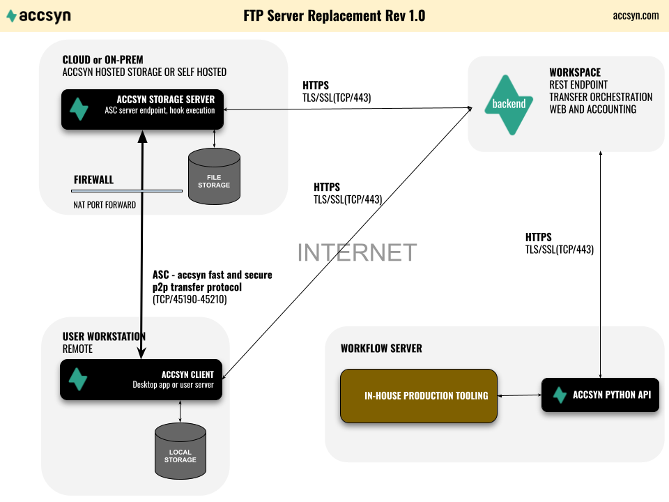

# Tutorial - FTP server replacement

## Introduction

This tutorial goes through how to set up accsyn in a pure File Sharing configuration, either at accsyn default hosted cloud storage or self-serviced on-prem/cloud.

  

### What is FTP?

File Transfer Protocol is a standard file transferring solution dating back to the 70s, and is the default solution for setting up a file server exposed to the Internet for sharing files with collaborators worldwide.

  

### Why replace FTP?

FTP has not evolved in half a century, this means the protocol suffers from performance and security issues:

- By default, FTP transmits file content over a single TCP connection which means very poor performance especially over long distances.
- No built-in encryption means that credentials and file data are sent totally exposed.
- No means of sharing particular subfolders with a group of users, only one account defines permissions.

- No resilience - if transfer gets interrupted in the middle of a large file and/or a huge set of files, transfer would have to be manually resumed where it left off.
- An FTP server listens 24/7 on a well-known port, which means it is constantly vulnerable to intrusion attempts and bots trying to guess logins and passwords.
- Poor auditing, the FTP logs are linear and are virtually impossible to read when it comes to backtracking user activity.

  

### Why choose accsyn as the file transfer solution?

- Transfers go at maximum speed using ASC - the accsyn accelerated file transfer protocol.
- Affordable, no hidden costs or limitations - batteries included.
- Full encryption during transfer (AES128/256) and no passwords need to be set and sent to users.
- No server listening 24/7, accsyn only starts a temporary firewalled server for a brief moment during client connection establishment.
- No need to create accounts and copy files to the account folder, share files in-place and then share securely with the remote user's email address (accsyn account) using ACLs. Even a collection of files spread all over storage can be shared as a virtual shared folder.
- Provides central monitoring, with advanced queue/bandwidth management, that is mobile phone/tablet friendly.
- Never-give-up transfers - resumes where left off when connection is re-established, no need for manual intervention.
- Python API support facilitates programmable file transfers in workflows.

  

### Tutorial overview

This tutorial will cover:

- Starting your trial accsyn workspace.
- Setting up a server on-prem (BYOS).
- The concepts of accsyn File Sharing.
- Inviting another employee that should have full access to a storage volume.
- Quickly share a project folder with a user, being able to write to a subfolder.
- Upload a large file package to the server.

  

*NOTE: Made-up example data is provided in [brackets] throughout this tutorial.*

## Schematics

## Setting up your workspace

The first step is to create your own accsyn Workspace in trial mode, the whole process is described in detail [here](https://sites.google.com/filmhubsoftware.com/help/trial):

1. Open <https://accsyn.io/trial> in your web browser, you will be asked to sign up for your personal accsyn account (email address identifier).
2. Download and log on to the accsyn [Desktop app](../desktop-app.md), the app is used for managing file sharing.

## Setting up your own storage server (BYOS)

*Note: this is for BYOS deployments where you would want to provide your own storage and serve files from your own local or cloud premises.*

We assume you start off from the cloud workspace trial, skip this step if you already have set up an accsyn BYOS workspace:

1. Open <https://accsyn.io/signup> in your browser and go to the BYOS tab.
2. Click Setup BYOS now.
3. You will be guided through the process of setting up your own server, you will be able to choose which network ports to use and the path to the local storage that will be deployed with accsyn.

More detailed information on BYOS workspace setup, can be found [here](../admin/byos/index.md).

## Introduction to accsyn File Sharing

accsyn uses ACLs - Access Control List, on folders to define what kind of access an individual user has. There are two levels/types of folders:

  

- Volume; Also denoted disk or network share, is the root folder and accsyn cannot access files outside this folder. Users with the "administrator" base role automatically have full access to a volume. Users with the "employee" base role can be given read(download) and/or write(upload) access to a volume. Multiple volumes can exist within an accsyn workspace, and they can be mapped to different servers.
- Shared folder; A folder beneath the volume, or the volume itself, to be shared with "standard" role (default) users. Either the entire folder is shared, or a particular sub folder. Administrators and employees own the right to share folders beneath a volume. The Collection is a virtual shared folder containing a set of files picked across the entire volume or even spanning multiple volumes.

  

This definition means that you do not need to move files into a temporary folder just to share it like you would need with an FTP when you create an account folder, instead you can for example share the entire project folder and then use ACLs to only give access to particular subfolders for download and/or upload. More on that below.

  

Throughout this tutorial, we will assume there exists one default volume named "storage".

  

### Delivery

The accsyn Delivery subsystem goes hand-in-hand with File Sharing, and provides means for collecting a set of files and folders to send as a delivery "package" to one or more recipients (Compare to services like WeTransfer®). The recipients get a link that can be opened in the browser where the user can choose to either download in browser (single files, folders ZIP:ed if not too large) or install and launch the accsyn desktop app to download the packages.

accsyn Delivery also supports upload requests - a link sent to a user where they are instructed to upload files and/or folders to your storage.

Find more information about the accsyn Delivery feature [here](../delivery/index.md).

## Inviting an employee to your volume

*Note: Skip this step if you intend to share files using your existing administrator account and have no need to invite a second operator to your workspace.*

  

1. Log on as an administrator to <https://accsyn.io/admin/users>.
2. Click Invite user.
3. Choose employee role.
4. Select the volume or volumes you want to grant access to.
5. (Optional) Create a home share - give the user a private "home" folder where they can store files.
6. (Optional) Enter a personal message to the user.
7. Click Invite button to create user and send an invitation link to user with clear instructions on how to sign up their personal accsyn account and access the volume.

## Share a project folder with users

In this example we assume we have a project called proj001 in the folder \_PROJECTS on your default accsyn storage volume that needs to be shared with an external collaborator - source material they should download in the "source" subfolder and then have them upload their contribution to the "FROM\_VENDOR" subfolder.

  

### Example folder structure

In this tutorial we assume the accsyn default storage volume has this folder structure:

\_TOOLS

\_PROJECTS

proj001    <= The shared project folder

      \_ADMIN

source<= The subfolder user can download from, not upload

     FROM\_VENDOR

monique<= The subfolder where user can upload to

\_LIBRARY

  

### Creating the shared project folder

Login to the desktop app as an administrator or an employee having read & write access to the volume:

1. Go to the Storage tab in app, for cloud workspaces it is located in the Vault view.
2. On the left hand side, choose your volume [storage].
3. Browse into the proj001 folder.
4. In the action bar, choose Share > Share folder. The create share dialog will open.
5. Give the shared folder a name [proj001].
6. Click Create to have share created.

  

*Note: if you want to share the entire project folder with a user, you can also grant access directly from the share dialog as needed.*

  

### Sharing the source folder

Next we want to give the remote vendor "monique" access to the source folder:

1. Go to the "proj001" shared folder by clicking it in the list on the left hand side.
2. Browse into the "source" folder.
3. Click Grant access to source button on the right hand side.
4. Either select an existing user or enter their email address at Invite new user [io@monique-post.nl]
5. Choose Read permission, but leave Write unchecked so they only can download.
6. (Optional) Give them a friendly notification message with further instructions.
7. Click Grant access button to create ACL and send them an email with clear instructions on how to create the personal accsyn account and get going with downloading files.

  

### Sharing the upload folder

Finally we give the user access to upload files back to the project folder:

1. Go to the "proj001" shared folder by clicking it in the list on the left hand side.
2. Browse down into/create the "FROM\_VENDOR/monique" folder.
3. Click Grant access to source button on the right hand side.
4. Choose existing user [[io@monique-post.nl](mailto:io@monique-post.nl)]
5. Choose both Read and Write permissions.
6. Click Grant access button to create ACL and send them an email with clear instructions on how to create the personal accsyn account and get going with downloading files.

  

### What will the user see?

When they log on to the desktop app, they will get notifications about the two shared folders. In their file browser they will see "proj001" as a shared folder, with only the "source" and "FROM\_VENDOR" folders visible.

They will be able to only download from the source folder, and only see the "monique" folder beneath FROM\_VENDOR where they can upload files.

## Conclusions

accsyn File Sharing provides a solid solution enabling hassle-free sharing of folders on your production or staging storage, either in the cloud or on-prem. By having users create and use their own personal accsyn account, and with ACLs sharing files in place - there is no longer a need to create separate accounts, move files there and then have passwords generated and floating around in different insecure channels. Users choose their own strong password, with optional MFA, and they can even login with Google when applicable.
