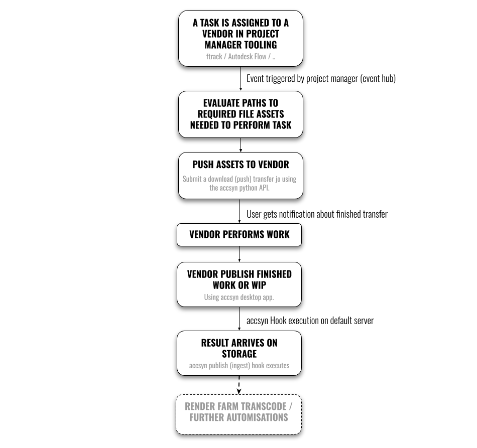
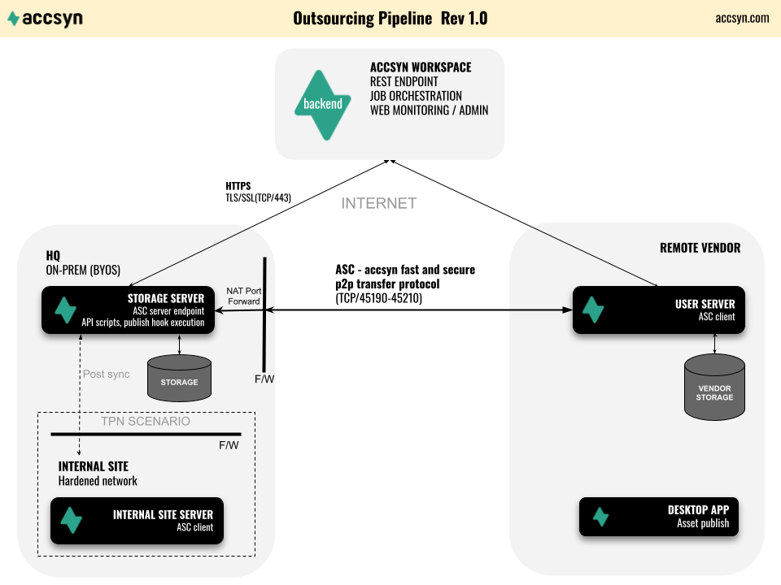

# Tutorial - Outsourcing Pipeline

Note: This tutorial is for on-prem BYOS deployments of accsyn, please reach out to support if you need corresponding functionality with your cloud hosted workspace.

Contents:

[Introduction](outsourcing-pipeline.md)

[Why automate outsourcing?](outsourcing-pipeline.md)

[Why choose accsyn as the solution?](outsourcing-pipeline.md)

[Tutorial overview](outsourcing-pipeline.md)

[Workflow](outsourcing-pipeline.md)

[Schematics](outsourcing-pipeline.md)

[Setting up your workspace](outsourcing-pipeline.md)

[Installing the user remote server at vendor](outsourcing-pipeline.md)

[Send work files and send to vendor](outsourcing-pipeline.md)

[Manual sync of work file assets](outsourcing-pipeline.md)

[Share project folders](outsourcing-pipeline.md)

[Automated API sync of work file assets](outsourcing-pipeline.md)

[Configuring vendor asset publish](outsourcing-pipeline.md)

[What is accsyn Publish?](outsourcing-pipeline.md)

[Implementing the publish scripts](outsourcing-pipeline.md)

[Conclusions](outsourcing-pipeline.md)

[Additional resources](outsourcing-pipeline.md)

## Introduction

This tutorial walks through how to set up accsyn for automated delivery of work material to a remote vendor, 

and ingest of produced asset(s) back into a media production pipeline, without any manual file transfer labour back and forth.

  
  

### Why automate outsourcing?

- Collecting and sending a work file package manually is time-consuming and error-prone.
- The receiving end needs to manually receive the material and unpack it, which can be a challenge when in different time zones.
- When the work has been done, the vendor has no way of telling that their result aligns with your internal asset specifications.
- The assets uploaded must be manually unpacked, transferred into the production storage, validated and then ingested into the production pipeline (e.g. ftrack Publish / Autodesk Flow / frame IO uploads).

In short, providing an automated outsourcing pipeline saves a vast amount of time and leaves your staff to do creative work instead of file wrangling - invaluable when on tight deadlines and when vendors are in different time zones.

  

### Why choose accsyn as the solution?

- Can easily be set up to provide a turnkey solution facilitating a fully automated and streamlined outsourcing pipeline.
- Python API support facilitates programmable file transfers in workflows.
- Affordable, no hidden costs or limitations - comes with batteries included.
- Transfers go at maximum speed using ASC - the accsyn accelerated file transfer protocol.
- Full encryption during transfer (AES128/256) and no passwords need to be set and sent to users.
- No server listening 24/7, accsyn only starts a temporary firewalled server for a brief moment during client connection establishment.
- No need to share/expose any on-prem data, have your scripts carefully collect and send exactly what the remote vendor should need to perform their work.
- Provides central monitoring, with advanced queue/bandwidth management, that is mobile phone/tablet friendly.
- Never-give-up transfers - resumes where left off when connection is re-established, no need for manual intervention.

  

### Tutorial overview

This tutorial will cover:

- Starting your trial accsyn workspace.
- Setting up a server on-prem (BYOS).
- Set up a user server and map the storage volume at the vendor.
- The concepts of API-driven file transfers.
- How to build an outsourcing script that collects and delivers a work package to the vendor.
- Configure a publishing pipeline that validates and ingests the finished assets produced by the vendor.

  

NOTE: Made-up example data is provided in [brackets] throughout this tutorial.

## Workflow

## Schematics

The schematics visualise two different scenarios:

- Standard setup - expose production storage; In this setup you install accsyn and expose your main production area, no need to further sync assets to and from this server.
- TPN hardened setup; For those scenarios where production servers cannot be exposed to the Internet through a port forward, the storage server and accsyn "HQ"(main) is installed in a DMZ locally or in the cloud and with additional asset pre/post sync to an internal site server on the hardened internal production network.

  

In this tutorial, we assume the following:

- The company and workspace name is "Acme VFX" (API code: acmevfx, API workspace endpoint: https://acmevfx.accsyn.com).
- A Linux storage server configured with an accsyn volume named "proj", having project "Something Completely Different" located at /mnt/proj/scd.
- An active workspace admin (or employee user with access to proj volume) user: "pipeline@acmevfx.co.uk". Script API sessions will run as this user.
- The project SCD has a shot with a cleanup task, with conformed source plates in the folder "scd\_0010\_0010\_src" located at /mnt/proj/scd/0010/0010/src/plates.
- ftrack is used as the project management tool, holding all information about colourspace, delivery format, handles and so on. This could be any database such as Excel sheets, Autodesk Flow or even text/markup files on disk.
- The remote vendor "Compers Inc" has a Windows file server where work files should be downloaded and performed on the share "clients" on "server", subfolder AcmeVFX.
- At the remote vendor, the coordinator user email is "emma@compersinc.com".
- The asset produced by the vendor should be transferred back to /mnt/proj/\_VENDORS/CompersInc/FROM\_CLIENT.

## Setting up your workspace

The first step is to create your own accsyn workspace trial, the whole process is described in detail [here](https://sites.google.com/filmhubsoftware.com/help/trial):

1. Open <https://accsyn.io/trial> in your web browser, you will be asked to sign up for your personal accsyn account (email address identifier).
2. Create a BYOS Workspace.
3. The BYOS setup wizard will be initiated, it will guide you through the process of setting up and configuring your on-prem server and storage - "Storage server" and "Storage" in the schematics above. [Storage volume configured at /mnt/proj]
4. Conclude the BYOS setup wizard, you now have a fully working accsyn workspace where you can start sending deliveries and share folders (FTP replacement) - all backed by the high speed ASC transfer protocol.

## Installing the user remote server at vendor

Next, we need to have the vendor setup an accsyn "user server" - an instance of the accsyn file transfer client running unattended 24/7. This enables us to push material to the vendor without them needing to manually choose where to download and store the files. Also it enables the vendor to expose their local storage, enabling you to pull missing material as needed.

  

Start by inviting the remote vendor account:

1. Log on as an administrator, or an employee with full access to volume [proj], to <https://accsyn.io/admin/users> in your browser and click INVITE USER.
2. Enter the email address of the vendor [emma@compersinc.com] and choose standard user role.
3. (Optional but recommended) Check Create home share to provide user base access to your workspace. The home share folder is also a neat fallback to have in case the vendor needs to upload something manually, or you need to share something quickly.
4. The user will get an invitation email, with instructions on how to activate their personal accsyn account.

  

Send these vendor instructions on how to install the accsyn user server:

1. Ask them to register the personal accsyn account and then log on to <https://accsyn.io/hosts>.
2. Go to "Daemon instances" and click INSTALL DAEMON.
3. Allocate a server machine, or workstation computer, that is powered on 24/7 with full access to the local storage and can act as the file transfer endpoint [Windows server].
4. Download the installer and install the accsyn daemon, enter the code presented in web browser when asked. Remember to configure the system user to run the accsyn daemon process as, the user needs to have full read and write access to the mapped share folder [\\server\clients\AcmeVFX]. There is no need to enter a "Delivery download path" when asked.
5. The daemon instance should appear shortly at the "Daemon instances". At "Workspace user servers", click "NEW" button.
6. Select workspace [Acme VFX] and click "Install accsyn user server for workspace 'Acme VFX'".
7. After a minute or so, the user server for your workspace should appear beneath the host.

  

More detailed information on how to set up a host & user server [here](../admin/hosts.md).

As a final step, we want to define the path at the vendor where all deliveries should be stored - with mirrored (preserved) folder structure.  

In this tutorial, we assume the vendor has a Windows file server named server, with a share clients and a designated folder AcmeVFX for I/O.

Send these additional instructions to the vendor for setting up a mapped share:

1. Shut down the accsyn daemon service on the Windows server.
2. Edit system environment variables and set variable "ACCSYN\_PROJ\_PATH" to "\\server\clients\AcmeVFX". Note: "PROJ" element must align with the unique volume code attribute.
3. Start the accsyn daemon again.
4. Launch and log on to the accsyn desktop app, on the same server machine, as the vendor [emma@compersinc.com].
5. Open Settings dialog by clicking the user account button in upper right corner.
6. Go to Share Mappings.
7. There should now be a new entry named "proj", check "Read" and "Write" boxes. This will enable Acme VFX operators to push files to, and pull files from, the local mapped storage folder @ \\server\clients\AcmeVFX.

Note: "PROJ" element in the environment variable definition must match the API code attribute on the default accsyn volume.

## Send work files and send to vendor

We now have a working sync setup, where assets can be transferred back and forth using high speed file transfers over the home share created earlier.

Because we have mapped the accsyn volume proj at vendor, and the vendor has granted read and write access, we are able to push material directly with folder structure intact. 

We will walk through three different approaches:

  

### Manual sync of work file assets

Here we simply use the accsyn Desktop app to push assets to the vendor manually:

1. Launch and log on to the accsyn Desktop app as an administrator, or an employee with read access to the (default) volume.
2. Go to the Transfer view/tab.
3. On the left hand side, choose your workspace and browse to the folder containing the asset to push.
4. On the right hand side, a user server entry should be available for the vendor [emma@compersinc.com].
5. Select the file/files to transfer, accsyn should suggest to mirror the paths at receiving end.
6. Click the green submit button in the middle to start pushing file(s) to the user.

  

Notes: 

- The same procedure applies for pulling file(s) from the remote vendor's locally mapped volume - transfer from the vendor to your workspace (upload).
- In case accsyn Publish is not to be used, remember to create a home share for the vendor so they possess means of uploading the final result back.

  

### Share project folders

This approach puts the labour on the remote vendor, to download work assets themselves. For this we use standard accsyn file folder sharing and grant access to relevant subfolders:

1. Launch and log on to the accsyn Desktop app as an administrator, or an employee with read access to the (default) volume.
2. Go to the Storage view.
3. Browse to the project folder on storage.
4. Create a shared folder on the project folder, ready to be shared with users. Name it the same as the project [scd]
5. Go to the newly shared folder in the left hand side share browser.
6. In this example, the user needs to download the source plates for scene 1, shot 1 - browse down to the folder [0010/0010/src]
7. On the right hand side, click Grant access button.
8. Choose the vendor user account [emma@compersinc.com]
9. Give read (download) access and then apply the permission.

The user will get a notification by email on how to use the app to download the source material themselves. 

Note: In case accsyn Publish is not to be used and no Home share is created for the vendor, grant access to an output folder beneath the project where the user can upload the final work done [scd/\_VENDORS/compersinc] (remember to also give write access otherwise they will not be able to upload)

  

### Automated API sync of work file assets

In this tutorial we will focus on API driven automated transfers, controlled from within the project management tooling [ftrack].

  

1. Create the vendor user in ftrack [emma@compersinc.com].
2. Create a task on shot 0010 named cleanup and assign the vendor to it.
3. Craft a ftrack action script named "Outsource", for detailed information see [ftrack Actions Documentation](https://www.ftrack.com/en/actions).
4. Design the script to operate on one or more selected tasks, have it produce a list of file asset paths relative to the proj volume that should be sent to the remote vendor.
5. Generate work description (notes) and technical metadata (colourspace, frame range, handles etc) to a file named scd\_0010\_0010\_cleanup\_description.txt.

  

We are not going into detail on how to implement the ftrack logic of this script, it is fairly simple to derive from the official [ftrack Python API Documentation](https://help.ftrack-studio.backlight.co/hc/en-us/articles/13129838282519-Getting-Started-with-API).

With the list of relative file paths at hand, use the accsyn Python API to create a daily sync job that pushes the files to the vendor. For detailed information about the accsyn Python API:

[accsyn Python API Documentation](https://www.google.com/url?q=https%3A%2F%2Faccsyn-python-api.readthedocs.io%2F&sa=D&sntz=1&usg=AOvVaw05k5tY40Ah3v6XBNmxX2mb)

Boilerplate code:

  

# Install accsyn python API

>pip install accsyn-python-api

  

# (Inside ftrack action script)

<code to collect/generate outsourcing file assets>

  

# Assume the list of file paths calculated from ftrack are generated and stored in the variable source\_files:

source\_files = ["scd/0010/0010/src/plates/scd\_0010\_0010\_src", "scd/0010/0010/cleanup/scd\_0010\_0010\_cleanup\_description.txt"]

# Import and create the accsyn session object

# It requires the following environment variables set:

# ACCSYN\_WORKSPACE=acmevfx

# ACCSYN\_API\_USER=pipeline@acmevfx.co.uk

# ACCSYN\_API\_KEY=...

# Note: Create a new API key @ <https://accsyn.io/developer>

import accsyn\_api

session = accsyn\_api.Session()

  

# Assume vendor name is already looked up by task assignee and defined. Also assume project name has been evaluated

vendor\_name = "CompersInc"

project\_name = "scd"

  

# Generate sync job name, optimal is to have on per project, vendor and day.

job\_name = f"Outsource - download - {project\_name} - {vendor\_name} - {datetime.now.strftime('%y%m%d')}"

  

# Build accsyn sync transfer tasks

tasks = []

for path\_rel in source\_files:

    tasks.append(dict(

        source=f"volume=proj/{path\_rel}",

        destination="emma@compersinc.com"

    ))   

  

# Locate daily sync transfer:

job = session.find(f'Transfer where name="{job\_name}"')

  

# Create or append to existing job

if not job:

    job = session.create("Transfer", dict(

        tasks=tasks,

        mirror\_paths=True

    ))

else:

    # Append tasks to existing sync job, will resume/retry finished job and retry(resend) existing duplicate tasks

    tasks = session.create("Task", tasks, entityid=job['id'], allow\_duplicates=True)

# (Optional) End script with feedback to ftrack web UI session that outsource transfer were dispatched, providing job['name']/job['id'] for reference

  

The transfer job will be queued with the rest of the jobs. 

  

Note: if multiple jobs (projects, or previous day) jobs are active, operators can use the powerful accsyn queue mechanism to prioritise between sync jobs. Even within a sync job, tasks can be prioritised, enabling transfer of certain shots before others.

## Configuring vendor asset publish

We now have the pipeline ready for sending material, the final part of the pipeline is the receiving endpoint enabling the vendor to publish produced assets back into the production workflow.

  

### What is accsyn Publish?

It is a variant of the standard accsyn desktop app upload mechanism, designed to pre-validate material before uploading. In addition to that, it supports defining where to upload the assets (without necessarily sharing the folder and granting ACL access), time report, notes taking, status and guidelines in-app.

  

The publish mechanism is driven by two scripts:

- Pre-publish script; Receives the path to a JSON file where remote user dropped folders are provided as-is, with directory tree and metadata such as size and date. The pre-publish script should provide per-asset feedback to the user in case there are any inconsistencies, or the upload destination path if validated. It also provides what fields user should input (time report, notes and status are supported) and additional optional outsource guidelines.
- Publish script; This script is run after the upload has finished, with path to the same data generated by the pre-publish script for reference. The publish script is designed to provide additional processing after the files have landed, this is typically proxy (JPEG/MP4/MOV) generation and publish to project management tools [ftrack] including the metadata (notes, time report and status) provided by the remote vendor.

  

Usually, it is implemented as a single script as their logic is very much the same but separated by a command line argument like "--pre" or similar.

  

We recommend designing a pipeline where the remote vendor publishes one folder per task, named as the task. Example:

  

scd\_0010\_0010\_cleanup\_v001

scd\_0010\_0020\_rotoscoping\_v003

..

  

And then let each folder contain all the file sequences, geometry, documents etc that constitute the final result.

  
  

### Implementing the publish scripts

We are not going into great detail on how to design the publish script, for detailed information on how to create the scripts with examples, check out:

[Developer Hub - Publish](../developer/publish.md)

The documentation provides links to our Github where template publish scripts can be downloaded. The scripts contain clear pointers on where to integrate into a production management tool like ftrack, for validating asset names against tasks and creating a version upload with a reviewable and notes/time report.

## Conclusions

accsyn provides a versatile API-enabled file I/O platform, easy to integrate into an existing production workflow, with proper user interfaces both for desktop and web. This tutorial only shows a small subset of what accsyn can provide in terms of media production automation.

### Additional resources

[Case study: Filmgate VFX](https://www.google.com/url?q=https%3A%2F%2Faccsyn.com%2Fcasestudy-filmgate%2F&sa=D&sntz=1&usg=AOvVaw3bnYjgBQU-EoOKdyqsFRyq)

Learn how Filmgate Films use accsyn within their VFX pipeline for conform, data wrangling, outsourcing and rendering.

[accsyn Python API on Github](https://www.google.com/url?q=https%3A%2F%2Fgithub.com%2Faccsyn%2Faccsyn-python-api&sa=D&sntz=1&usg=AOvVaw2ZBwcEBZZrND8mclEA7jK4)

Download the accsyn Python API source code from Github.
