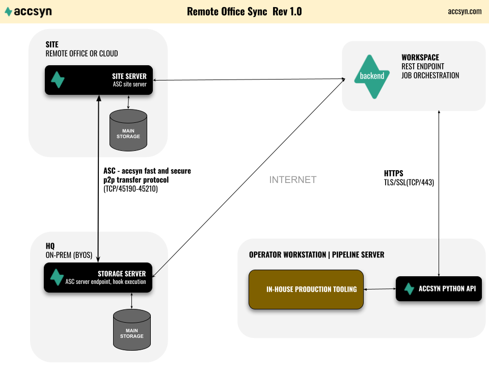

# Tutorial - Remote office sync

Contents:

[Introduction](remote-office-sync.md)

[Schematics](remote-office-sync.md)

[Prerequisites](remote-office-sync.md)

[Setting up site](remote-office-sync.md)

[Manual Sync](remote-office-sync.md)

[Setting up project queues](remote-office-sync.md)

[Manual queue creation](remote-office-sync.md)

[Create queue using API](remote-office-sync.md)

[Setting up volume](remote-office-sync.md)

[Developing](remote-office-sync.md)

[In-house tool plugin development](remote-office-sync.md)

[accsyn sync script](remote-office-sync.md)

[Further resources](remote-office-sync.md)

## Introduction

This tutorial describes how to set up manual or API-driven sync of file assets between main premises (hq) and a remote site - a common scenario in film post production for distributed organisations:

- The main storage on main premises (hq) holds source production assets.
- Each project has a fixed templated folder structure, enabling automation.
- Work is going to be performed on a selected subset (e.g. shots) at the remote office (site).
- An operator (employee) should be able to push (download) the required file assets to the site, from within their in-house production tool.
- Each project should have its own queue, to be able to prioritise transfers on a per-project basis.
- The operator should get an email notification when all assets are synced.

  

The tutorial will walk through:

- Setting up your workspace and sites.
- Setting up project queues and volume.
- The sync script (Python) that triggers a download to site / upload from site on a per-project sync context.

  

NOTE: Made-up example data is provided in [brackets] throughout this tutorial.

## Schematics

## Prerequisites

- An active BYOS workspace or an ongoing BYOS trial. Example workspace code/API domain for this tutorial: [acmepost].
- At least one active storage and one active site server license.
- An elevated admin accsyn account for setting up the site [admin@acmepost.com]
- An employee account for the operator initiating the sync [coordinator@acmepost.com]
- A valid API key for the operator, see [Python API documentation](../developer/python-api.md) for instructions on how to create one.

  

Hint: find out your workspace API code identifier @ <https://accsyn.io/admin/settings> >"General" tab.

## Setting up site

We are not going into great detail on how to set up remote sites with accsyn, this is well covered in the [site documentation](../admin/byos/site.md):

1. Create the site @ <https://accsyn.io/admin/sites/new> that will represent the remote office in accsyn [london]
2. Install a server on the site @ <https://accsyn.io/admin/servers/new>, acting as the endpoint for all p2p ASC file transfer between the main hq site and the office.
3. Edit the accsyn storage volume to be served at the site by the new server, provide a custom volume path in case storage is not mounted at the same path at site as it is at hq.
4. Test that you can transfer files to site, by logging on to the accsyn Desktop app and transferring a file from hq to site.

  

You are now all set to start using the API to push files.

## Manual Sync

With a site active, you can now start syncing files between your main location (hq/accsyn cloud) and your site.

  

Download and run the accsyn desktop app:

[Get the accsyn Desktop app](https://www.google.com/url?q=https%3A%2F%2Faccsyn.io%2Fgetapp&sa=D&sntz=1&usg=AOvVaw347DVoq0Wwbl4tjIp_nP7D)

Here is an example of how to download a folder from central hq/accsyn location, to your remote site:

1. Log on to the desktop app with an administrator account, or with an employee having read and write access to the volume.
2. Click on the TRANSFER tab in the app top menu.
3. On the left hand source side (From), choose your main location - Workspace (hq or accsyn cloud).
4. On the right hand destination side (To), choose your site.
5. Browse and select the file(s) and/or folders(s) to transfer on left hand side.
6. On the right hand side, either choose "Mirror paths" option or "Browse". Mirror paths will transfer the files with paths intact, mirroring them to the destination. With browse, you can choose the download location yourself.
7. Click the green middle arrow button to launch the sync transfer.
8. Monitor the transfer in the bottom MY JOBS or TRANSFER tabs.

## Setting up project queues

Note: You can skip this step if you do not need project queues - all sync jobs will run in the default (Medium prio) queue.

### Manual queue creation

1. Create a queue for the project @ <https://accsyn.io/admin/queues/new> [proj001]
2. Repeat this for all projects you wish to enable sync for.

### Create queue using API

Queues can also be created using the API, suitable for integrating accsyn into an internal project creation tool:

queue = session.create("job", {"type":2,"code":"proj001"})

## Setting up volume

In this tutorial, we assume you have your project data stored on a NAS on a share and this share is mapped/served as the volume "projects" in accsyn. To verify your storage configuration, head over to <https://accsyn.io/admin/volumes>.

  

Further on, we assume projects are located directly within the root of that folder, and the file assets to be synced for each shot are located in a scans folder like this:

projects/

    proj001/

        sc0010/

            sh0010/

               scans/

               published/

               ..

            sh0020/

                scans/

published/

            ..

        ..

    proj002/

  

As an alternative, to provide more granular project permissions and enhanced security, you can setup a volume for each project. This way you can control which project(s) each operator can work with.

## Developing

### In-house tool plugin development

In this tutorial, we assume you have an in-house project management tool such as ftrack or Autodesk Flow, where you have projects and shots.

We are not going to cover how to implement this task, as it varies a lot depending on the tool, but here is a rough guideline:

1. Write a plugin within the tool that operators can run on one or more selected shots.
2. Have the plugin resolve the relative path/paths for each selected shot, and provide it as a list [proj001/sc0010/sh0010/scans] together with the site that user selects.
3. Have the plugin call the download sync script below, or if it is a Python based tool that is compatible with the accsyn Python API - implement the sync script below directly within your tool/plugin.

  

### accsyn sync script

This is the script that does the heavy lifting, and is either implemented directly as a module within the tool above by extracting the 'site\_sync' function or executed as a standalone CLI tool in the shell - suitable if the in-house tool is not written in Python / cannot use the accsyn Python API directly.

Prepare the local script environment so the API can authenticate with the accsyn backend, we recommend setting the ACCSYN\_API\_USER and ACCSYN\_API\_KEY environment variables locally on the machine, or store it locally in a hidden file. Hard-coding the API key in your Python script and then pushing it to Github can be a security hazard and is strongly discouraged.

Here is a working example CLI implementation of the sync script, that takes that list of shot assets as arguments and downloads the files using the fast and secure ASC protocol to the site - (code is available on Github, see resources below):

Breakdown of the script:

  

1. Command line arguments are read and passed on the site\_sync function.
2. The accsyn API session object is created.
3. The share, queue and site entities are loaded from accsyn and verified.
4. The list of tasks is built, with paths mirrored on the destination end.
5. The script submits and re-uses one sync job, for each project and direction (download/upload) each day. This gives a good balance when it comes to amount of jobs within a project queue and the amount of tasks (files) within each job, making it easy to manage at a later stage.

  

Note: this is just a sample script - modify as you see fit within your production environment.

## Further resources

[Source code](https://www.google.com/url?q=https%3A%2F%2Fgithub.com%2Faccsyn%2Fremote-office-sync&sa=D&sntz=1&usg=AOvVaw1WF_udRmS3T7SMnXaMs25k)

View and download the source code on Github

[Python API](../developer/python-api.md)

accsyn Python API support main page.

[Site admin](../admin/byos/site.md)

accsyn site management documentation.
