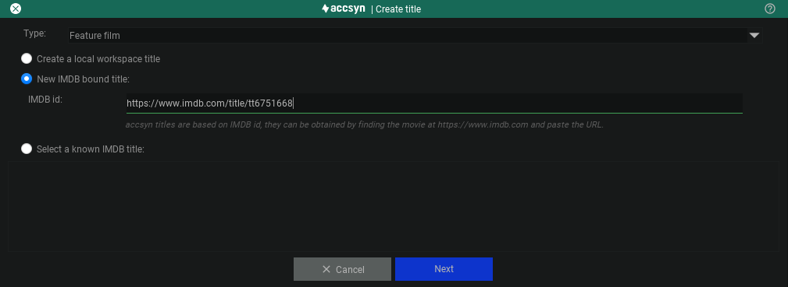
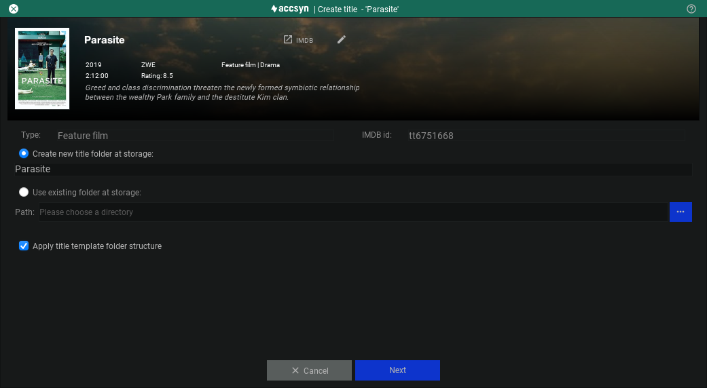
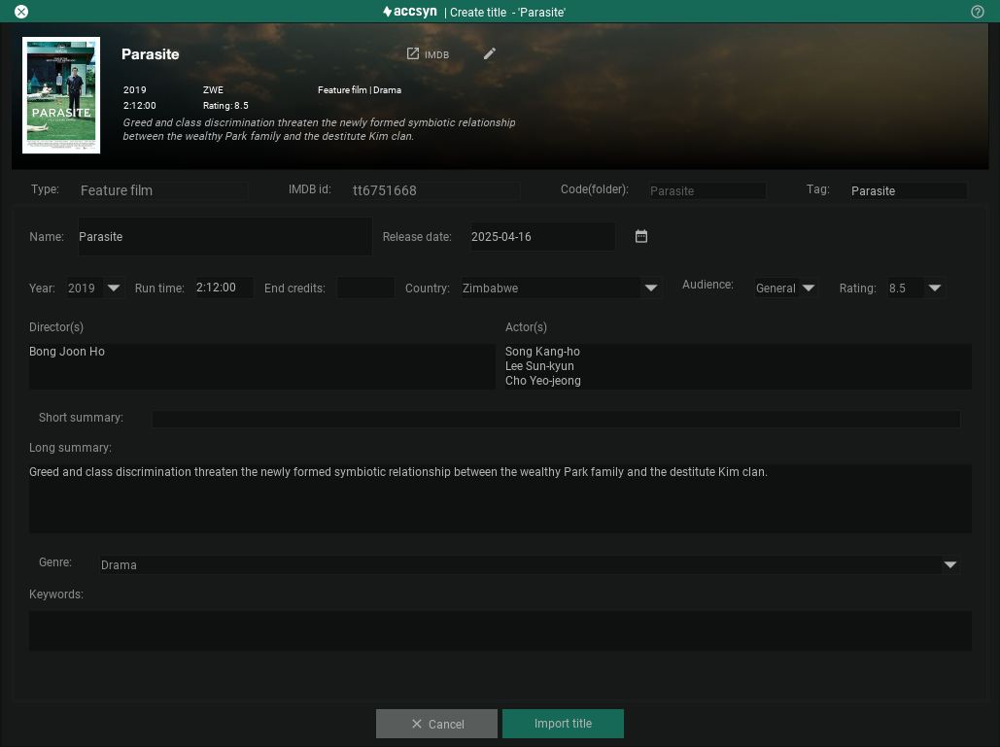

# Create a title

Getting started creating your first accsyn title / project and uploading media to accsyn.

### Preparations

- To manage your Media Vault, you will first need to [install the accsyn Desktop App](../desktop-app.md).
- Launch the app
- Login as a user having the administrator or employee role.

  

*Note: Make sure you are not on a BYOS workspace, as the Media Vault feature is not available in that configuration.*

## Create title

1. Go to the VAULT tab in accsyn app, it should display empty.
2. Click on the empty New title or project card or NEW TITLE button in the toolbar:

### Type

Select the type of movie, this controls if it can be an IMDb title or not.

  

Create a local workspace title

This title is not bound to an IMDb title, typically a corporate media title or other generic media project.

New IMDb bound title

Enter the URL from IMDb or just the ID [tt6751668]. accsyn will try to connect to the OMDB API and fetch title metadata, sometimes titles do not exist in OMDB and the title will have to be created as a local workspace title.

Select an existing accsyn title

Browse and select a title already added by another user within the accsyn platform.

  

Check if the title is already known to accsyn, e.g. it has been created previously in the platform. If so choose it beneath Select an existing accsyn title.

3.   Click Next, the cover image should be downloaded and presented, you can change it by clicking the pencil icon on the cover image. Here you can also set a banner image - prepare a jpeg with 9:1 proportions (optimal) and set it by clicking the pencil symbol in the upper right corner.

4. Now you need to decide which folder to create the title in, it will suggest to name it the same as the title. You can also browse and put it in an existing pre-created folder. Check Apply title template folder structure to have accsyn create some standard category folders (see below).

5.   Click Next to bring up the title editor, here you can enter additional title attributes as needed, or finalise it later by editing the title. Note that many of these fields are required to be present if the accsyn Exporters are going to function properly. See below for a detailed description of the different attributes.

Example screenshot of title creation in accsyn.

6.   Click Create title / Import title to create the title at your workspace and deploy the folder structure. If it is a title unknown to accsyn, it will also be created centrally in the platform.

Title attributes:

Any attributes you feel are missing? Reach out to us and we will add them.

A standard title sub-folder structure can be chosen to be deployed when a new title is created, making it easy to get started organising your media deliverables:

- Here is where DCP masters are uploaded.

- Here is where feature length masters are uploaded.

- Here is where you transcode or upload VOD deliverables.

- Here is where subtitles go, associated with masters by type, content and category tags.

- Folder for sound mixes.

- Pictures are uploaded here, extracted still images are stored here.

- Other video material goes here.

- Here is where you upload marketing material related to the title.

- Here is where trailer masters are uploaded.

- Here is where you upload your title media for ingestion into accsyn later. Within this folder you are free to choose whatever structure that suits you.

If these folders are not created now, they will be created when uploading files in the media view - based on type, content and category tag selection.

You are now ready to start [uploading and tagging your first media](log-media.md)!

## Related articles

[Media Vault introduction](index.md)
