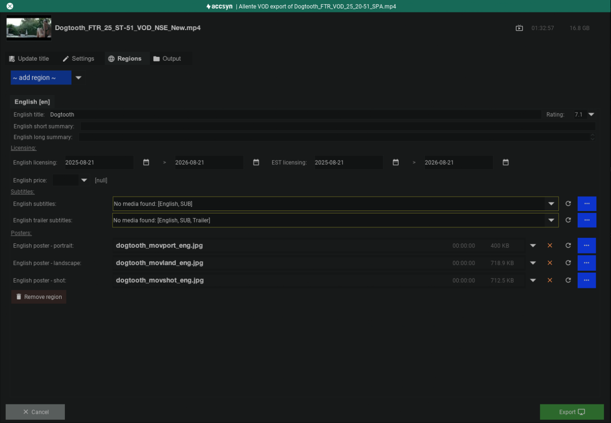

# Export

The media exporter is designed to package video together with subtitles and other data, to provide a package that can be imported by VOD streaming services.

  

Currently these platforms are supported natively in the platform:

- Allente

  

Refer to the [accsyn Lab](media-lab.md) for exporting to other popular platforms.

  

## Allente

  

1. Start by transcoding the VOD media, this can be done from a high resolution master using the [Processor](process.md) tooling. Recommended quality is HD 25Mbit H.264 with 256Kbit stereo sound.
2. For each region (language) to include in export, make sure you have logged landscape, portrait and shot post images. Also make sure that subtitles are logged for the language, and optionally a trailer with the subtitles.
3. Choose the VOD media and run the processor.
4. Go to "VOD export" tab and choose the Allente exporter:

The exporter window consists of a media preview at the top, and then below that four tabs:

  

### Update title

Here you can update the title with additional metadata, that was not entered during title creation, required for the export to work out. 

  

### Settings

- Customer; N/A
- Type; The type of export: SVOD, TVOD or EST.
- Trailer; The trailer to include in export.

  

### Regions

Choose the region (language) to add to export:

- <language> title; The title in the given language.
- <language> short summary; A short summary written in the given language.
- <language> long summary; A long summary written in the given language.
- Licensing; The date range the platform can stream the title.
- <language> price; The price for viewing/renting the title.
- Subtitles; Main subtitles, and optional trailer subtitles, for the region.
- Posters; The poster images in the language of the region.
- Remove region; Remove the region again.

  

Output

Define what to do with the export:

- Deliver (temp); Deliver to one or more recipients. Output export to temporary folder that will be deleted when delivery expires.
- Deliver (custom); Choose a location on storage where the export is permanently stored, and then deliver from that location.
- Custom; Just store the export on storage, do nothing more.

  

When done, click Export button to kick off export on the accsyn farm. You will be alerted on any missing entries.

  

Note: not all entries are required with the Allente exporter, for example the trailer might not be necessary to include in some scenarios.

  

### Monitoring export

  

Check the farm - JOBS tab - at the bottom of the app GUI for progress on export, do not hesitate to reach out to the accsyn support if you encounter any oddities with the export.

  
  
  

Back to [processor](process.md).
