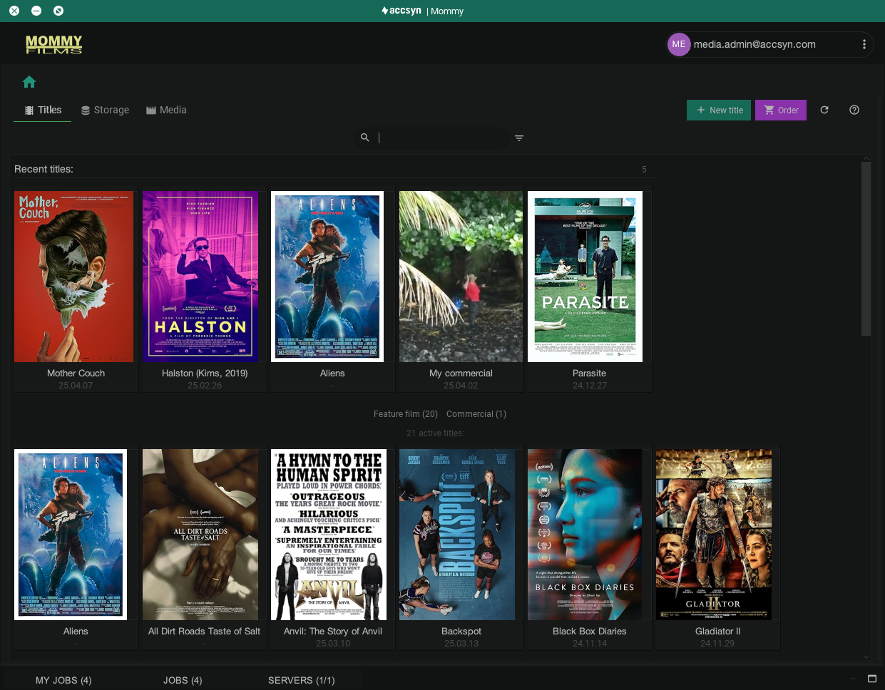

# accsyn Media Vault - Introduction

Learn about the accsyn Media Vault feature allowing you to use accsyn to host your film master files and deliverables, with media proxies, transcoding, streaming, export tooling, lab services, and much more.

Important notes:

- Not currently available for BYOS workspaces (on-prem), only at the accsyn cloud hosted storage.

## Get started

Watch this 9 minute video to get up and running with your accsyn Media Vault:

### What is the accsyn Media Vault feature all about?

accsyn provides media management capabilities for files residing on the accsyn cloud hosted storage. The major purpose is to categorise your media deliverables beneath titles (movies, TV series, short films, general projects, etc) and then tag associated media files enabling:

- Well structured title assets, making it very easy to find the content you are looking for, with IMDb linkage.
- Streamlined and accelerated [delivery](../delivery/index.md) of DCPs, masters, sound, sales material, pictures and videos.
- Accelerated upload of media to your titles.
- [File sharing](../file-sharing/index.md), allowing collaboration with vendors, partners and clients.
- Web streaming, allowing users to watch title media in their web browsers - no additional software needed.
- Clip and still image extraction - transcode selected parts of your master media to ProRes, H.264 or TIF/JPG.
- Export tooling targeting established SVOD/TVOD vendors.
- Additional [Lab services](media-lab.md) - let us help you refine your media assets.

## How does it work?

The Media Vault is designed to work in tandem with Deliveries and File Sharing, at the accsyn cloud storage.

  

 accsyn divides the file & media management into two separate phases:

  

- Film production / media refinement; This is the phase where the film is produced, and is covered by the Delivery, File Sharing and Workflow accsyn tools. No media is logged in accsyn when using these features by default, although they can manually be logged as you wish.

  

- Film distribution / archival; The film is done and there are one or more master files, these are ingested as media into the Media Vault with proxies rendered and metadata extracted. In this phase, File Sharing and Delivery can still be utilised during the distribution process - for example when mastering a separate DCP or when delivering/sharing content to VOD platforms.

  

Although it is treated as two disconnected phases, a film can still live in a single root folder at your storage as a pre-created "title" entity in the Vault, with production carrying on within that folder and with the final masters stored in the same folder upon production wrap.

  

The only exception from this is for BYOS deployments - Media Vault cannot currently run on-prem due to the limitations of the built in proxy and transcode engines. If you require this arrangement, please create a separate cloud workspace for the final master media.

## Titles

An accsyn "title" is a (root) folder on the cloud storage containing media bound to a specific movie or TV show, identified by its IMDb ID, or a general local media project. 

accsyn fetches movie metadata from IMDb upon title creation making it easy to quickly set up the base structure of your library. Titles have a cover image, and also can have a banner image, for easier identification and enriched presentation of deliveries:

Example of title listing in the accsyn Desktop app.

When media is uploaded to a title, you can either have accsyn sort it into a standard category-based folder structure or manage the folder structure yourself.

## Media

A "media" asset is a file or folder beneath a title being tagged with standard attributes, identifying its format (technical attributes) and purpose within your delivery pipeline. accsyn probes the media accordingly, giving you a solid base for evaluating video and audio streams on a technical level.

  

Once a file is tagged as media, it can be subject to advanced media operations within accsyn such as automated transcoding, streaming, DCP authoring and VOD delivering.

  

Example of media tags:

Type: VID (video), SND (sound), PIC (picture),..

Content: FTR (feature), TRL (trailer), CLIP (clip)

Category: MAS (master), DCP, VOD, SALES

Audio: 20 (stereo), 51 (surround)

Season: S01, S02,... 

  

Tagged media is also very easy to locate, without needing to descend into a deep folder structure and rely on filenames.

## Delivering

Media delivery is enriched by the proxy engine, providing title cover + banner and thumbnail + video proxies for files. A delivery can have a mix of media and standard file and folder contents.

With the accsyn [host daemon installation](../admin/hosts.md) feature, deliveries to remote endpoints such as clients, cinemas and other public showrooms can be sent without any user intervention on the receiving side.

## Transcoding

Once the master media has been logged (Category: MAS), accsyn enables transcode into a well-defined set of sub content such as:

- Clips & Still images, extract ProRes or H.264 subclips from your masters, or still images in TIF or JPG format.
- VOD, for further streamable proxy transcode (HD HLS)
- Lowres, proxy with TC burn-in and more.
- Proxy, 1280x720, 2Mbps preview.
- Thumbnails

  

The accsyn Cloud hosted storage is backed by a powerful farm of high performance ffmpeg nodes, currently available for proxy transcoding without any additional costs.

## Web streaming

Video media can be sent as a [streaming delivery](stream.md) to one or more recipients. They will get an email with a link to the stream, allowing account and/or password protected playback in their web browser. The streaming delivery can have a mixed content of streams, media and standard files and folders.

  

Once videos have had a streaming (HD) proxy transcoded, they can be watched in a standard web browser by the recipients.

## Lab services

The media add-on was initially built in-house at one of accsyn's major customers to provide [streamlined lab services](media-lab.md), services that now are provided by our partner FyraK media and include:

1. General Media Work - have the lab team consult you on getting the most out of the vault, and have a look at your current media library facilitating a smooth import.
2. DCP Mastering (Digital Cinema Packaging)
3. Advanced AI Upres
4. VOD (Video On Demand) export, supporting major stream vendors such as Netflix, Viasat, Disney+ and much more.
5. Media QC, check media for artefacts.
6. Colour Grading & General Post production
7. Content digitising
8. Editorials

..and much more, easily made available by selecting media and placing the lab order from within accsyn.

Reach out to us in the chat (lower right corner) or send an inquiry to [support@accsyn.com](mailto:support@accsyn.com) to learn more.

From here, take the first step and [create your first title](create.md).

Related articles:

[Delivery](../delivery/index.md)

- Learn more about the accsyn file delivery subsystem.

[File sharing](../file-sharing/index.md)

- Permanently share your Titles with sales teams, vendors, partners, customers and end users.

[Lab services](media-lab.md)

- Utilise our experienced media lab staff for sorting your deliverables.
