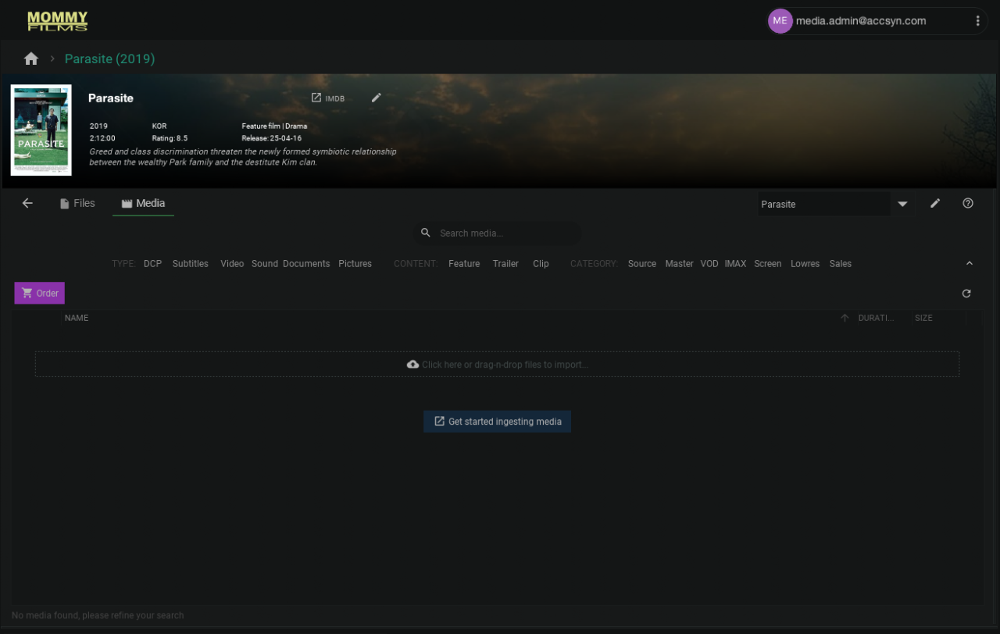
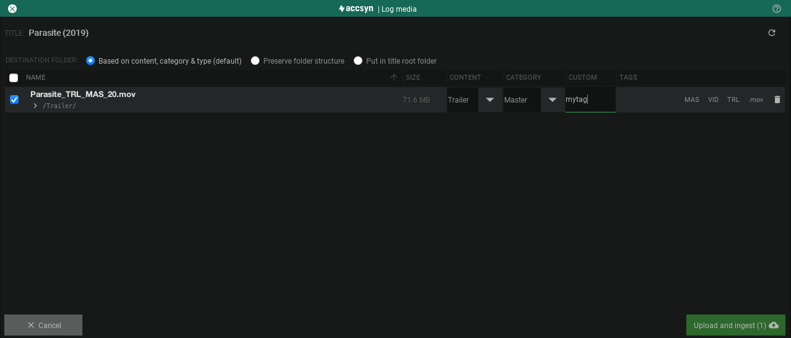

# Log title media

Learn how to log media files beneath a movie title - upload it to its designated title folder and ingest it into the media vault database.

### Prerequisites

- Log on to the accsyn desktop app as a user having administrator or employee role.
- Have a [title created](create.md).

### Understanding the accsyn media asset management

Before you can start utilising accsyn title library capabilities, files and folders on your accsyn Cloud storage need to be uploaded and ingested into the workspace media database.

Whenever you are in a title context and an uploaded file is recognised as media, accsyn ingests the file into the vault. Ingest means that the file is stored in the vault database as a media entity with metadata extracted and, if a picture or video file, proxy and thumbnail. 

Note: Files can be uploaded without being ingested, for later ingest or if you want the vault simply to ignore the files. This is done from the Storage view.

Ingested media are displayed in the Media view within vault, files that are not ingested will only be displayed in the Files view.

## Log master media

Usually, logging begins with the master files. In this example we will log a trailer master:

1. In the app, go to the title you want to ingest files to. Choose either the Files view or Media view, logging files in the Files view will suggest to preserve the folder structure (e.g. upload to the folder you are in) while logging in the Media view will have accsyn suggest the most appropriate folder depending on the type, content and category tags chosen. In the example we ingest to the media view:

2.   Drag-n-drop the master file onto accsyn, the ingest dialog will appear:

Destination folder

Choose the rules to apply when calculating destination folder:

- Based on content, category & type (default); This is the default when logging files in the media view outside a folder context - have accsyn determine the most suitable folder structure for you based on the tags.
- Preserve folder structure; This is the default when logging files in the files view - put the files in the folder you are in. If chosen in media view, this will put the files in the title root.
- Put in title root folder; Just upload the files as they are without adding any subfolder or anything.

  

Checksum

Check validate if accsyn should calculate an MD5 checksum (or run DCP validation) on media. On each media, checksum can be entered and will then be validated against the calculated checksum. If no checksum is provided during ingest, accsyn cannot validate if media is intact during upload and the calculated checksum will be used by default. 

If validate is left unchecked, no checksum will be calculated (or DCP will not be validated), but you can still enter checksum on each media to have it passed along with deliveries as metadata for users who download the media later.

  

Tag the media

- Content; Choose if the media is the full length feature, a trailer or a clip.
- Category; Categorise media using the accsyn standard categories tailored for a video master library.
- Custom; Choose your own free text tag to apply to media file.

  

accsyn also tries to identify other tags based on the filename, you can adjust these later. These are displayed as grey "pills" to the right. To remove files, click the trashcan button.

  
  
  

3. When done, click Upload and ingest.

  

Media will be created in the vault with Uploading status, followed by upload that will happen using the accelerated file transfer protocol. When uploaded, accsyn will try to extract technical metadata from the media and transcode thumbnail and picture/video proxies where applicable.

  

### Logging other types of media - DCPs

The accsyn Media Vault basically supports any video and picture media, although it is designed to hold masters and related assets, streamlined for film distribution & archival.

DCPs are recognised if the folder contains a file named using the pattern '\*cpl\*.xml'. If the folder does not contain any file that matches this, it is not ingestable and will be treated as a folder.

## Ingesting uploaded media

Media can be uploaded in the general Storage view outside a title context, and be imported later into the media vault.

1. Go to the title, or create the title on the folder where media file(s) are uploaded.
2. In the Files view, browse to the file.
3. Select the file(s) and click Ingest in the toolbar.
4. Proceed the same as you would when logging media - choose destination folder / tag.

## Edit media

Once logged, the media tags can be altered: 

- Select the media in the list.
- Right click and choose Edit media or click the three-dot context menu icon at right hand side of media and choose Edit media.
- The editor panel will show up at the right hand side.
- Adjust the tags accordingly, if needed - change the tail tag.
- Changes are saved in real time.

Repeat the steps above to log all media to the title, when done - then follow [this guide](work.md) to get going working with media.

Related articles:

[Create title](create.md)

- Create a new title in the library
