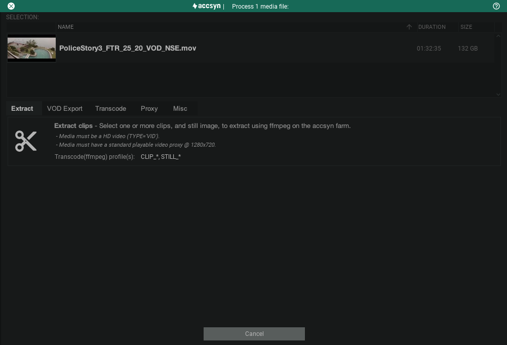

# Process title media

This guide shows how to process media files with accsyn - utilising the built-in transcoder engine to produce media variants and proxies of all forms and shapes.

## The media processor

Preparations:

- Make sure you have a title and master/high res media logged.
- Remove any media that collides with media created by the processor.

Login to the accsyn Desktop app (and select a non-BYOS workspace), then select the title you want to process.

Then select the media files you want to deliver and either click the Process button in the toolbar, or right click and choose Process:

The selected media are listed in the top section, below are tabs with different available actions (click Cancel to abort processing):

## Extract

Tool to extract sub clips and still images from a single media file. This processor is also reachable from the proxy player through the extract clip & still buttons.

  

Head over to [Clip & Still image extraction](clip-extract.md) section to learn how to use the feature.

## VOD export

Tool for exporting media to packages that VOD streaming platforms can ingest.

  

Head over to [Export](export.md) section to learn how to use the feature.

## Transcode

  

Standard transcode of media producing new media that are ingested back to the title.

### Lowres transcode

This is a basic transcode, useful for producing a lowres proxy out of high resolution masters, suitable for previews and for example subtitling:

- Codec: h264 (mp4)
- Bitrate: 2Mbps
- Resolution: 1024x576

A lowres media asset will be logged, with status "TRANSCODING" that will be set to ONLINE once transcode has finished.

### VOD transcode

Transcode master media to VOD media, optimised for SVOD/TVOD deliveries and further web streaming (see Proxy below):

- Codec: h264 (mp4)
- Bitrate: 25Mbps
- Resolution: native

A VOD media asset will be logged, with status "TRANSCODING" that will be set to ONLINE once transcode has finished.

## Proxy

Create proxies of existing logged media, to be used in various ways within the accsyn platform.

### Streamable proxy

Create an HLS streamable HD proxy of VOD media, tailored for web streaming with the accsyn platform:

- Codec: HLS
- High quality stream: 1080 @ 12Mbps
- Medium quality stream: 1080 @ 6Mbps
- Low quality stream: 720 @ 2.8Mbps
- Mobile quality stream: 480 @ 800kbps
- Audio: Stereo (2.0)

A "hddef" proxy will be created on media, with status "TRANSCODING" that will be set to ONLINE once transcode has finished.

*Note: Streaming proxies are only available on video type media.*

### Video proxy

A video proxy is always created by default when videos are ingested into the vault, use this processor option to re-create it:

- Codec: MP4
- Standard quality: 720 @ 2.8Mbps
- Audio: Stereo (2.0)

A "hd720" proxy will be created on media, with status "TRANSCODING" that will be set to ONLINE once transcode has finished.

*Note: Video proxies are only available on video type media.*

### Image proxy

An image proxy is always created by default when images are ingested into the vault, use this processor option to re-create it:

- Codec: JPG
- Standard quality: 320px max width or height, aspect ratio preserved.

A "lr" proxy will be created on media, with status "TRANSCODING" that will be set to ONLINE once transcode has finished.

*Note: Image proxies are only available on image type media.*

## Misc

### Probe

Re-run ffprobe on the selected media, useful for repairing or updating media metadata within the accsyn platform.

### Update

Re-probe metadata, check for physical existence on disk, check and re-sync with proxies.

## Troubleshooting

- I cannot transcode VOD, it complains media is not a master? To be able to transcode VOD, you need to select video media that has the Cat(egory) tag set to "MAS". Edit the media and set this tag to enable VOD transcode.

- Transcoding takes forever and does not complete? The accsyn backend currently contains 10 high performance transcoding machines running 24/7 crunching media. If you reckon something is stuck, check the JOBS tab at the bottom area of the app. It shows your transcode job(s) and progress.

Having issues or questions you cannot resolve on your own, do not hesitate to reach out to our support team through Chat or email.

Next, learn how to send a [web stream](stream.md) to your recipients.
