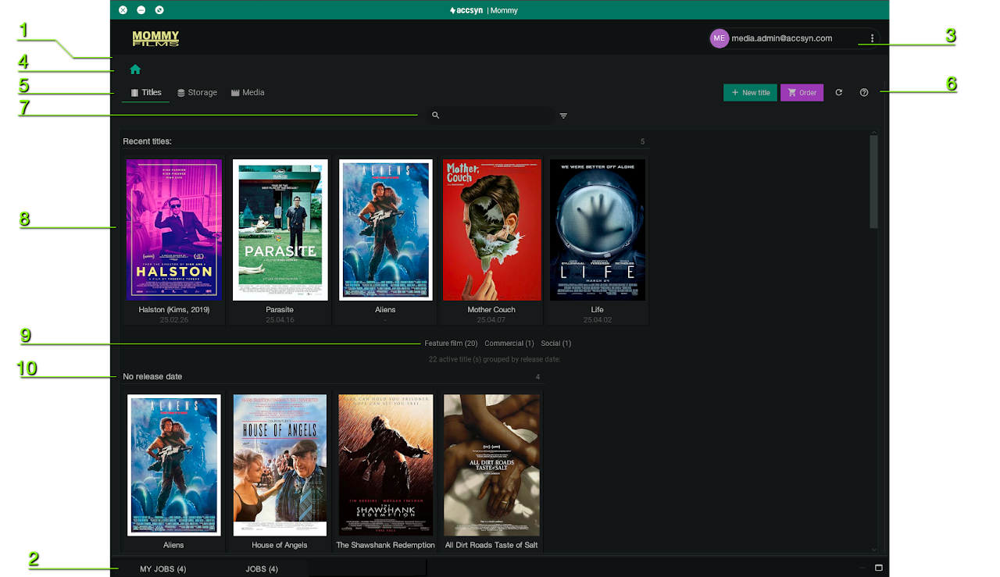
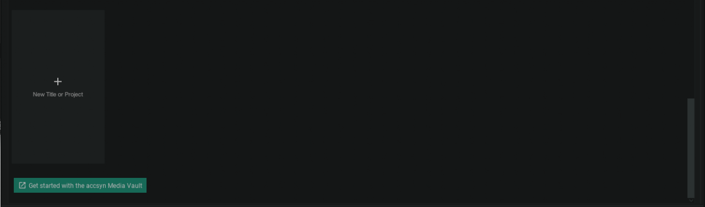
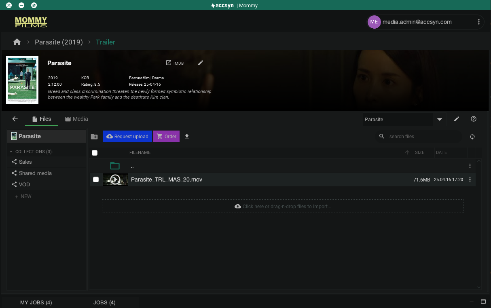
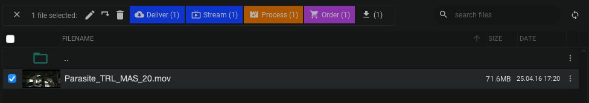
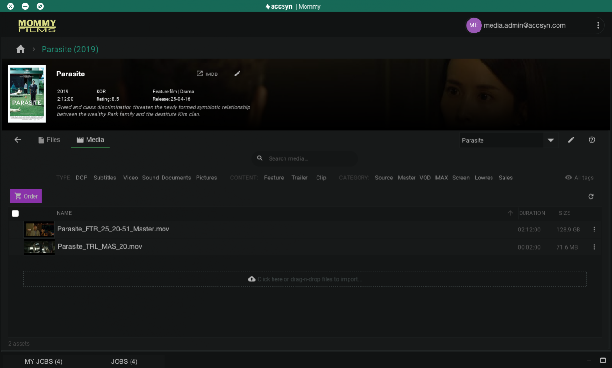

# Work with titles and media

This guide describes the vault view in the accsyn Desktop app - how to navigate it, find information and work with your titles and media.
  

*Note: This view is not present for BYOS workspaces, please refer to separate documentation.*

  

## A breakdown of the vault

When you login to the accsyn Desktop app, you will land in the vault where titles are displayed in a grid layout:

A breakdown of the accsyn Media Vault.

### 1 - Vault view

The top main area is the vault view, when the monitor panel is maximised the vault view can be brought back by clicking the VAULT button that will be rendered at the top.

  

### 2- Monitor panel

At the bottom you will find the jobs panel - click on it to monitor the current file transfer and proxy render queue.

  

### 3 - Account button

Displays the user (email) you are logged in as. Click to open a menu where you can reach app settings, switch user, check for updates and close app.

  

### 4 - Breadcrumb

On top left hand side is the breadcrumb panel, it displays the home button and the path to the current location in the vault - usually starting with the selected title.

  

### 5 - Main navigation

The main navigation buttons allow you to switch between top views:

  

- Titles; Browse/search the titles and projects you have in your Vault.
- Storage; Browse your accsyn cloud storage.
- Media; Browse/search all media in your vault.

## Title browser

The titles browser is where your titles and projects are listed.

  

### 6 - Titles toolbar

  

- NEW TITLE; Click this button to create a new title/project, see [Create title](create.md) documentation.
- Order; Click this button to place an accsyn Media Lab order within the vault. For more information, see [Media Lab](media-lab.md) documentation.
- Reload titles button.
- Help button - opens this documentation in your browser.

  

### 7 - Search titles and filter/display options

Enter text and press ENTER to search for a title by its name. 

  

On the right hand side of the search field you will find the filter button, click this button to:

- Choose a title type filter - only show titles of a certain type.
- Group titles by an attribute.
- Set the size of the cover images.

  

### 8 - Recent titles

This view displays the five (5) most recent titles viewed.

  

### 9 - Type filter buttons

Filter titles on type.

  

### 10 - Title listing

Displays all titles in the vault by selected type or matching search criteria and grouped by chosen grouping options.

Click on a title to open the title view, click the + button to [create a new title](create.md).

Edit a title by clicking the title name, as the pen edit icon appears on hover.

  

### New title placeholder

At the bottom of the file listing, a placeholder for a new title is displayed. Click it to create a new title / project:

## Title view - files

The title view displays the title with banner and the file browser (default):

Example screenshot of title files view.

### Title banner

The top of the title view is occupied by the title banner - where title and media info is displayed.

- Click the IMDb button to open the title in IMDb.
- Click the pencil (edit) button to [edit/remove the title](media-lab.md).

*Note: A default title banner background is rendered in the accsyn app, change it from the edit title dialog.*

  

### Toolbar

The toolbar is where you switch title view mode and change / edit title.

- Back button (<-); Reset title/tag selection and go back to the titles view.
- Files; Switch to file browser mode.
- Media; Switch to media browser mode (see below).
- Title selector; A pulldown menu where you can change the current title.
- Edit title button; Click to [edit/remove the title](media-lab.md).
- Help button; Open this help guide in a new browser window.

  

The file browser is divided into two areas, the share browser on the left hand side and the file listing on the right hand side.

  

### Share browser

Here you either browse the title (default) or click on a shared folder beneath the title or collection to browse it. Find more information about the storage view below.

  

### File list

Here the files are listed in the title, or title subfolder you are located in.

  

Toolbar

Without any file(s) or folder(s) selected, the toolbar shows:

- Create folder button.
- Request upload - send a link to one or more recipients asking them to upload content to this folder.
- Order; Click this button to place an accsyn Media Lab order within the vault related to this title. For more information, see [Media Lab](media-lab.md) documentation.
- Upload button; Upload files and ingest media to the title.
- Search files; search for files matching the text entered.
- Reload button; Reload the folder contents (the file view auto reloads approximately every 10s).

  

Folder content list

- Ordinary non-media files are listed with their file name, size and modification date.
- Media files are listed with thumbnail, click on the thumbnail to view proxy image or play proxy video in a popup window.
- Double click on a folder to enter it.
- Sort listing by clicking on the column headers.
- Right click outside files to bring up the context menu, providing the same options as displayed in the toolbar.

  

File & media actions

When one or more files or folders are selected, the action bar is displayed replacing the default toolbar:

- De-select button (x); Cancel current selection, hide action bar.
- Rename button (pen); Rename the file.
- Move button; Move the file(s)/folder(s) to another folder.
- Delete button (trashcan); Delete the files permanently, alternatively media can be removed from the media view without actually deleting the file.
- Deliver; Queue the selected file(s) and folder(s) for delivery to one or more recipients. See [Deliver media](deliver.md) documentation.
- Stream; Queue the selected file(s) and folder(s) for streaming to one or more recipients. See [Stream media](stream.md) documentation.
- Process; Process the media, see [Media Processor](process.md) documentation.
- Order; Place an accsyn Media Lab order within the vault related to this title. For more information, see [Media Lab](media-lab.md) documentation.
- Download button; Download selected file(s)/folder(s) to your computer.

## Title view - media

The media view displays all media that has been ingested beneath your title project:

### Search media

Enter text and hit ENTER to search across the title for media matching the text entered (filename & tags are searched).

  

Tag selectors

Filter media on tags - type, content and category. This provides a quick way to list media in your vault decoupled from the folder structure, speeding up day-to-day work tasks.

Click All tags to switch the tag selector to advanced mode - choose between all technical tags within the accsyn platform.

  

### Advanced media tag filters

The next panel is the advanced Media tag filters, by default this is displayed for administrators but hidden for employees. Here you make detailed media filtering based on the accsyn title media tagging subsystem:

- Click on each pulldown menu to select a tag value to filter on.
- Click on Clear selection button to reset all tag selectors.
- Click on the refresh button to reload the tags from the central accsyn master registry.
- Click on the minus (-) button to hide the advanced tag selector.

  

### Toolbar & action bar

The media toolbar behaves the same way as it does in the files mode.

## Manage title

To modify a title, click the pencil symbol just next to the title selector or click the pencil symbol in the title banner in the top area.

  

Here you can change the attributes of the title, each entry will be saved immediately as a field loses focus.

  

### Set a custom cover image

  

The title cover image can be customised, just click the pencil edit icon on the cover and select a local .JPG or .PNG asset with optimal resolution and aspect of 175x240 pixels.

To restore the cover image to the default as fetched from IMDb, click the undo icon just right to the edit icon.

  

### Set a custom title banner image

  

When you view a title and its media content, the top section is called the title banner. It can be customised - simply click the pencil icon in the upper right corner and select a local .JPG or .PNG asset with optimal resolution and aspect of 1800x200 (9:1) pixels.

  

To remove/clear the banner image once set, click the cross/remove button in the upper right corner next to the edit icon.

  

### Remove a title

To remove a title, you first need to remove all media beneath it. That can be done by selecting all media, right click and select Remove.

## Manage media

Renaming, moving and deleting a media physical file/folder is done when in the title files view. It can also be performed from the general cloud Storage main view.

  

### Get media info

To read out metadata for media, right click and choose Info. This will bring up the metadata viewer on the right hand side.  

  

Edit media tags

 To change the tags media have within the vault, right click and choose Edit tags. This will bring up a list of all current tags with selectors and inputs where all values except type and ext(ension) can be changed (type is derived from file extension).

  

Rename media

To rename the media (file), right click and choose Rename. 

  

Remove media

To remove media, e.g. un-ingest it, right click and choose Remove media. Here you will be able to choose how the physical files on storage will be handled after media is de-registered from your vault.

## Storage

The storage main view is where you can browse and manage the entire accsyn Cloud storage, this allows for creating other folders and uploading material outside the context of a title suitable for deliveries, file sharing, backup and so on.

  

The storage view is basically the same as the title files view, with the access (ACL) info on the right hand side and the ability to share folders with other users.

## Media

The media main view is where you can browse all media outside the context of a title, this allows for advanced search and media monitoring in general.

Next, learn how to [process / export](process.md) media from the vault.

Related articles:

[Lab services](media-lab.md)

- We can help you with the entire process of ingesting a title, prepare deliverables and do QC/transcoding and export to SVOD/TVOD vendors.
