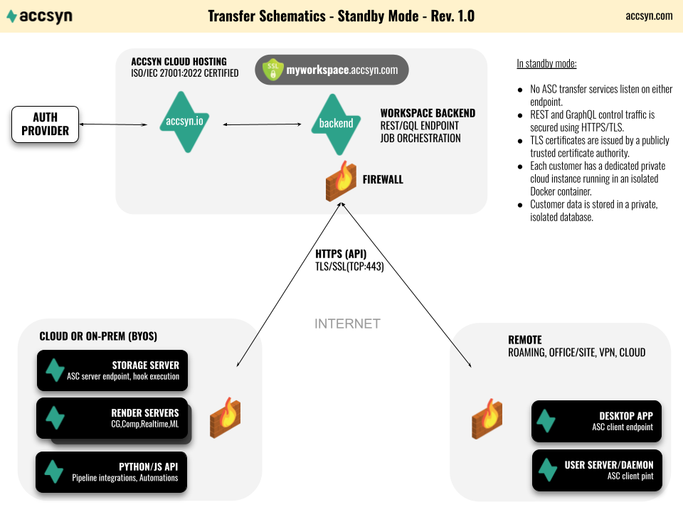
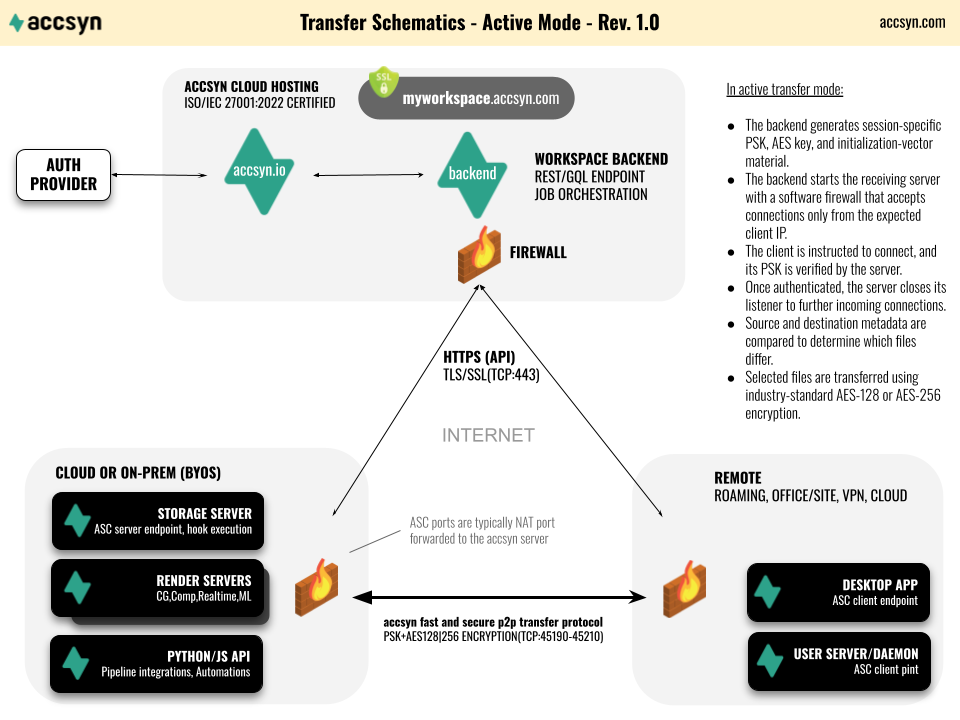

# accsyn Whitepaper

<button type="button" class="md-button whitepaper-print-button" onclick="window.print()">Print / Save as PDF</button>

ASC (accsyn Copy) is accsyn's proprietary, accelerated peer-to-peer file transfer protocol. It is designed to move large files and large file sets efficiently between accsyn endpoints while the accsyn cloud control plane handles orchestration, authorization, scheduling, and audit.

This page consolidates the ASC protocol reference and the former accsyn Security Whitepaper. It describes the protocol, security architecture, transfer lifecycle, job model, and operational tuning for technical decision-makers. For the complete setting reference, see [Internal settings](settings.md).

## Scope and security objectives

accsyn is a managed file transfer (MFT) platform for moving files and associated workflow metadata. Its architecture is designed around the following objectives:

- Encrypt control-plane communication and file data in transit.
- Keep file payloads on the intended data path instead of routing peer-to-peer transfers through the dispatcher.
- Avoid permanently exposed ASC listeners on transfer endpoints.
- Authorize every transfer centrally and issue session-specific credentials and encryption material.
- Restrict an on-demand listener to the expected connecting IP address.
- Record transfer activity for operational monitoring and audit.
- Support resilient, resumable movement of large files and file sets.

## Architecture at a glance

ASC separates the **control plane** from the **data plane**:

- The accsyn cloud dispatcher is the control plane. It authenticates users and endpoints, schedules jobs, selects connection parameters, records audit metadata, and supplies short-lived authorization and encryption material.
- The source and destination applications are the data plane. File data travels directly between the transfer endpoints rather than through the accsyn cloud.
- ASC runs over TCP and normally uses the port range configured by `client_ports`.

### Standby state

When no transfer is active, ASC endpoints maintain outbound HTTPS/TLS control-plane communication with accsyn over TCP port 443. The control plane uses certificates issued by a publicly trusted certificate authority. No ASC file-transfer service needs to listen continuously on either endpoint.

Authentication is delegated to the configured identity service, including accsyn accounts and supported external identity providers such as Google and Microsoft. The endpoint presents an identity token when communicating with the control plane; accsyn does not distribute a reusable user password to transfer peers.

### File-transfer state

A transfer is initiated as follows:

1. The dispatcher validates and schedules the job.
2. It instructs the receiving endpoint to open an ASC server for that transfer.
3. The server installs a temporary software-firewall rule that only accepts the expected client IP address.
4. The dispatcher generates and supplies the endpoints with session-specific pre-shared authorization material, an AES encryption key, and initialization data over authenticated HTTPS.
5. It instructs the sending endpoint to connect and begin the transfer.
6. Once the expected TCP connection has been established, the temporary listening surface and firewall allowance are removed. The established connection remains active until the transfer ends.
7. Session key material is discarded after the transfer and is not exchanged directly between the peers over an unprotected channel.

This on-demand model avoids exposing a permanently listening ASC service.

### Data location and transfer paths

For BYOS and endpoint-to-endpoint transfers, the dispatcher orchestrates the session but does not receive or retain the file payload. Files travel directly between the selected source and destination.

For accsyn Cloud workspaces, files are intentionally stored on the workspace's EU-hosted cloud storage. Browser-based transfers use HTTPS, while supported app-to-app and app-to-storage paths can use ASC. In every case, accsyn stores the account, operational, billing, and audit metadata required to provide and secure the service; the statement that peer-to-peer ASC payloads bypass the dispatcher does not mean that accsyn stores no metadata.

### Network requirements

All endpoints require outbound HTTPS access to the accsyn control plane on TCP port 443. The endpoint selected as the ASC receiver must also be reachable on at least one TCP port from its configured `client_ports` range. A server behind NAT normally requires port forwarding to the server, while an enterprise firewall must permit the expected inbound connection.

The range is configurable and can be reduced to a single port where network policy requires it. The server's temporary source-IP restriction is applied in addition to the surrounding firewall/NAT policy. Administrators should expose only the configured ports and use the built-in connectivity test after changing the WAN IP, port range, NAT, or firewall.

Low-port deployments can be configured where required by restrictive networks, but TCP 443 should not be assumed to carry ASC unless the endpoint and surrounding infrastructure have explicitly been configured for it.

## How ASC accelerates transfers

### Parallel TCP data paths

ASC reads each file efficiently, divides its data into chunks, and distributes those chunks over multiple TCP sockets. The receiving endpoint reassembles the stream and writes the file to its destination.

Using multiple sockets allows ASC to keep storage and network pipelines busy when a single TCP flow cannot fully utilize the available bandwidth. The default socket count is configured through `transfer_conf`; increasing it can improve throughput on high-bandwidth, high-latency links, but only until the network or storage becomes saturated.

Parallelism does not remove physical bottlenecks. End-to-end throughput is bounded by the slowest component: source read performance, CPU, encryption, network path, receiver write performance, or filesystem metadata operations.

### Rsync-style file selection

Before transmitting data, ASC compares source and destination metadata to determine which files require transfer. The default comparison is equivalent to rsync's quick-check behavior: a file is selected when it is missing at the destination, or when its size or modification time differs.

This is **rsync-style selection**, not the rsync wire protocol or its rolling-checksum delta algorithm. ASC transfers the selected file data using its own parallel TCP protocol.

The comparison can be changed with `transfer_comparison`:

- `size+modified` (default): compare both file size and modification time.
- `size`: compare file size only.
- `modified`: compare modification time only.

`size+modified` provides the safest metadata-based default. A size-only comparison can be useful where timestamps are unreliable, but two different files of equal size will then be considered equal.

### Copy and one-way sync

ASC supports two transfer modes:

- **Copy** (`copy`, default): transfer source files and directories that are missing or differ at the destination. Unrelated destination content is retained.
- **One-way sync** (`onewaysync`): make the selected destination tree mirror the source. Destination files and directories that do not exist at the source are deleted before copying begins, corresponding to `rsync --delete-before` behavior.

!!! warning
    One-way sync performs destructive deletion at the destination. Validate source and destination paths, filters, and permissions before enabling it in an automated workflow.

### Integrity model

ASC relies on TCP's ordered, reliable delivery and built-in error detection while data is in transit. ASC does not perform a separate post-transfer whole-file checksum verification by default.

This design avoids an additional full read of both the source and destination after every transfer, which matters for multi-terabyte files and storage systems where I/O is the limiting resource. According to accsyn's operational experience over more than ten years and petabytes of transferred data, no transfer corruption attributable to this design has been reported.

TCP error detection is not a cryptographic end-to-end content proof and cannot detect every possible failure before or after the TCP path, such as faulty storage or memory. Workflows requiring independently verifiable content integrity should carry and validate application-level checksums as part of their delivery specification.

### Resume of large files

ASC can resume partially transferred large files rather than retransmitting them from byte zero. Resume is enabled by default for files larger than 50 MB:

- `transfer_resume`: enable or disable single-file resume.
- `transfer_resume_limit`: set the file-size threshold in MB; `-1` removes the threshold.

Resume is especially valuable for large media assets and long-distance links where restarting a nearly complete transfer would be expensive.

### Why TCP

TCP provides standardized reliability, ordering, congestion control, and broad compatibility with enterprise firewalls and network operations tooling. It backs off under contention instead of requiring ASC to implement a proprietary reliability and congestion-control layer over UDP.

Custom UDP transports can have an advantage on highly lossy or unusual paths, historically including satellite and unstable ADSL links, because they can implement behavior tailored to those conditions. On modern fiber and well-managed IP networks, parallel TCP can approach link capacity while remaining predictable and network-friendly. Actual performance depends on latency, packet loss, congestion, endpoint I/O, and network policy; protocol choice alone does not guarantee throughput.

## Security model

### Control-plane transport

Applications and services communicate with the accsyn control plane through HTTPS/TLS on TCP port 443. TLS authenticates the service endpoint and protects authentication tokens, job metadata, connection instructions, and session key material in transit.

Cloud infrastructure is hosted within the European Union in ISO/IEC 27001-certified premises. Each customer workspace operates as a private cloud instance with customer data isolated from other workspaces. Network access to control-plane services is restricted by infrastructure firewalls. Administrative access is limited to authorized accsyn personnel, uses individual key-based authentication, and is separated from normal Product access.

### Identity and access

User authentication is handled through the configured identity provider. Accsyn supports its own account flow and federation with Google and Microsoft. Authentication produces a time-limited token used by clients when calling the control plane; users do not send their account password to the remote transfer endpoint.

Workspace roles, share permissions, endpoint authorization, and job policy determine whether a user may initiate or receive a transfer. Multi-factor authentication can be enforced at workspace or role level. See [Internal settings](settings.md) for the current authentication controls.

### On-demand listener

The ASC receiving service is started only when the dispatcher has authorized and scheduled a transfer. An endpoint therefore does not need to expose a continuously listening file-transfer daemon.

### Source-address restriction

While waiting for the connection, the server's built-in software firewall accepts incoming traffic only from the client IP selected for that transfer. This narrows exposure during connection setup. It supplements - but does not replace - network firewalls, endpoint hardening, patching, and access controls.

### Per-transfer authorization and encryption

Before startup, the dispatcher creates and distributes a pre-shared key (PSK) for authorization and session-specific AES key material for transfer encryption. ASC supports AES-128 (default) and AES-256 through `transfer_encryption`.

The authorization material binds the connection to the orchestrated transfer. Encryption protects file data in transit against passive inspection. Key distribution occurs through the authenticated accsyn control plane, not through an unauthenticated peer-to-peer exchange. Session key material is retained only for the duration of the transfer process.

### Small attack surface

After the expected TCP session is established, ASC removes the temporary listener/firewall exposure while retaining the established data connection. Combined with source-IP filtering and per-transfer credentials, this limits the externally reachable attack surface to the short connection-establishment window.

### Monitoring and audit

accsyn records job state and file-access audit events to support monitoring, troubleshooting, and accountability. Depending on the event, records can include the user, endpoint, action, timestamp, resource, IP address, and derived geolocation. Workspace administrators can use this trail to investigate access and transfer activity.

Audit records are security evidence, not proof that a transferred payload is byte-for-byte identical. Content-integrity requirements should be addressed separately as described in [Integrity model](#integrity-model).

### Security responsibilities

ASC reduces the exposed transfer surface, but it does not replace the surrounding security program. Customers remain responsible for:

- Hardening and patching BYOS hosts and their operating systems.
- Restricting network access to the configured ASC ports.
- Protecting identity-provider accounts and enforcing suitable MFA policy.
- Granting least-privilege workspace, share, and filesystem permissions.
- Protecting destination data after it has been decrypted and written.
- Maintaining backups and application-level checksums where required.

## Comparison with common transfer approaches

The former Security Whitepaper compared accsyn with FTP, SFTP/FTPS, cloud-drive services, and accelerated UDP products. The relevant distinction is architectural rather than simply the protocol name:

| Approach | Data path and security characteristics | Operational considerations |
|---|---|---|
| Plain FTP | Credentials and data can be transmitted without encryption. A service normally listens continuously. | Not appropriate for sensitive Internet transfers. Separate credential distribution and monitoring are required. |
| SFTP or FTPS | Provides encrypted file transfer when configured correctly, but commonly relies on a continuously listening service and long-lived user credentials. | Mature and interoperable, but operators must harden the exposed service, manage accounts/keys, and build notification and workflow layers separately. |
| General cloud-drive or delivery service | Usually encrypts transport and stores a copy with the service provider. | Convenient for sharing, but payloads follow the provider's storage path and retention model. |
| Accelerated UDP transfer | Can provide encrypted peer-to-peer acceleration and can perform well on lossy, high-latency paths. | Requires a proprietary reliability/congestion layer and may need additional network-policy consideration. |
| ASC | Uses centrally orchestrated, per-transfer authorization; an on-demand IP-restricted listener; direct peer-to-peer AES-encrypted data over parallel TCP; and integrated jobs, notifications, monitoring, and audit. | Optimized for modern managed networks and accsyn workflows. Requires endpoint installation for ASC; browser delivery uses HTTPS instead. |

> **Graphic placeholder — transfer-method comparison:** Visual comparison of ASC, FTP, SFTP/FTPS, cloud-drive services, and accelerated UDP products.

The table is a design-level comparison. The security of any implementation depends on its current configuration, identity controls, key management, patching, and operating environment.

## Tuning ASC

Settings inherit from the workspace and can be overridden at supported client, volume/share, queue, or job levels. Prefer the narrowest practical scope: tune a specific endpoint or workload before changing the workspace default.

### Throughput and resource use

| Setting | Operational effect | Tuning guidance |
|---|---|---|
| `transfer_conf.sockets` | Number of parallel TCP sockets. | Increase gradually on high-bandwidth/high-latency links. More sockets can increase CPU, memory, and network contention without improving throughput once a bottleneck is saturated. |
| `transfer_conf.io_buffer_size` | Disk I/O buffer size. | Larger buffers may reduce call overhead for large sequential files, at the cost of memory per active transfer. Benchmark against the actual storage. |
| `transfer_conf.socket_buffer_size` | TCP socket buffer size. | Consider increasing on high bandwidth-delay-product paths. OS limits may cap the effective value. |
| `transfer_conf.disk_readers` | Parallel source readers. | Increase only when source storage benefits from parallel reads. Excess readers can hurt spinning disks and shared arrays. |
| `transfer_conf.disk_writers` | Parallel destination writers. | Match destination storage characteristics; excessive concurrency can amplify random I/O and metadata pressure. |
| `transfer_conf.nodelay` | TCP no-delay behavior. | Usually leave at its default for bulk data. Test before changing for workloads dominated by many small operations. |
| `transfer_concurrent` | Concurrent transfers allowed per remote client. | Keep at `1` for predictable bandwidth. Increase for many short independent jobs when endpoints and links have sufficient capacity. |
| `transfer_speedlimit` | Global or scoped MB/s cap. | Use to protect interactive traffic, shared WAN links, or storage systems from transfer saturation. |

Change advanced `transfer_conf` values only after measuring network throughput, CPU load, source read rate, and destination write rate. Tuning one component without observing the complete path commonly moves rather than removes the bottleneck.

### Selection and filesystem behavior

| Setting | Operational effect |
|---|---|
| `transfer_mode` | Selects copy or destructive one-way-sync behavior. |
| `transfer_comparison` | Controls metadata used to decide whether files differ. |
| `transfer_include` / `transfer_exclude` | Restricts files and directories selected for transfer. Filters at workspace, share, queue, and job scopes are merged. |
| `transfer_ignore_existing` | Skips existing destination files and/or directories. Use only when destination content is trusted to be complete. |
| `transfer_attributes` | Preserves owner, group, and/or permissions when both endpoints use POSIX-compatible operating systems. |
| `transfer_reserved_space` | Reserves destination free space so a transfer does not consume the filesystem completely. |
| `transfer_conf.notmp` | Writes directly to final destination files instead of temporary files followed by rename. This reduces rename requirements but exposes incomplete destination files during transfer. |
| `transfer_conf.nolock` | Disables destination file locking for filesystems that do not support it. Prefer a share-specific override. |
| `transfer_conf.umask` | Sets the transfer-process umask on macOS/Linux/Unix endpoints. |

### Recovery and diagnostics

| Setting | Operational effect |
|---|---|
| `transfer_resume` / `transfer_resume_limit` | Controls checkpoint-based resume and its minimum file size. |
| `transfer_log` | Selects informational, warning, file, comparison, ownership, group, and permission details written to the task log. Enable additional categories for diagnosis, then reduce verbosity for normal operation. |
| `job_max_retries` | Maximum automatic transfer retries before a job is marked failed. |
| `job_autoretry_delay_s` | Initial delay before retrying an interrupted or failed transfer. |
| `job_on_missing` | Either fails the job when source files disappear (`fail`) or ignores missing files (`ignore`). |

## The accsyn job model

### Tasks

A **task** is the unit of work in accsyn. For a transfer, a task identifies a single file or folder to move from a source path to a destination path.

Folder tasks can be recursive. A parent task may contain child tasks, and the parent is not marked finished until all required descendants have finished. This hierarchy allows a large transfer to retain meaningful structure while accsyn tracks progress and state at finer granularity.

Tasks can also define:

- **Dependencies**: a task remains blocked until the tasks it depends on have completed successfully. Dependencies can express ordered pipeline stages without requiring separate jobs.
- **Priority**: higher-priority tasks are dispatched before lower-priority tasks within the same runnable job. Task priority ranges from 1 (lowest) to 1000 (highest), with 500 as the normal default.

### Jobs and queues

One or more tasks constitute an accsyn **job**. A peer-to-peer transfer job has one unique source party and one unique destination party, although multiple volumes belonging to a party may be referenced.

Every job belongs to a queue. Queue priority and order determine which job runs first between endpoints; task priority determines execution order inside the active job. These are separate scheduling layers:

1. Queue priority selects the next job.
2. Position within that queue resolves jobs at the same priority.
3. Task dependencies determine which tasks are eligible.
4. Task priority orders eligible tasks.

The standard queues are High (`999`), Medium (`500`, default), and Low (`1`). Moving a job to another queue changes job-level priority.

### Tuning job execution

| Setting | Operational effect | Typical use |
|---|---|---|
| `task_bucketsize` | Limits how many runnable tasks are grouped into each transfer process. `0` groups all available transfer tasks. | Use `1` or another small value for very large task sets, constrained memory, granular progress, or long-running independent tasks. Larger buckets reduce process/setup overhead. |
| `job_max_retries` | Limits automatic retries. | Raise for unattended transfers over intermittent links; keep bounded so persistent configuration or storage faults become visible. |
| `job_autoretry_delay_s` | Delays retries after failure. | Increase where endpoint restarts or network recovery take time; avoid rapid retry loops against an unavailable dependency. |
| `job_on_missing` | Chooses `fail` or `ignore` when source content is missing. | Use `fail` for controlled deliveries where completeness matters; use `ignore` for volatile ingest folders where files may legitimately disappear. |
| `job_done_actions` | Runs post-completion behavior such as `delete_excluded`. | Useful for controlled backup/synchronization workflows; validate filters because cleanup actions can be destructive. |
| `job_compress_tmp_limit` | Maximum folder/multi-file delivery size eligible for temporary compression. | Set against available temporary storage and desired browser-delivery behavior. Very large packages should transfer through the app rather than be staged as archives. |

Task priority and dependencies are task attributes rather than `task_*` settings. Use them to express business ordering; use `task_bucketsize` to control execution granularity and resource consumption.

## Practical tuning profiles

### Large media files over fast fiber

- Keep `transfer_resume` enabled.
- Increase `transfer_conf.sockets` gradually while measuring throughput.
- Ensure socket buffers are appropriate for the path's bandwidth-delay product.
- Verify that source and destination storage can sustain the target rate.
- Keep `task_bucketsize` large enough to avoid unnecessary process setup.

### Millions of small files

- Storage metadata performance is usually the bottleneck, not link bandwidth.
- Use include/exclude filters to reduce the working set.
- Consider a smaller `task_bucketsize` if memory pressure appears.
- Avoid excessive readers, writers, sockets, or concurrent jobs.
- Enable comparison logging only while diagnosing selection behavior.

### Intermittent connection

- Keep resume enabled and consider lowering `transfer_resume_limit`.
- Increase `job_max_retries` and set a measured retry delay.
- Do not increase socket count until packet loss and endpoint stability are understood.
- Use job logs to distinguish network interruptions from missing files or storage failures.

### Controlled mirror

- Test with `copy` first and inspect the destination.
- Validate all include/exclude filters.
- Switch to `onewaysync` only when destination-only deletion is intended.
- Keep `job_on_missing=fail` when source completeness is mandatory.

## Related documentation

- [Internal settings](settings.md)
- [Manage jobs](manage/job.md)
- [Queue administration](admin/queue.md)
- [Job specification](developer/job-specification.md)
- [Client administration](admin/client.md)
