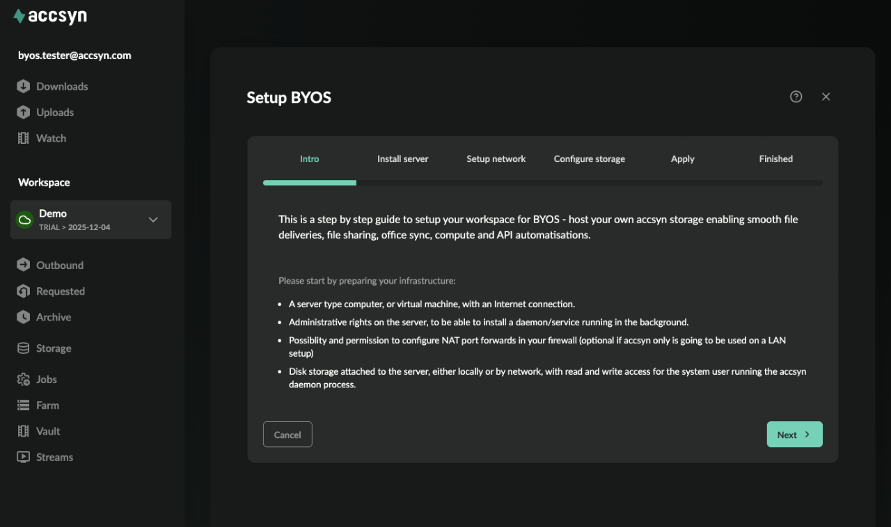

# Bring Your Own Storage

This page serves as an admin and operator's manual for accsyn BYOS - how to setup and use accsyn on your own premises.

CONTENTS:

[What is BYOS?](byos.md)

[Which additional features becomes available?](byos.md)

[Setting up](byos.md)

[Setup new BYOS workspace](byos.md)

[Initiate workspace conversion](byos.md)

[Intro](byos.md)

[Initiate setup](byos.md)

[Intro](byos.md)

[Install server](byos.md)

[Setup network](byos.md)

[Configure storage volume](byos.md)

[Apply](byos.md)

[Finalise](byos.md)

[Testing](byos.md)

[Steps to take from here](byos.md)

## What is BYOS?

By default, new accsyn workspaces are 100% cloud hosted in terms of storage and volumes.

  

To facilitate on-prem storage, an accsyn workspace can be setup or converted into a "BYOS" (Bring-Your-Own-Storage) workspace. This enables you to move the default storage to a server that is installed on a machine (bare metal or virtual) located at your premises or in the cloud.

## Which additional features becomes available?

Primarily, these core features are migrated to your premises:

- Deliveries; are now sent from your local storage volume(s), supporting both the accsyn fast file transfer protocol(ASC) and web browser deliveries (HTTPS).
- File sharing; are now served from your local storage volumes.

  

With BYOS, remote Sites are supported - install servers on additional remote physical offices or cloud, for mirrored path synchronisation/backup of production assets.

  

Additional, these [Workflow](../developer.md) features will be enabled:

- [Hooks](../developer/hooks.md); Have scripts run on your server when job is submitted, finished, and so on.
- [Compute](../developer/farm.md); Setup a render farm with Python script engines for common apps such as ffmpeg, Houdini, Unreal MRQ render and much more.
- [Publish](../developer/publish.md); Setup a publish workflow, enabling remote vendor ingest of files within your production pipeline.

  

Important note:

- Media Vault is NOT available for BYOS mode workspaces, sign up and setup a separate BYOS workspace if you require both within your organisation. Feel free to reach out to support so we can guide and assist you in this process.

## Setting up

Prerequisites:

- A physical machine (or VM) running Windows, Linux or Mac.
- Administrative privileges on the machine.
- Logged on as an administrator at <https://accsyn.io>.

  

### Setup new BYOS workspace

Go to <https://accsyn.io> and launch a new BYOS trial, for more information: [Start a new trial](https://accsyn.io/signup/trial)

  

### Initiate workspace conversion

To convert your cloud workspace to BYOS, go to Billing (present in workspace menu on the left hand side) or open <https://accsyn.io/signup>.

Go to BYOS tab and click Setup BYOS Now button.

  

### Intro

You will be presented an intro, read through carefully. Click Next when ready to install the server.

Prerequisites:

- An active accsyn workspace, in trial or billed mode: [Start a new trial](https://accsyn.io/signup/trial)
- A physical machine (or VM) running Windows, Linux or Mac.
- Administrative privileges on the machine.
- Logged on as an administrator at <https://accsyn.io>.

  

### Initiate setup

To setup BYOS, go to Billing (present in workspace menu on the left hand side) or open <https://accsyn.io/signup>.

Go to BYOS tab and click Setup BYOS Now button.

  

### Intro

You will be presented an intro, read through carefully.

Click Next when ready to install the server. 

  

### Install server

Download and install the server on the machine, when asked input the code displayed.

  

Hint: Hover the download buttons to copy the link to the installer.

  

For detailed instructions on how to install and configure servers, please refer to [server documentation](byos/server.md).

  

Click Next when server is up and running.

  

### Setup network

With this step, we configure and test the (TCP) network ports that remote clients should use to connect to your server on file transfer init. Follow the instructions listed, you can skip this step and do it later - for example if you intend to not run transfers over the Internet and instead will have them pass over local LAN/VPN routes.

  

Note: If your server is directly connected to the Internet, skip the firewall NAT setup and instead make sure the ports are opened in local software firewall configs.

  

Click the Configure network ports and test connectivity button to enter the port ranges and run a connection test:

1. The server will start TCP listeners on the ports you have configured.
2. accsyn backend (<yourdomain>.accsyn.com) will attempt to connect to these ports from the cloud.
3. If failed for one or more ports, feedback will be given.

  

When configured, click Next.

  

### Configure storage volume

As the last step, we need to configure the disk or folder on server that accsyn should use. Click Configure storage button path to proceed.

  

Enter the absolute path on server, the path exist and be writeable by the system user that runs the accsyn Daemon/server. 

  

Note: To change the user that server runs at, please refer to [server documentation](byos/server.md).

  

Click Validate path to have tests run, feedback will be given if they fail.

  

Click Done when finished and then Next.

  

### Apply

The final step concludes BYOS setup - configure new main server and storage. Check the confirmation checkbox and click Apply when ready.

  

The conversion will include these operations:

1. The built in "hq" site will not be set as the main site instead of "accsyn".
2. The VPC server at accsyn cloud storage will now be demoted to site server for volume "storage".
3. The new server will now be serving "storage".
4. The storage volume will be renamed and reconfigured with new path.
5. Workspace type will be set to byos and three(3) trial server licenses will be generated with "storage", "site" and "compute" capabilities.

  

### Finalise

Click OK to reload the BYOS workspace,  you are now serving content from your own storage with no space limites and enabling advanced Workflows.

## Testing

As a first thing to do, we recommend you test file transfers by uploading and then downloading a folder containing files.

  

Checklist:

1. Make sure the file transfers perform as expected in regards to bandwidth utilisation.
2. On server storage, check file permissions - make sure they align with the rest of your workflows in terms of security and accessibility.
3. Open storage in desktop app and test creating folders, renaming and deleting files.

## Steps to take from here

[Servers](byos/server.md)

Install a server, for serving volumes on a remote site, running hooks or compute processes.

[Sites](byos/site.md)

Install accsyn on a remote office or cloud endpoint, to facilitate remote file sync/backups.

[Engines](byos/engine.md)

Configure Python scripted engines, for render/compute farm deployments.

[Developer Hub](../developer.md)

You can now setup advanced Workflows with Hooks, Publishing and Render farm processing.
