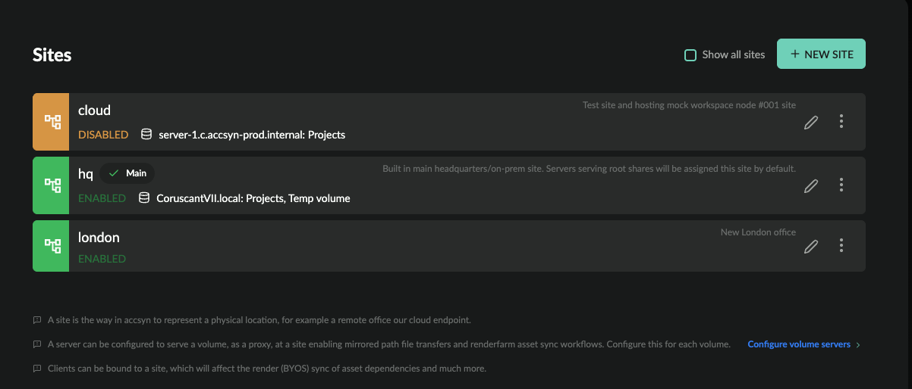

# Site administration

NOTE: This feature is exposed to BYOS and Enterprise licensed workspaces only.

[BYOS](../byos.md)

This guide walks through how to add and configure remote sites within your accsyn workspace.

  

Prerequisites:

- Logged on as an administrator to <https://accsyn.io/admin/servers>.

Contents:

[What is a site?](site.md)

[Site types](site.md)

[Site location based WAN IP](site.md)

[Sites and file transfers](site.md)

[Sites and compute/render jobs](site.md)

[Site list](site.md)

[Create a new site](site.md)

[Edit a site](site.md)

[Toolbar](site.md)

[Servers & Clients](site.md)

[Attributes](site.md)

[Metadata](site.md)

[Delete a site](site.md)

[Related resources](site.md)

## What is a site?

A site is a remote physical or cloud location that enables file synchronisation and workflow collaboration across a geographically distributed organisation.

  

Servers and clients owned by elevated (admin or employee role) users can be assigned to sites, defining where they are located. When signing up a workspace, a default cloud storage and server are initialised at the accsyn builtin site "hq" - providing basic cloud file delivery, file sharing and media vault storage.

  

### Site types

- Main site; This is the default site within a workspace, servers are assigned to this site by default and the server on main site serving the default volume is called the main server. See [servers](server.md) for more in-depth information. A workspace must have exactly one main site.
- Roaming; This is a built-in site to which all standard role user clients are assigned, this can also be called the road warrior site.
- accsyn; This is the accsyn cloud storage site, and is primarily assigned to new workspaces in the default accsyn setup before moving to BYOS. The accsyn site can be used in tandem with on-prem storage.

  

### Site location based WAN IP

Clients belonging to elevated workspace users, but not assigned to any particular site, will be loosely assigned to the site if their WAN IP matches the WAN IP of a server on the site. This affects file transfers (see below).

Servers will not be auto-assigned this way, they will manually have to be assigned to the site.

  

### Sites and file transfers

When a download or upload is initiated from a machine assigned to a site, or detected to be at the site based on the WAN IP, the transfer will be carried out by the site server and not the client itself.

  

### Sites and compute/render jobs

For more information, see [Workflows](../../developer.md) compute section.

## Site list

Toolbar:

- Show all sites; Display hidden built-in sites such as the accsyn and roaming sites.

  

The site list shows active sites within your workspace:

- Status indicator; green is enabled, grey is offline, yellow is disabled, dark orange is disabled and offline.
- Name (code); The unique name of the site.
- Main - indicates if this is the main site.
- Description; The description of the site.
- Status: (Second row) Shows the site status.
- Server & volumes: List of volumes being served, and the server(s) serving these volumes.
- Edit (pen) button.
- Menu button.

Site menu:

- Edit; Bring up the site editor.
- Disable; Disable the site, all jobs (file transfers, compute jobs) involving the site will be cut off and resumed again when site is enabled.
- Enable; Enable the site.
- Logs; Show log events related to the site.
- Delete; Delete the site.

## Create a new site

To create a new site, click the NEW SITE button in the upper right corner.

Give a name (code) for the site, it must be unique within the workspace and contain letters a-zA-Z0-9\_.- only with a maximum length of 32 chars.

Description (optional); Give the site a description, for display only.

  

When created, you can take the following actions:

- Install a new server at site, go to <https://accsyn.io/admin/servers/new>.
- Serve volume(s) at site, go to <https://accsyn.io/admin/volumes>, edit the volume that should be served by the server and then go to the "Servers" tab where you can set the server. Make sure storage is available at the site at the same physical disk locations as configured at the volume, you can override the paths if needed.
- Assign compute engines to server lanes, to enable remote office/cloud rendering capabilities. For more information, see [Workflows](../../developer.md).

## Edit a site

To edit a site, click on it in the list or choose Edit from the site's menu.

  

### Toolbar

- Disable site; Click this button to disable the site, note that all ongoing jobs involving the site will be interrupted.
- Enable site; Enable the site again.

  

### Servers & Clients

List of servers and clients assigned to the site.

- Online status; green if online and checked in recently.
- Hostname (code); The hostname.
- Type; The type - server, app, user server.
- Last checkin; When the server or client was last seen.
- Spawned; When it was created.
- ID; The internal (API) ID of server/client.

NOTE: Site and compute/render servers require additional BYOS licences.

  

### Attributes

- Code; The name of the site, click to edit.
- Status; The status of the site.
- Main site: Denotes the main site.
- Description; Set the optional description the site should have.

  

Settings

Sites currently have no settings.

  

### Metadata

Define metadata for this site, which will be appended to upstream metadata and provided to jobs with Workflows - API calls, engine execution, hooks execution, and so on.

## Delete a site

To delete a site, open the site's menu (three dots icon) on the right hand side and choose Delete.

  

NOTES: 

- Server(s) assigned to site must be re-assigned to another site before proceeding.

- The main site cannot be deleted, reach out to support to have another site be set as the main site.
- This cannot be undone.

### Related resources

[Server admin](server.md)

Install a site server, enabling hq-to-site file synchronisation and backups.

[Tutorial | Remote Office Sync](../../tutorials/remote-office-sync.md)

Learn how to use the accsyn Python API to automate file synchronisation between your offices and/or cloud storage.
