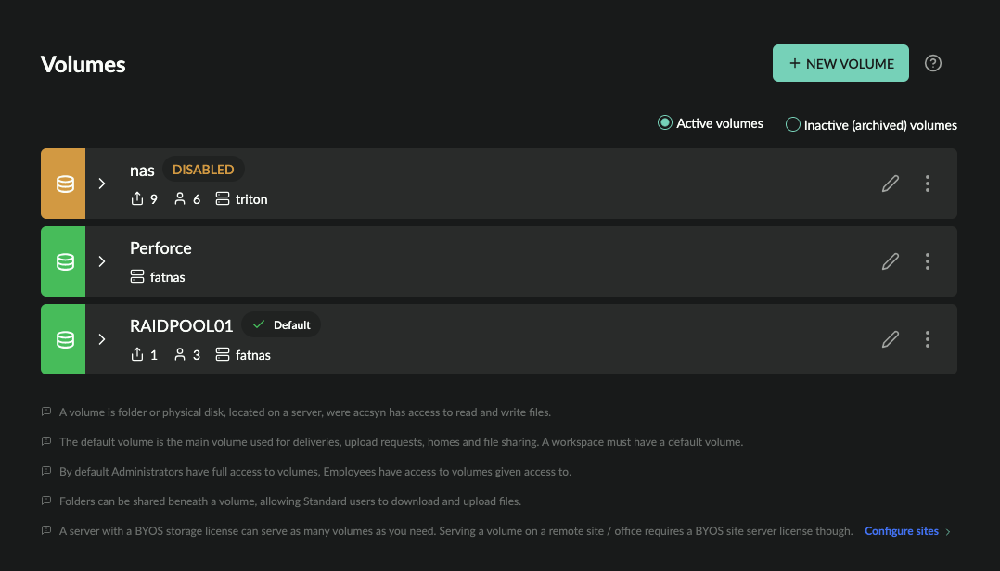

# Storage administration

This guide shows how to administrate your workspace storage - volumes, shared folders and collections. 

  

Prerequisites:

- Logged on as an administrator at<https://accsyn.io/admin/volumes>.

Contents:

[What is a volume?](storage.md)

[Volume list](storage.md)

[View volume](storage.md)

[Create a new volume](storage.md)

[Edit a volume](storage.md)

[Access](storage.md)

[Servers](storage.md)

[Attributes](storage.md)

[Metadata](storage.md)

[Delete a volume](storage.md)

## What is a volume?

A volume is the topmost folder on a server where accsyn is allowed to access files - download, upload, rename, move and delete.

  

- More than one volume may exist within a workspace.
- accsyn cannot access anything outside volumes, admins can access all volumes whereas employees and standard users must be given explicit access.
- One volume must be the "default" volume, the default volume is were home shares are created and new temp deliveries lives.
- A volume must be served by a [server](byos/server.md), the server that is servering the default server is called the main server.
- Volumes can be served on other sites,  as proxy volumes, enabling replication across physical or cloud locations.

## Volume list

The volume list shows all active volumes within your workspace:

- Status indicator; Green is enabled, orange is disabled.
- Name (code); The name of the volume.
- Default indicator - points out the workspace default volume, where deliveries originate from and accsyn home share folders are created.
- Share count: Shows the amount of shared folders beneath volume.
- User count: Shows amount of users having access to volume.
- Description; (Optional) The description of volume.
- Servers; List of main and site servers serving volume.
- Edit (pen) button.
- Menu button.

  

Volume menu:

- Edit; Bring up volume editor.
- Disable; Disable the volume.
- Enable; Enabled the volume.
- Inactivate; Archive the volume.
- Activate; Restore volume from archive.
- Logs; Show log events related to the volume.
- Delete; Delete the volume.

Filtering:

- Active volumes; Show current active volumes
- Inactivate archived volumes; Show volumes that has been inactivated - kept in workspace for audit reasons.

## View volume

To view/expand a volume, click on it. Volume information that is presented is:

- Space usage, together with a summary of capacity, occupied and free space.
- A list of shares - shared folders and home folders.

  

A shared folder is a folder beneath, or the entire volume it self, were standard users can be granted access to download and upload files. 

A home folder is a special type of personal shared folder that can be created upon invitation, to provide a default area of user collaboration.

  

Hint: For more information about operating shared folders and storage in general, see [File Sharing](../file-sharing.md).

  

Share list:

- Name; The given name of the share.
- Path; The (relative) path shared folder is at.
- Metrics; The amount of access points within the share folder, and the amount of users having access to shared folders, as defined by ACL:
- Accessed; The most recent time share was accessed.

  

Share menu:

- Edit; Audit and edit the share.
- Logs; Display log events related to share.
- Disable; Disable the share.
- Enable; Enable the share.
- Inactivate (archive); Remove the share but keep it in the platform for auditing purposes.
- Activate (restore); Restore an inactive share.
- Delete; Permanently delete the share, this will not affect physical data on disk.

## Create a new volume

To create a new volume, click NEW VOLUME button in upper right corner.

  

A volume needs to be served by a server, choose the server from the list. The servers are listed with the site they are at.

  

Enter the local path for the accsyn volume and click Validate path when you are done, the path must exist on the server.

  

Enter the name of the volume and additional paths by which this volume should be associated with.

  

When done, click CREATE to have the volume created. Click the cross (X) icon in upper right corner to cancel creation.

## Edit a volume

To edit a volume, click on it in the list.

  

### Access

Audit all users having access to the volume, as ACL:s grouped by accsyn base roles:

- User; The user ident (email).
- Share; The shared folder or home the user has access to.
- Path; The path beneath shared folder where user has access.
- R(ead); Indicate if user has rights to list and download files.
- W(rite); Indicate if user has rights to upload and modify files.
- Granted; The date ACL entry were created.
- Granted by; The user giving access.
- Ack; Indicate if user has acknowledged the grant.

  

Revoke access

Click the rightmost trashcan icon button at an ACL entry to revoke access for the user.

Note: administrators cannot be revoked access on volume level, they will require to be disabled or deleted on a user level.

  

### Servers

List servers that are serving the volume, the server at main site (hq) are coloured green.

To set/change the server for a site, hover the corresponding site and click the pen icon that appears. A list of servers configured at site will be presented, if no servers found you will need to install a new server on the site for the purpose.

You can override the path(s) that volume has at the site, when changing these - make sure that the server and clients at site can read and write files as needed at these paths.

Note: Site servers may require additional BYOS licenses.

  

### Attributes

Edit volume attributes such as server, paths and name.

  

Transfer settings

Override global accsyn copy protocol (ASC) file transfer settings for the volume.

NOTE: Transfer settings can be further overridden on share, queue and individual job level.

  

Email Settings

Override global email rules for jobs involving this share.

NOTE: Email settings can be further overridden on queue and individual job level.

  

### Metadata

Define metadata for this volume, will be appended to upstream metadata and provided to jobs with Workflows - API calls, engine execution, hooks execution, and so on.

## Delete a volume

To delete a volume, open the volume menu (three dots icon) on the right hand side and choose Delete.

  

NOTES: 

- Default volumes cannot be deleted, assign another volume as default first.

- This cannot be undone.

  

Eventual shared folders and homes beneath the volume will also be deleted. Also collections containing files on volume, will have these file references removed.
