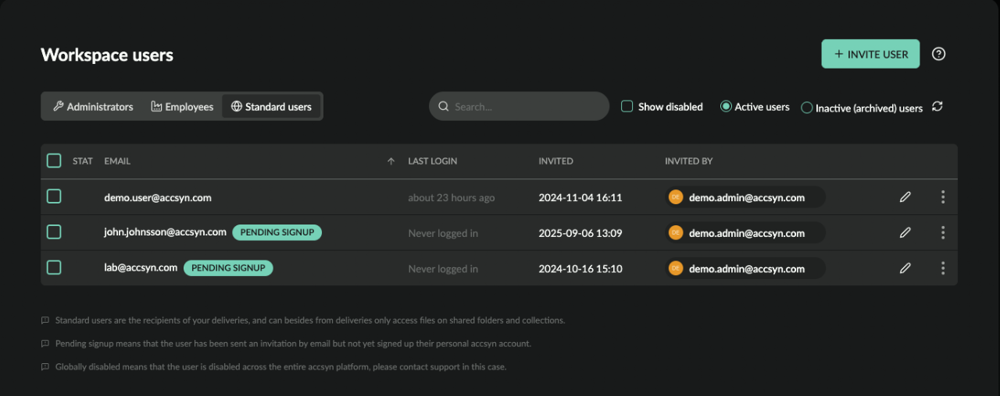
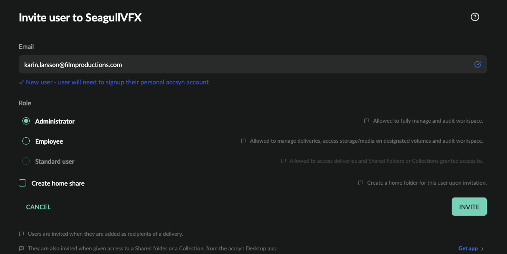

# User administration

This guide shows how to manage your workspace users and is targeting workspace administators and employees

Contents:

[What is a user](user.md)

[Licensing](user.md)

[List users](user.md)

[Invite new user](user.md)

[Modify users](user.md)

[Change role](user.md)

[Status](user.md)

[Archive & Restore](user.md)

[Delete](user.md)

[Audit](user.md)

[Logs](user.md)

[Access](user.md)

[Clients](user.md)

Prerequisites:

- An active accsyn workspace.
- An elevated accsyn account being member of workspace, either admin or employee.

## What is a user

Users in accsyn are identified by their unique email addresses and their internal ID, defined by their accsyn account.

Accounts are personal - when the user registers their account they choose their own password or can choose to sign up using a third party identity provider such as Google.

Note: A user in accsyn can have access to more than one workspace, this means that removing the user from your workspace does not remove their accsyn account.

Each user has a base role, defining what they will be able to do  within the platform. There are three base roles in accsyn.

- Admin; Allowed to see and perform any type of operations, including administration.
- Employee; Allowed to perform any type of operation on volumes they have access to, not allowed to perform administrative tasks.

- Standard; Standard (end) user, only allowed to access deliveries and shared files given explicit access to.

## Licensing

accsyn comes with unlimited Standard role user accounts, but with a license restriction on elevated users - administrators and employees.

The accsyn Essentials cloud subscription plan allows for one(1) elevated users, whilst the accsyn Pro and BYOS plans allows for two(2) elevated users.

Excess amount of elevated users are billed on a monthly basis according to the current pricing, for more information see <https://accsyn.com/pricing>.

 The user count are evaluated every day at midnight 00:00 CET, and the monthly top notation is used to calculated the exceess amount of elevated user and are charged accordingly the next billing period.  To check your current render farm usage, visit your workspace billing page @ [https://accsyn.io/si](https://accsyn.io/signup)

## List users

To list all members of your workspace, click the Workspace button on the left hand side and choose Users from the pulldown menu. The list of users will be shown, on list per role:

Presentation:

1. User selection; Enables batch operations on multiple users at once.
2. Email; The user's unique identifier.
3. Last login: The last time the user logged in.
4. Invited: When the user was invited to your workspace.
5. Invitee: Who invited the user.
6. Edit; Click to initiate user edit.
7. Modifications; Pulldown menu with single user modifications actions.

  

Filters:

- Search; Enter text to filter by text input.
- Show disabled; Also show disabled users.
- Active users; Show active users.
- Inactive users; Switch to show inactive (archived) users. An inactive user is kept to enable audit, later restore and to free up resources.

## Invite new user

To invite another administrator, employee or standard user, click the +INVITE USER in the upper right corner. This will bring up the invitation page:

Email

Enter the email address the user has. If the user already exists within the workspace, a warning will be given.

  

Role

The base role user should be given.

  

Volume access (employee role)

Choose one or more volume(s) the user should be granted access to. With no volume access, the employee will only be able to do basic job monitoring and audits.

  

Create home share

Check this if a home folder should be created on the default storage volume, with full access for the user, providing a place to upload material available immediately on account registration.

## Modify users

### Change role

The base role a user has can be changed any time. In the user list, click the user and go to Attributes tab were you will find an entry for changing the role.

  

### Status

The user can either enabled (default) or disabled, a disabled user is logged off immediately, jobs(transfers) are cut off and looses access to your workspace.

Select the user in list and choose Enable/Disable bulk actions, or, click the three-dot context menu drop down on the user and choose Enable/Disable option.

  

### Archive & Restore

To inactivate the user, e.g. archive it for later restore or audit, either selected user and run Inactivate or choose Inactivate from the user's context menu.

The user can be re-eactivated again using the same approach.

  

### Delete

To delete a user, either do it by bulk selection actions of from the user context menu.  Note that deletion cannot be undone, reach out to support to bring back an accidentially deleted user of importance.

## Audit

### Logs

User activity is stored as a log stream within the accsyn platform, to bring out the log open the users context menu (three-dot icon the right hand side) and choose Logs. It can also be opened by clicking a user an click the Log events button at the bottom.

### Access

To view which storage, folders a certain user has access to, click the user in list and go to the Access tab. (Active) Deliveries, upload requests and web streams are also listed here.

### Clients

To audit which p2p accsyn file transfer clients a certain user has registered, go to the Clients tab with a user open.
