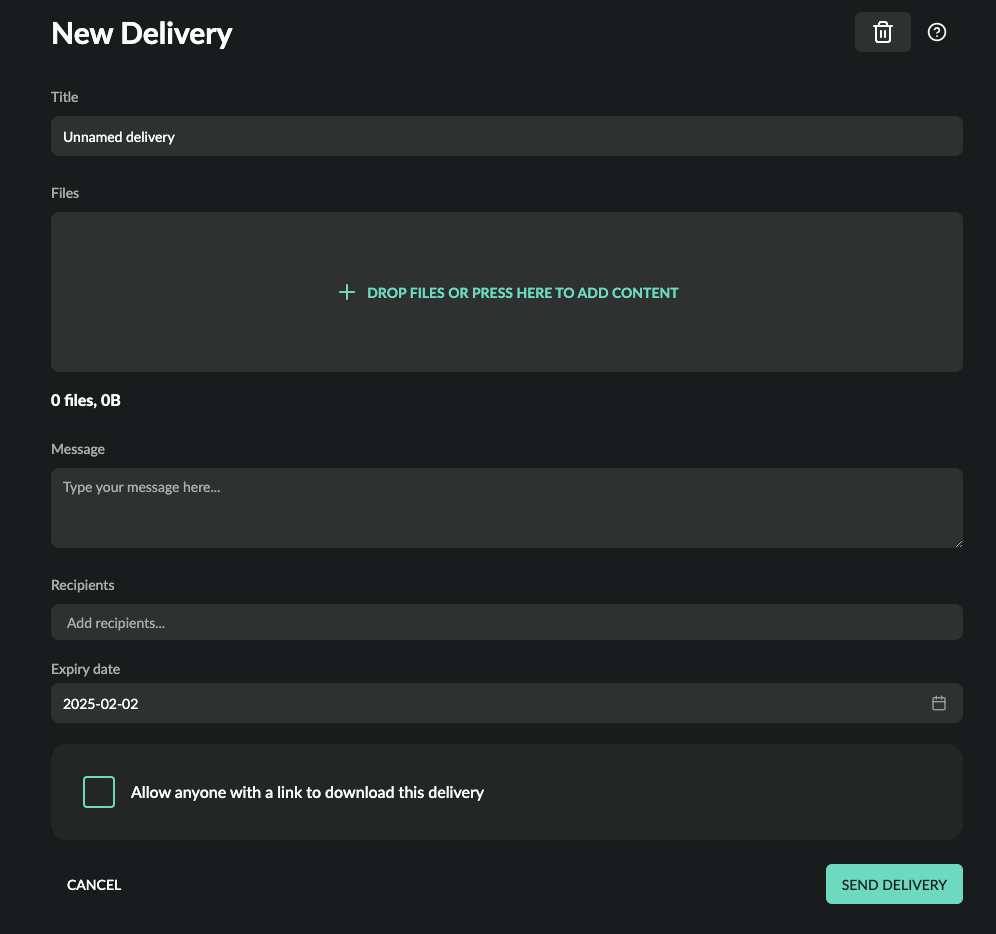
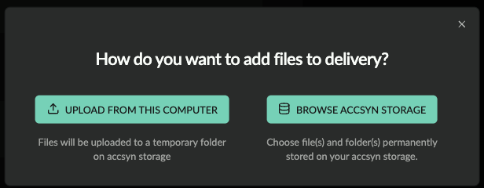
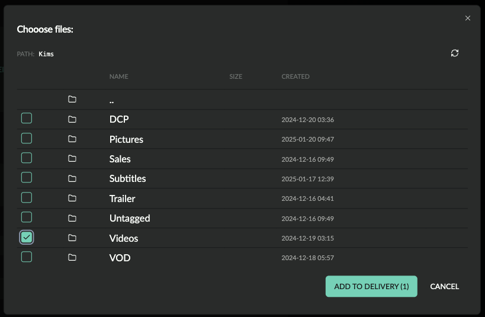
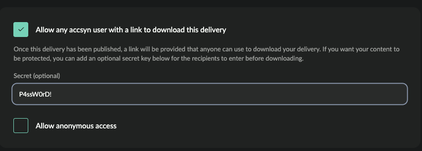
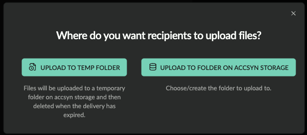
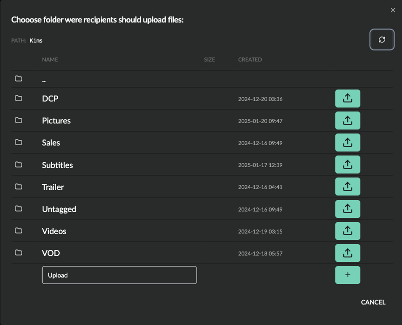
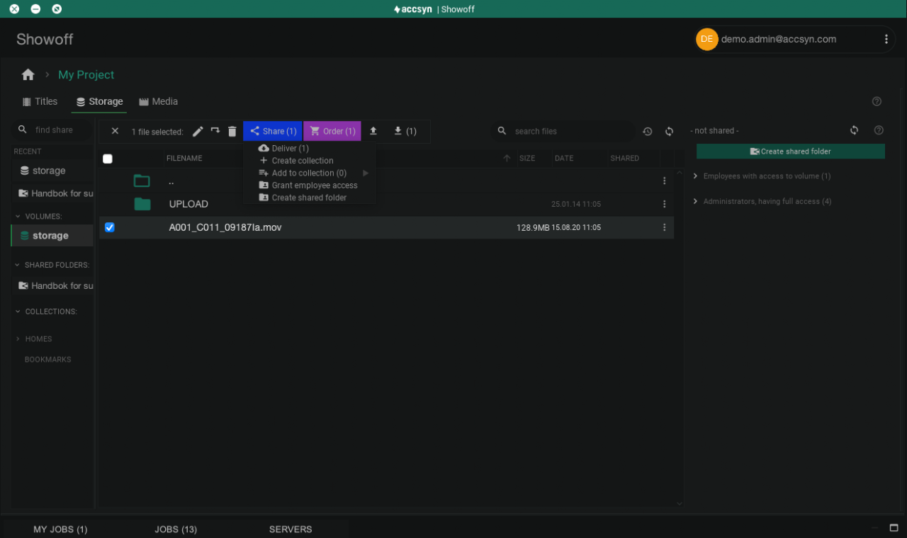
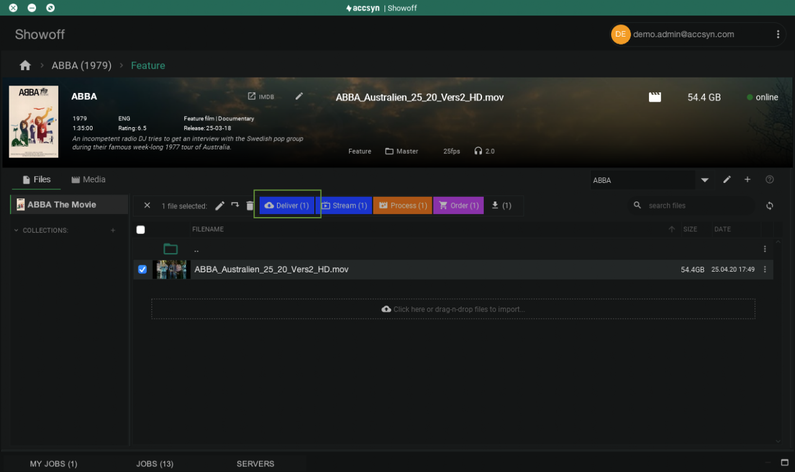

# Create a delivery

This guide shows how a file delivery is created in accsyn and sent to a recipient. We will both cover how to send deliveries based on temporary files uploaded just for that delivery, and how to delivery files/title media from accsyn cloud storage or BYOS storage.

### Prerequisites

- An active accsyn workspace trial or subscription.
- A web browser, preferably Google Chrome.

## Create a standard delivery

A standard accsyn delivery is one or more files and/or folders uploaded to a temporary place on your accsyn cloud storage, for delivery to one more recipients.

Note: See below for guides on delivering from files already residing on the cloud storage or delivering media from a title.

  

1. Logon to accsyn web app [<https://accsyn.io>].
2. Go to Outbound section beneath the workspace menu button on the left hand side.
3. Click NEW DELIVERY.

Screenshot of delivery create page

4. To add files to delivery, click DROP FILES OR PRESS HERE TO ADD CONTENT. A prompt will appear were you can choose between uploading files from your local computer to a temp directory on accsyn storage, or browser and choose existing file(s)/folder(s) on your accsyn storage:

### Upload from this computer

Here we upload the files and folders to the delivery.

The recommended way is to install and use the accsyn desktop app for transferring files, it is way much stable and faster than attempting to use the browser. If it is small single files on the other hand, browser transfer will be sufficient.

- Choose USE ACCSYN FOR MAC, it will check if the accsyn app is running. If you have it installed, click I HAVE THE ACCSYN APP INSTALLED, otherwise click INSTALL THE ACCSYN DESKTOP APP.
- Download the installer and run it, accsyn will launch after installation has completed and then pickup the upload prompting you which files to upload.

If you seek to use the browser, instead choose PROCEED WITH BROWSER and then upload the files one by one - note that web browsers does not support folder upload, then you will have to switch to app.

### Browse accsyn storage

Watch this video to see how to send a folder from your storage:

A file browser will appear, listing the contents of your accsyn storage. Choose the file(s) and/or folder(s) to send, and then click ADD TO DELIVERY:

5. Delete files from delivery by clicking the trashcan symbol on the right hand side of each file added.

6. When all files has been added, enter the email address of the user that should download the delivery. Multiple users can be added here and users that have been sent to earlier are remembered and selectable from a list.

7. Set the Expiry date, by default it is set to a month/30 days.

### Public delivery

Screenshot of delivery access options.

By default, only the recipients can download the delivery when logged in with the same email. If you want any accsyn user with the link to be able to download the delivery, check Allow any user with a link to download this delivery.   To protect the download further, you can add a password by filling out the Secret field.

  

If you want to allow anonymous access, meaning that anyone can download the delivery without needing to create an accsyn account/login, check Allow anonymous access.

  

Disclaimer: Allowing anonymous access is generally a bad idea, as you will expose your files without any layer of access protection!

### Send delivery

When ready, click SEND DELIVERY to have download link created and emails sent to recipients.

Note: you can leave the delivery for completion later, deliveries will stay there for 8h before they expire and you will have to start over.

## Create an upload request

An upload request is a reversed delivery - requesting users to upload files to a folder for download when everyone has actioned the upload.

  

This video shows how to create an upload request to a temporary folder:

1. Logon to accsyn web app [<https://accsyn.io>].
2. Go to Requested section beneath the workspace menu button on the left hand side.
3. Click NEW REQUEST, a prompt will appear asking if recipients should upload to a temp folder or to a targeted folder on your accsyn storage:

### Upload to folder on accsyn storage

A file browser will appear were you can choose which folder to upload to. A new folder can be created by entering the name and clicking the plus (+) button:

4. Enter the email address of the user that should upload to the request. Multiple users can be added here and users that have been sent to earlier are remembered and selectable from a list.

5. Set the Expiry date, by default it is set to a month/30 days.

6. As with a delivery, click Allow any accsyn user with a link to upload to this request to allow any user having the link to upload to the folder.

  

When you are all set, click SEND REQUEST to haveemails dispatched to recipients with upload instructions. If uploading to a temp folder, it will be created at the storage.

## Deliver from Cloud or BYOS storage

Deliveries can also be made from the accsyn Cloud storage if you are using it as permanent storage, this section also applies to BYOS deliveries from volumes/shared folders.

  

1. Download and install the [accsyn Desktop app](../admin/desktop-app.md), login to your workspace (with a user having the admin or employee role)
2. Open the STORAGE tab.
3. Upload files & folders to your permanent storage.
4. Select the files/folders and either click the Share button in action bar and choose Deliver, or right click and do Share>Deliver.

Screenshot showing desktop app when choosing a file for delivery.

5. The new delivery will be spawned and you will be redirected to your web browser to finish up the deliver (see above).

## Deliver from the Media Vault

Media can easily be delivered from the media vault:

1. Download and install the [accsyn Desktop app](../admin/desktop-app.md), login to your workspace (with a user having the admin or employee role)
2. Create the title and log media to deliver.
3. Select the media file(s) and choose Deliver from the action bar, or right click media and choose Deliver:

Screenshot showing desktop app when choosing media for delivery.

4. Media will be added to the delivery cart on the right hand side, repeat the steps until you collected all media, 

5. When done, click Next recipients, to finish up the delivery in your browser - the same way you do for any delivery within the platform.

## Request upload to Cloud storage

In the same way, upload requests can be created with the desktop app, to have users upload to a permanent folder on your accsyn Cloud or BYOS storage.

  

1. Download and install the accsyn Desktop app, login to your workspace (with a user having the admin or employee role)
2. Open the STORAGE tab.
3. Browse to the folder you want to have users upload to, create new folders by clicking the create folder menu button or right click and choose Create new folder.
4. Click the Share button in menu and choose Request upload here, or right click and do Share>Request upload here.
5. The new upload request will be spawned and you will be redirected to your web browser to finish it up (see above).

Next: [monitor and manage a delivery.](manage.md)

Related articles:

[Introduction to accsyn](../introduction.md)
