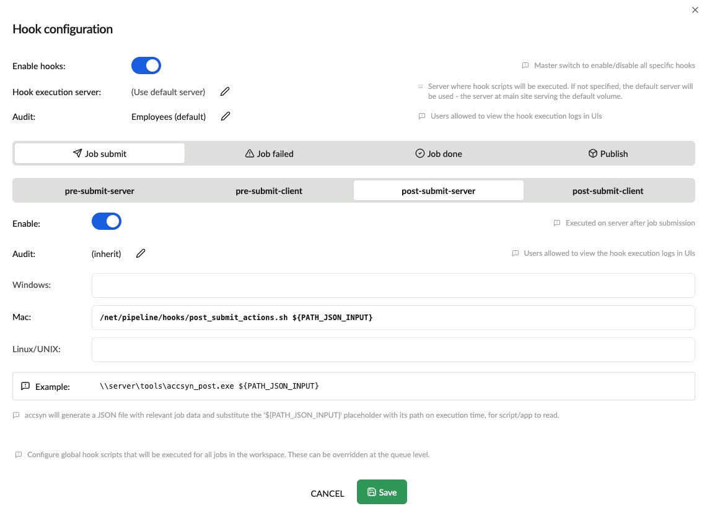

# Hooks

NOTE: This feature is exposed to BYOS workspaces only.

[BYOS](../admin/byos.md)

This documentation explains accsyn hooks and walks through how to configure them within your Workspace.

[What is a hook?](hooks.md)

[How does it work?](hooks.md)

[Hook data input format](hooks.md)

[Job lifecycle hooks](hooks.md)

[Publish hooks](hooks.md)

[Configure hooks](hooks.md)

[Configure queue hooks](hooks.md)

[Further resources](hooks.md)

## What is a hook?

A hook is a configured command line that points to script on your servers, that is executed by accsyn on certain triggers within accsyn:

- pre-submit-server; Executed on the server before a job is submitted, with job data provided. If hook execution fails, the job fails to fully submit.
- pre-submit-client; Executed on elevated\* clients before a job is submitted, with job data provided. If hook execution fails, the job fails to fully submit.
- post-submit-server;  Executed on the server after a job is submitted, with job data provided.
- post-submit-client;  Executed on  elevated\* clients after a job is submitted, with job data provided.
- post-failed-server;  Executed on the server every time a job fails, with job data provided.
- post-failed-client;  Executed on the remote elevated\* client every time a job fails, with job data provided.
- post-done-server;  Executed on the server when a job has finished, with job data provided.
- post-done-client;  Executed on the elevated\* client after a job has finished, with job data provided.
- pre-publish-server;  Executed on the server when a remote user requests to publish one or more files, with publish file data provided and expecting feedback to provided back to accsyn (see [Publish workflow](publish.md))
- publish-server;  Executed on the server when the published files from remote user has been uploaded, with publish file data provided (see [Publish workflow](publish.md))

  

\* Thes client hooks only apply to clients owned by an elevated accsyn user (admin or employee), like for example a site server. They will not execute on standard user clients due to privacy and security concerns.

## How does it work?

When a hook execution event triggers, accsyn executes the configured hook script on the server:

1. Data related to the specific hook is compiled and written to a temp JSON file, see syntax below.
2. The configured script command line is loaded and the expression "${PATH\_JSON\_INPUT}" is replaced with the full absolute path the temp JSON input file. This enables the script to load the metadata from arguments.
3. When required (pre-publish-server hook), a temp path is generated and replaces  "${PATH\_JSON\_OUTPUT}". This enables the script to write back data to accsyn as needed.
4. The script is executed, by the same system user are accsyn (daemon) is running on the server.

## Hook data input format

### Job lifecycle hooks

Here follows example hook input data, as beeing passed on to the "post-done-server" hook after the file "moonshot.tif" was uploaded to a project share:

Breakdown of JSON data:

1. metadata; Job metadata, aggregated upstream over queue, share, volume and workspace (global). For server side hooks, both internal (workspace private) and external (public) metadata are provided separately. For client side hooks, only the external metadata is provided in case the party is a user having the standard role.
2. clients; The client(s) involved in execution, identified by role attribute:server = the main site transfer part or compute execution server, client = the remote side of a transfer, either a user's desktop app/server or the site server.
3. client.metadata; Client metadata, aggregated upstream over workspace.
4. code & name; The job human readable identifier.
5. source; accsyn raw source party ident, on the form "<entitytype>:<entityid>".
6. source\_hr; Source party on human readable form.
7. destination; accsyn raw destination party ident, on the form "<entitytype>:<entityid>".
8. destination\_hr; Destination party on human readable form.
9. version; The accsyn backend version.
10. hook; The name of the hook.
11. size; The size of the job - sum of non excluded task sizes.
12. engine; The engine ID.
13. engine\_hr; The engine name (code).
14. id; The ID of the job.
15. user; The ID of the user that created the job.
16. user\_hr; The email address of the user creating the job.
17. created; The date job were created.
18. queue; The ID of the parent queue job is in.
19. queue\_hr; The name of the parent queue job is in.
20. tasks; Job tasks dictionary, providing detailed information about transfer source and destination (full path and share/volume relative paths).
21. status; The status of the job during hook execution.

### Publish hooks

For detailed information about the publish hooks, header over to the [Publish documentation](publish.md).

## Configure hooks

To configure hooks globally, logon as administrator to <https://accsyn.io/admin/settings>:

1. Click on the Hooks settings tab.
2. Click the edit(pen) icon on Hook configuration setting.

3. Click Enable hooks to have hook subsystem enabled.

4. If you want to run the hooks on a different server than the default (serving default volume at main site), choose the server @ Hook execution server.

5. Audit; Define by base role, which users are allowed to audit the hooks and read the execution logs.

6. Choose which hook you want to configure.

6. Click Enable.

7. Choose the entry matching the operating system your server is running, enter the local full path your script. Keep the token "${PATH\_JSON\_INPUT}" - it will be replaced with the path to the temp JSON input data at runtime. (Same goes for ${PATH\_JSON\_OUTPUT} with the pre-publish-server hook)

  

Click [ Save ] when done to apply your hooks configuration. Test the hook by submitted a job / performing a publish.

  

### Configure queue hooks

Hooks can be overridden, or just be configured on a queue. See [Queue administration](../admin/queue.md).

## Further resources

[Python API](python-api.md)

Use the Python API within your hook, for example to program chained file transfer workflows.

[Outsourcing Pipeline](../tutorials/outsourcing-pipeline.md)

A tutorial going through how to setup an outsourcing pipeline with accsyn, using publish hooks.
