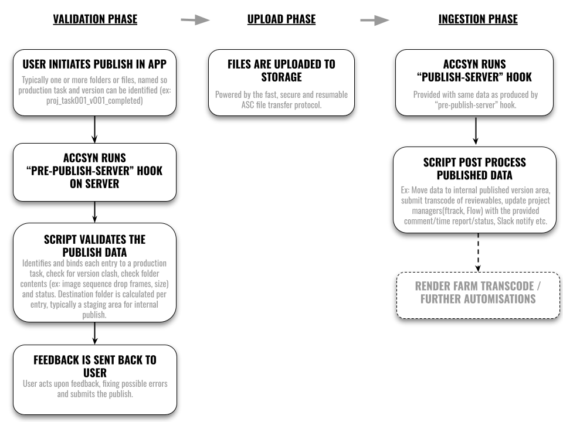

# Publish Workflow

NOTE: This feature is exposed to BYOSworkspaces only.

[BYOS](../admin/byos.md)

This guide walks through how to setup a publishing workflow within your accsyn Workspace

CONTENT

[What is publish?](publish.md)

[How does it work?](publish.md)

[Validation phase](publish.md)

[Upload phase](publish.md)

[Ingestion phase](publish.md)

[Publish hooks developer guidelines](publish.md)

[Prerequisites](publish.md)

[Developing the pre publish hook script](publish.md)

[Developing the publish(ingest) hook script](publish.md)

[Configuring the pre publish (validation) hook](publish.md)

[Configuring up the publish(ingest) hook](publish.md)

[Testing](publish.md)

[Troubleshooting](publish.md)

[My pre-publish hook(s) crashes during execution, where can I read the logs?](publish.md)

[The publish job failed and turned red after publish hook crashed, how do I re-run the hook?](publish.md)

[Further resources](publish.md)

## What is publish?

Common in media production is the need to work with external vendors, the accsyn [File Sharing](../file-sharing.md) feature is ideal for setting up shared folders to distribute work assets and also receive the final work done.

accsyn Publish is a special uploader that adds a layer of validation and also facilitates automated ingest of material into the production system. This is a huge time saver as it eliminates a lot of manual work and brings your external vendors closer to production - as if they were a part of your in-house team.

Publish is driven by the accsyn [Hooks](hooks.md) subsystem.

## How does it work?

The following schematic visualises the accsyn publish workflow:

The remote user logs on the desktop app, choose the publish option and drops the files on to the publish area.

### Validation phase

What happens is that accsyn reads the full list of filenames, folders and file size. The script configured for pre-publish-server hook is then run on your server, allowing you to validate the file list and give feedback to the user - this is before any file is actually uploaded.

The pre publish script can:

- Detect if any required files are missing.
- If file sets are incomplete.
- If files has the wrong naming convention.
- File sizes does not add up.

The user will then be presented feedback, for each item - typically a folder per task in a post production workflow. If all is greenlit, the user will be able to publish the files.

### Upload phase

The pre-publish provides the path to were files will be uploaded, this way you can steer exactly were files will end up - typically a staging area for further ingestion.

Important Note: The user does not require write permission to this path, leaving it to the pre publish hook logic to determine the upload destination par entry.

### Ingestion phase

When the files are uploaded, the publish-server hook is run with the same payload as provided by pre-publish-server hook, with additional comments, statuses and time reports provided as entered by the user.

With this script you can then further ingest the files into your system, for example submit a Quicktime proxy movie transcode job to a render farm and publish a version to a shot tracking system such as ftrack, flow or sheets.

## Publish hooks developer guidelines

### Prerequisites

The publish feature is 100% code driven, you will need basic Python developer experience. We provide production ready template scripts on our public Github that you should be able do download and augment:

[Example publish scripts @ Github](https://www.google.com/url?q=https%3A%2F%2Fgithub.com%2Faccsyn%2Fpublish-workflow&sa=D&sntz=1&usg=AOvVaw2-EBcyStRLGp8BT3SduYQ4)

Note: In this guide we assume your publish scripts will be written in Python, and is deployed on a Linux server.

  

- An active BYOS workspace, with an active administrator login.
- An accsyn server, be it the main storage server or a separate server where you already have configured hooks to run.
- Python installed at the server.
- (Optional) A pyenv designated to run the scripts, providing additional dependencies.

  

### Developing the pre publish hook script

Here follows example hook input JSON, from a user publish a folder "proj\_task001\_v001\_completed" containing an image sequence:

A breakdown of the input:

- hostname; The name of the remote computer publish were initiated at.
- ip; The remote IP address of client.
- client; The ID of the remote accsyn client.
- metadata; The user metadata, aggregated with workspace metadata.
- hook; The name of the hook being executed.
- user; The ID of the user.
- user\_hr; The user unique code identifier (email).
- files; The file(s)/folder(s) to be published, each file corresponding to one item/entry to be published and having an unique id. Folder items recursively contains another "files" entry. Folder size are provided as the sum of file sizes within a folder. is\_dir attributes directories.

  

After script logic has processed the data, output should be passed back to accsyn by writing JSON to the file path given as argument to the script. Here follows example feedback for the data above:

Breakdown of the output:

- guidelines; (optional) Plain text, or HTML, formatted instructions to the remote user giving the guidance how to publish their data into your production pipeline.
- comment; If true, user must provide a comment - e.g. add a note describing work that has been done.
- time\_report; If true, user must report time spent on the work task.
- statuses; A list of statuses user is allowed to choose among. The default propsed status should have the "default": true key set.
- files; File entries, augmented with feedback data. See below.

File entry format:

- id; The publish entry id, should be preserved from the input.
- ident; An internal unique entry identifier for the publish entry, provided as label/human readable identifier to remote user.
- can\_publish; If true, the entry is accepted as is.
- rejected; If true, the entry is rejected with a comment.
- warning; String describing the reason entry was not approved, will be presented clearly to user within the desktop app.
- can\_upload; If true, files are still allowed to be uploaded. E.g. the entry was not technically approved, but allow "panic" upload for manual internal publish later.
- comment\_label; (Optional) The label to preceed comment input field, defaults to: "Comment:".
- path; If approved, or can be uploaded, this is the destination path that will be used for that entry during upload phase. Can be given as an absolute path that accsyn understand (derived from configured volume platform paths), or on accsyn notation (ex: volume=projects/staging/proj\_task001\_v001\_completed)
- info; (optional) Additional feedback to the user on this entry.

  

### Developing the publish(ingest) hook script

Here follows example JSON data provided to the "publish-server" hook upon arrival of an publish upload:

The data is very similar to the standard data passed on to a job lifecycle hook (ex: job-post-done-server), the base entries are covered fully [here](https://sites.google.com/accsyn.com/help/developer/hooks).

Breakdown of entries in the files JSON data sub-structure:

- time\_report; The time (in seconds) reported by user.
- path; The destination path, as dictated earlier by the pre publish hook (see above).
- filename; The last path entry.
- can\_publish: As provided by the pre publish hook (see above).
- v\_hr; The name of the destination volume.
- ident; As provided by the pre publish hook(see above).
- is\_dir; If true, the entry is a directory.
- v; The internal accsyn ID of the destination volume.
- comment; The comment entered by the user.
- status; The status entered by the user.

## Configuring the pre publish (validation) hook

Assuming you have implemented the initial pre publish python script and it is ready for testing:

1. Store the pre publish script on the server, for example /mnt/pipeline/accsyn\_scripts/pre\_publish.py.
2. Logon to [accsyn.io/admin/settings](http://accsyn.io/admin/settings) as an administrator and go to Publish tab.
3. Check Enable publish, it will give an alert that publish hooks are not setup which is fine.
4. Go to Hooks tab and edit the Hook configuration.
5. Go to pre-publish-server tab and locate the script entry that corresponds to the operating system server is running.
6. Enter the script command line, for example "python3 /mnt/pipeline/accsyn\_scripts/pre\_publish.py ${PATH\_JSON\_INPUT} ${PATH\_JSON\_OUTPUT}" (replace python3 with full path to venv executable if applicable).
7. Click save.

  

Important notes:

- The expression ${PATH\_JSON\_INPUT} will be replaced in runtime with path to the JSON data file (located in default accsyn temp location). Setup your script to read publish data from this path (sys.argv[1]).
- ${PATH\_JSON\_OUTPUT}  will point to a JSON output file where your script is expected to save the data returned to user accsyn desktop app. Setup your script to output data this path (sys.argv[2]).
- Try to make the script fairly quick to execute, maximum 30s, not to keep the remote user wait to long for the response.

  

Now test the pre publish hook by publishing a file and or folder, the stdout and stderr of hook execution are streamed to the standard accsyn server log (located at /var/log/accsyn on Linux). Iterate implementation of the pre publish script until the desired validation process is solid.

## Configuring up the publish(ingest) hook

This is an optional step, and can be left out if no post processing of files are needed on arrival.

1. Store the publish script on the server, for example /mnt/pipeline/accsyn\_scripts/publish.py.
2. Logon to [accsyn.io/admin/settings](http://accsyn.io/admin/settings) as an administrator and go to Hooks tab and edit the Hook configuration.
3. Go to publish-server tab and locate the script entry that corresponds to the operating system server is running.
4. Enter the script command line, for example "python3 /mnt/pipeline/accsyn\_scripts/publish.py ${PATH\_JSON\_INPUT}" (replace python3 with full path to venv executable if applicable).
5. Click save.

  

Important notes:

- The expression ${PATH\_JSON\_INPUT} will be replaced in runtime with path to the JSON data file (located in default accsyn temp location). Setup your script to read publish data from this path (sys.argv[1]).
- The script should not execute long running tasks, it is best practice to run such tasks by a background process executor server like a render farm or similar.

  

### Testing

Now publish a file and test the publish script, the stdout and stderr of hook execution are streamed to the standard accsyn server log (located at /var/log/accsyn on Linux). Iterate implementation of the pre publish script until the desired validation process is solid. You do not need to publish a new file each iteration, simply run the script manually in a shell session based on the command line output in log file.

## Troubleshooting

### My pre-publish hook(s) crashes during execution, where can I read the logs?

Cause: Hook script syntax i malformed or executable throws an exception and returns a non-zero exit code back to accsyn server.

Solution 1: Either check the Job audit logs available here: <https://accsyn.io/admin/audit> > Job log.

Solution 2: Inspect the accsyn daemon(server) log, log file location are documented [here](../admin/byos/server.md).

  

### The publish job failed and turned red after publish hook crashed, how do I re-run the hook?

Cause: A hook has caused the publish upload job to fail.

Solution: Retry the job, either from desktop app or from <https://accsyn.io/jobs>.

## Further resources

[Tutorial - Outsourcing Pipeline](../tutorials/outsourcing-pipeline.md)

Tutorial going through in detail how to setup an outsourcing pipeline with accsyn and publish.
