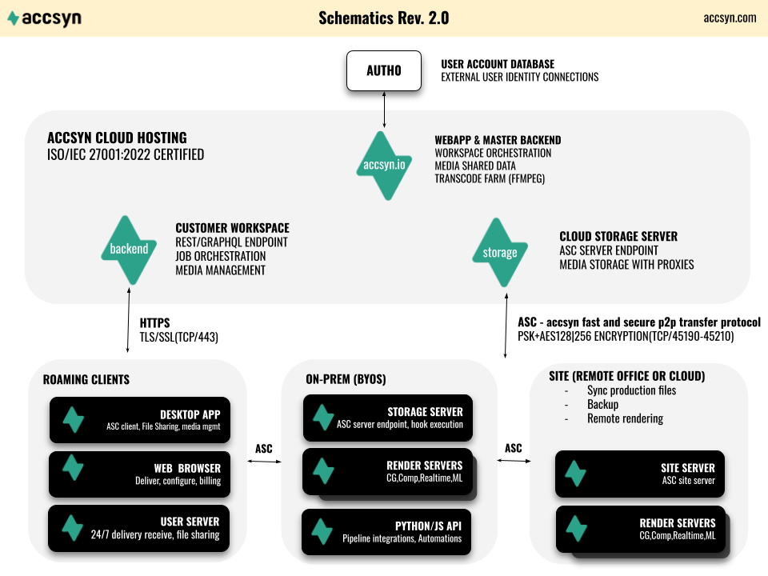

# An introduction to accsyn

## What is accsyn?

accsyn is a SaaS (Software as a Service) platform featuring the high speed encrypted ASC file delivery protocol, designed to transport a large set of files as efficiently as possible from one physical location to another, featuring a complete I/O platform targeting film production and film distribution industries.

## What can accsyn do?

accsyn is designed to be used in one of these two scenarios:

- Media production; Shooting, ingest, post production, rendering, collaboration, rendering, delivery and workflows.
- Media distribution and archival;  Tagging and structuring, proxy generation, web streaming/previews, distribution to screen (cinemas, conferences), long term archival.

  

These common features are available across the platform:

- [File Delivery](delivery.md); Smooth web browser based delivery of large file sets.
- [File Sharing](file-sharing.md); Cloud hosted or on-prem advanced ACL driven file and folder sharing, replacing FTP and similar solutions. With advanced functionality such as desktop app monitor with queue management, locally mapped shares, remote sites/officess, render farm and publish workflows.

  

These features are targeting production:

- [BYOS](admin/byos.md); Run accsyn servers on your own infrastructure. Compute/render farm, hooks and publishing.
- [Workflows](vault/media-lab.md); Automate file transfers, creating advanced API driven workflows.

  

These features are targeting distribution and archival:

- [Media Vault](vault.md); Media/master long term cloud storage with IMDB linkage,proxies, web streaming, clip extraction, Q/C.
- [Lab Services](vault/media-lab.md);  Have our partners help you refine your media assets.

  

Important note: The Media Vault can not be run on-prem as of version 3 (although this is subject to be improved in future versions). To facilitation both BYOS and Media Vault, two separate workspaces  should be deployed.

## Why would I need accsyn?

Film production, and media production in general, deals with transferring and storing filmed and processed media. What really slows down film production and distribution is slow file transfers, and limited means of organising and sharing media assets.

  

accsyn is designed act as a reliable file hub throughout the entire film creation process - 

from shoot on set all the way to the screen - cinema or a streaming

## How does it work?

The accsyn cloud backend both orchestrates high speed p2p transfers, compute jobs and provides media management capabilities. The accsyn app, which runs both on desktop and as a background service, act as the high speed file transfer endpoints.

## How secure is accsn?

Security and integrity is paramount, all internal communications are carried over standard https protocols and the ASC (accsyn copy) accelerated p2p protocol are using standard AES industry grade encryption. 

  

No file servers are listening 24/7, providing a minimal attack surface for hackers. Only during a brief moment during ASC file transfer init, a software firewalled (only accepting connections from the remote client IP) is spawned and then teared down upon connection establishment.

  

For more in depth coverage of how the accsyn protocol works with comparison to other file transfer solutions:

[SECURITY WHITEPAPER](https://www.google.com/url?q=https%3A%2F%2Fdownload.accsyn.com%2Fsupport%2Faccsyn%2520Security%2520Whitepaper.pdf&sa=D&sntz=1&usg=AOvVaw1lYQGGZskz-LRSgvB8hdGl)

- Explore the ASC protocol in detail

## Is there a free trial?

Yes, you can start your own 1 month 500GB or 1 BYOS storage server free trial by signing up a workspace at <https://accsyn.io/trial> - with all features exposed, no credit card required.

## How do I get going with accsyn?

To start using accsyn within your business, you will need to create an accsyn Workspace:

- Go to <https://accsyn.io>, you will be asked to register your personal account - this is mandatory.
- An verification email will be sent to you, please action it.
- Once logged in to accsyn, click START 30 DAYS FREE TRIAL button in the left hand menu.
- Start the workspace by entering your contact information and the name you wish to give your Workspace, this can be changed later.

Once in, you are ready to [create your first accsyn delivery](delivery.md).

[TRIAL](trial.md)

- Detailed documentation on how to initate a trial

## How is it licensed and what does it cost?

An accsyn license grants you access to all features within the platform, without restrictions. Two types of licenses exists, the accsyn Cloud Workspace license and BYOS server licenses.

  

accsyn comes with a standard 1TB Cloud workspace and 2 users included, with an additional charge for:

- Storage; per TB (Terabyte) of additional cloud storage used on a monthly basis
- Users\*; per additional elevated (admin or employee role user)  with an additional charge for web streams.

  

accsyn BYOS comes with one storage server and 2 users,  with an additional charge for:

- Per site server\*
- Per compute/render server\*

  

- Usage is measured at midnight CET, the top notation is recorded and billed for the next billing cycle.

  

Lab services are charged per order item, hours spent and deliverable.

[Pricing](https://www.google.com/url?q=https%3A%2F%2Faccsyn.com%2Fpricing%2F&sa=D&sntz=1&usg=AOvVaw0R0zBMaZwmUvZt7XYlLZXp)

- Learn overall pricing, and download the current price list.

## How do I get started?

Depending on were you are in production, there are different ways to approach accsyn after you started your trial. The features below can be combined in many ways, it is up to you to decide which tools to use.

  

### Delivery

I you just need a delivery tool for sending out file packages, or receiving files, you simply use your web browser logged in to <https://accsyn.io> - no additional software needed.  Looking to deliver from your own on-prem server, head over to [BYOS](admin/byos.md) section.

[Deliveries](delivery.md)

- Get started with smooth, secure and resumable accsyn file deliveries

### File Sharing

When you need an area to store and share files during production with collaborators, either cloud or on-prem([BYOS](admin/byos.md)). To manage your storage and sharing, you will need to install and use the [accsyn Desktop app](admin/desktop-app.md) after your trial is up and running.

[File Sharing](file-sharing.md)

- Get started with the accsyn file sharing functionality, streamlined for production.

### Media Vault

The film is produced but the master needs some place to live, organised with proxies and tooling for distributing it to the screen. To manage your vault, you will need to install and use the [accsyn Desktop app](admin/desktop-app.md) after your trial is up and running.

[Media Vault](vault.md)

- Let us host your masters and deliverables, bringing order to all kinds of file media formats empowered by our transcode, streaming and delivery engines.

### Developer Hub

I am looking to setup advanced automisations involving pushing and processing large files sets between different locations.

[Developer Hub](developer.md)

- Discover what you can achive with programmabe file transfers.

## What does accsyn mean?

accsyn means accelerated file synchronisation

For more information, please visit: <https://accsyn.com>
