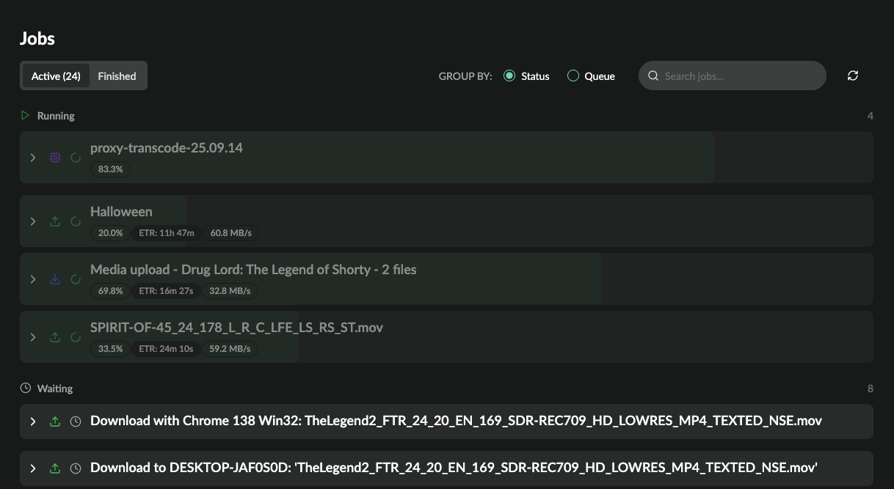

# Monitoring and Queue management

This guide walks through how to monitor and manage accsyn ongoing jobs - file transfers and render/compute jobs.

  

Covered elsewhere:

- [Monitor deliveries and upload requests](../delivery.md).
- [Monitor web streams](../vault/stream.md).
- Monitor render/compute farm.

  

Prerequisites:

- Logged to <https://accsyn.io/jobs> as an elevated user - having employee or admin role.
- Logged on to the desktop app as an elevated user - having employee or admin role. Download app [here](https://accsyn.io/getapp).

Contents:

[Job monitoring](job.md)

[My jobs](job.md)

[Workspace jobs](job.md)

[Job view](job.md)

[Task list](job.md)

[Footer](job.md)

[Job and queue management](job.md)

[Manage job states](job.md)

[Queue system](job.md)

[Concurrent file transfers](job.md)

[Re-queue jobs](job.md)

[(Advanced) Manage task states](job.md)

[Retry mechanism](job.md)

## Job monitoring

### My jobs

On the web, your current running job is visualised in the upper right corner on the activity icon:

It shows the progress and the ETR, if you have many jobs running it will display the oldest (first submitted). Click the my jobs icon to bring up a drawer showing all your active and finished jobs.

  

In  the desktop app, you will find your jobs at the exapandle bottom area in the MY JOBS tab.

### Workspace jobs

Jobs are spawned:

- When someone uploads or downloads from a delivery, request or web stream.
- From the accsyn Desktop app, with [File Sharing](../file-sharing.md) or when submitting a compute/render job.
- With the accsyn API (Python/JS), for more information see [Workflows](../developer.md).

  

To monitor all ongoing and finished transfer, go to the Jobs page (<https://accsyn.io/jobs>) om the web.

The page displays all file transfers and compute jobs currently running, grouped by queues:

Choose between displaying active or finished(and aborted) jobs. Change grouping between queue(default) or status, search jobs.

  

### Job view

Expand a job to view detailed information about the job, including tasks/files within job.

  

Toolbar:

- Pause, resume, abort job buttons.
- View job log - all events related to job during its lifetime.
- Queue and position within brackets.
- Size of job

  

### Task list

A task is a single file or folder within a file transfers, or a compute/render task:

- Select; Select one or more task to modify the status.
- Number/uri; The task number/identifier.
- Name; The filename
- Size; The size of the file being processed.
- Status; The status of processing.
- Tries; The amount of times task has processed.
- Start; The time task started processing.
- Time: The time task processed.
- Logs; Bring the detailed task process log.
- Description; (Optional) Task description.

  

### Footer

- Source > destination
- Create date
- Finished date
- ID (API).

## Job and queue management

This section covers more advanced operations that involves managing jobs (transfers/compute) on a larger scale. accsyn has been designed to be a central hub for all file transfers and long running background tasks within an organisation, enabling operators to prioritise single jobs or groups of jobs depending on project needs.

  

### Manage job states

How to manage job states using your web browser:

- Pause (active only); To pause a job, either select the job in the list and choose Pause from the action bar, or open the job and click the pause icon. Job will stop executing immediately and be de-queued.
- Retry/resume; To retry a job a paused/failed active job or a finished/aborted job, either select the job in the list and choose Resume/Retry from the action bar, or open the job and click the play icon. Job will be put at bottom of queue and resume operations once job(s) above has given way.
- Abort;  To abort a job, either select the job in the list and choose Abort from the action bar, or open the job and click the stop icon. Job will stop executing immediately and be flagged as finished.

  

### Queue system

Under the hood, accsyn provides a queue management system.  Each job, including deliveries, are always placed in a queue. If not provided during submission, the default queue is used. Each queue has a priority number, defining which  jobs should run before others. Jobs cannot have a priority number set, to change job priority the job has to be moved to another queue. 

  

Three standard queues are supplied in accsyn:

1. High, priority: 999.
2. Medium, priority: 500 - the default queue.
3. Low, priority: 1

  

### Concurrent file transfers

A queue makes sure only one job, between two endpoints, runs at a time. That means in theory that a virtual queue exists for each p2p pair of endpoints. This is because accsyn cannot measure, control and adjust for bandwidth consumption on a higher router level - a very complicated algorithm.

  

A queue can be configured to allow more than one concurrent transfer, see transfer\_concurrent setting.

  

### Re-queue jobs

To change the queue a job is in:

1. Check Show all queues if the destination queue is not visible.
2. Drag the job to the new queue.

  

To change the order of jobs in a queue:

1. Drag the job to a new position in queue by dropping it on the drop zones that appear between jobs.

  

Different rules apply by default depending on job type:

- File transfers; They are interrupted immediately to give way to the job(s) above in queue.
- Renders: They are allowed to finish processing before giving way.

  

To learn how to configure your accsyn workspace queues, head over to [Queue administration](../admin/queue.md). 

  

### (Advanced) Manage task states

The state of individual tasks can also altered to fine tune which parts of a job should run. Expand the job and select one or more tasks in the task list:

- Retry (non waiting tasks only): Force retry of a executing, failed, on hold or finished task.
- Put on hold: Pause the task temporarily, for manual retry at a later stage.
- Set failed: Set task manually as failed.
- Set done: Set task manually as done.
- Exclude: Exclude the task, has the same function as delete but task is kept for auditing reasons.

  

### Retry mechanism

accsyn is design to provide robust self-healing file transfers, which means that if interrupted it will retry with an exponential fall-off rate. Several reasons for interruptions can exist:

- The job is paused/aborted or another job is brought above job in queue or has a higher priority.
- One of the file transfer endpoints (clients) goes offline or looses their network connection.
- The storage volume goes offline, file(s) disappear or runs out of space.

  

The amount of retries to perform can be configured as  job\_max\_retries and job\_autoretray\_delay\_s settings on queue level and globally on workspace level.
