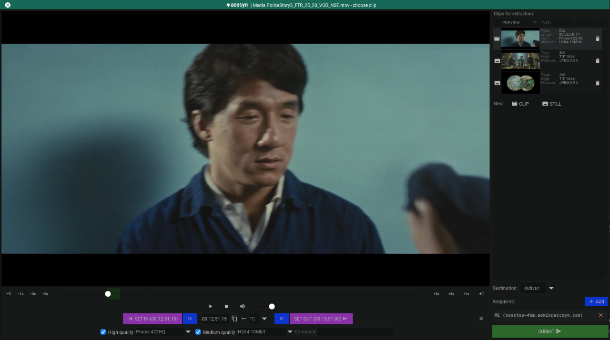

# Clip & still image extraction

The clip and still image extractor enables you to quickly have selections transcoded and sent you, directly from the accsyn Media Vault, without needing to download the masters and process them locally.

  

Watch this video to learn how to extract clips:

### Accessing

There are two ways to initiate the clip extraction:

1. Playing a proxy from the vault.
2. Selecting media and running the [Media Processor](process.md).

  

### Layout

The clip extraction processor are built into the proxy player, making it fast and straightforward to make a selection of clips and still images:

Seek bar

Beneath the player window is the seek bar, reflecting the current position in movie: 

- In edit mode it has additional frame step buttons featuring 1 frame, 1 second, 3 seconds and finally 5 second jumps.
- The selected clip range are rendered at the seek bar in green.
- When selecting a clip, the seek bar jumps to the in point.

  

Player controls

These are the standard player controls featuring play, pause, stop and volume control.

  

Clip bin

On the right hand side you find the panel containing the clip list:

- Clip list; A list of your clips and images is located at the top.
- Add clip and and still buttons are located beneath the list.
- Destination; What to do with the transcoded material.
- Submit button.

  

Clip editor

Beneath the player controls is the clip editor:

- SET IN - Set the clip or still image in point to the current seek bar frame position.
- |< - Go to the in point
- Time code display
- Copy time code to operating system clipboard, so you can paste it in a text document or similar.
- . . .  - Set time code, enter time code or frame manually.
- TC(Timecode) or FR(Frames) display selection.
- >| - Go to out pint
- SET OUT - Set the clip out point.
- High quality - Check this to have a high quality video or still image exported.
- High quality preset select - Choose the high quality transcoding preset.
- Medium quality - Check this to have a medium quality video or still image exported.
- Medium quality preset select - Choose the medium quality transcoding preset.

  

### Adding a clip

  

1. Position yourself on the timeline were you want to clip in point to be.
2. Click the CLIP
3. A clip will be added, with out point set automatially +1s in time.
4. Adjust the the out point, and in point, as needed. This is done by moving the play head to the new position and either clip SET IN or SET OUT. The clip will be updated automatically, no need to save.
5. Adjust high res / medium res quality options.

  

### Adding a still image

  

1. Position yourself on the timeline were you want to still image to be captured.
2. Click the STILL  button on the right.
3. A still image will be added.
4. Adjust the the time position as needed. This is done by moving the play head to the new position click SET FRAME. The still will be updated automatically, no need to save.
5. Adjust high res / medium res quality options.

  

### Removing a clip

  

Click the trashcan icon located on the right hand side of the clip in the bin.

  
  

### Destination

- Deliver; Have the result delivered back to either you or a custom set of recipients.
- Custom: Choose folder on storage were to store the result.

  
  

### Initiate clip exctraction

  

Click Submit button to start transcoding on the farm, an email confirmation will be sent upon finish. 

  

Check the MY JOBS section at the bottom of the accsyn main GUI for progress.
