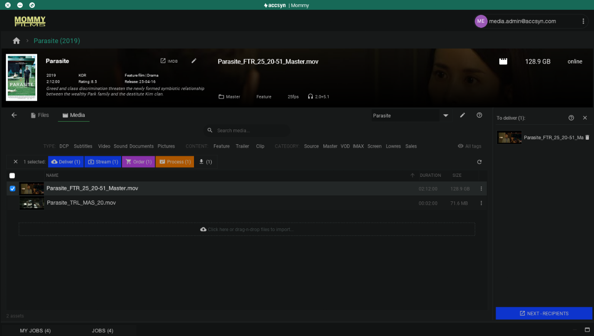

# Deliver title media

This guides shows how to deliver media files and folders from the accsyn Media vault using the desktop app. For information about creating standard accsyn deliveries, head over to [this guide](../delivery/create.md).

## Deliver media

Login to the accsyn Desktop app (and select a non BYOS workspace), then select the title you want to deliver.

Then select the media files you want to deliver and either click the Deliver button, or right click and choose Deliver:

Media is added to a "cart" on the right hand side. Remove files from the cart by clicking the trashcan icon on the right hand side.

You can also from within the titles folder content panel add files to delivery, by right clicking a file/folder and choose Deliver.

Continue to add media to until you are done, then click NEXT - RECIPIENTS.

 A browser window will open, taking you to the accsyn standard delivery page were you can finish up the delivery - add recipients and set expiry date and such. Find more detailed information on how to create deliveries in[this guide](../delivery/create.md), have your recipients follow [this guide](../delivery/receive.md) if they need to learn how to receive a delivery.

  

### Monitor deliveries

The recommended place to monitor deliveries is to open <https://accsyn.io/outbound> in your web browser, this will bring the full picture and also offers means to modify the delivery.

You can can also get a brief overview of delivery from the JOBS view in accsyn Desktop app, it is located as a tab in the bottom area.

Next, learn how to [process media](process.md) - transcode master to various formats suitable for VOD, streaming and such.
