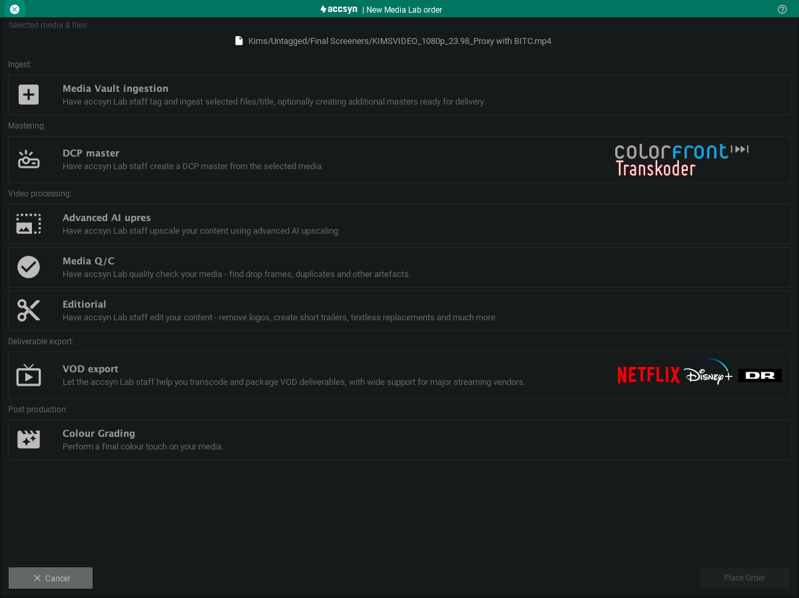
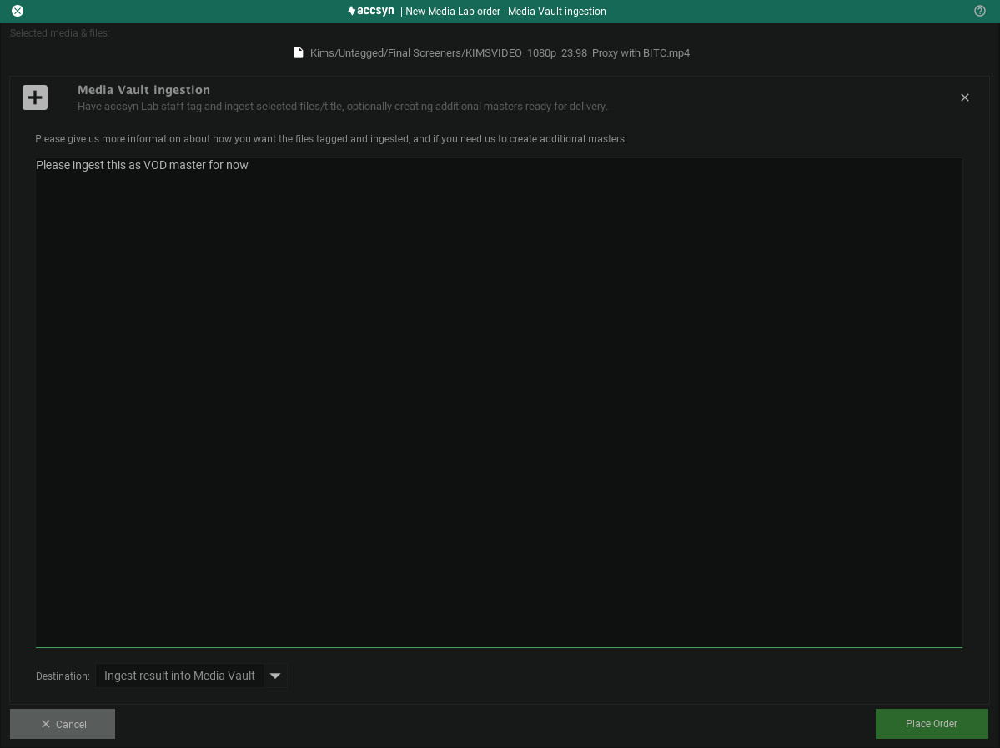

# Media Lab Order

Here we walk through how to place an accsyn media Lab order directly from within the accsyn Desktop app - get help from our senior staff with 25+ years of media industry experience.

  

To learn about the accsyn media lab and get updated prices, go to our home page:

[Lab services](https://www.google.com/url?q=https%3A%2F%2Faccsyn.com%2Flab&sa=D&sntz=1&usg=AOvVaw0uSRNiScRP_q_QRr6HHP5b)

Preparations:

1. Logon to your workspace using the accsyn Desktop app.
2. Have a [title created](create.md)
3. Make sure to upload the associated lab order media.
4. Some lab services only works with ingested/tagged media, see below.

## Media Vault ingestion

In this guide, we are going to illustrate how to use our lab services by ordering Media Vault ingest lab job - have the accsyn staff organise(tag) and ingest the media you have uploaded:

1. Open the title in the app.
2. Click Show title folder contents button in lower right corner to bring up upload files.
3. Choose the folder or specific files you want to have ingested and click the purple Order button in the toolbar.

This will bring up the order dialog, click "Media Vault ingestion" choice:

Screenshot of the accsyn Media Lab order dialog

Enter a message giving more information about how you want the files ingested - for example the purpose of the media in the future:

Click Place Order button when done, an email will be dispatched to you and the lab staff with order# and information. 

  

The staff will then come back to you within a business day, with a quote and more information on expected delivery.

  

We will also provide you Google sheet, from were you can track your order progress

## Manage my orders

### How do I update my lab order?

Just reply to the email sent and give us updated information.

How do a I cancel a lab order?

Unless the order is started working on, you can reply in the email thread just stating that you want to cancel the lab order.

### How do I pay for my order?

We use Stripe card payments and will state an invoice covering the work. In some cases we grant credit and the lab work will be added to the next standard accsyn Workspace invoice.

### How will I receive the processed files?

When you place the lab order, you can choose were the files will be output. In the example above, it is clear that files should be ingested into its correct Media Vault location. But with some orders, you can choose to have files delivered to you or you can choose a folder at storage were files will uploaded by the lab staff.

Having further questions, feel free to reach out to our team using the chat in the lower right corner or drop an email to [support@accsyn.com](mailto:support@accsyn.com).
