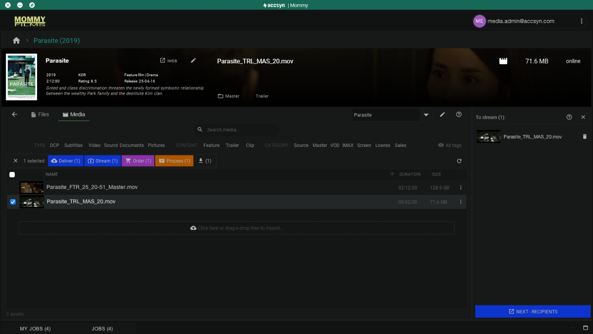
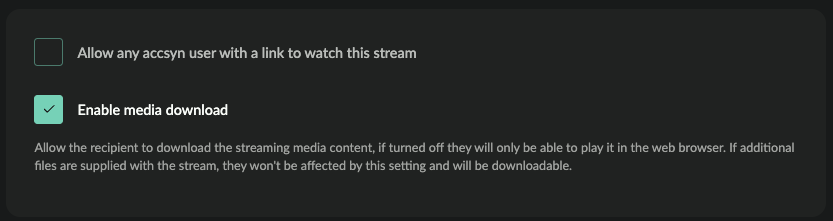
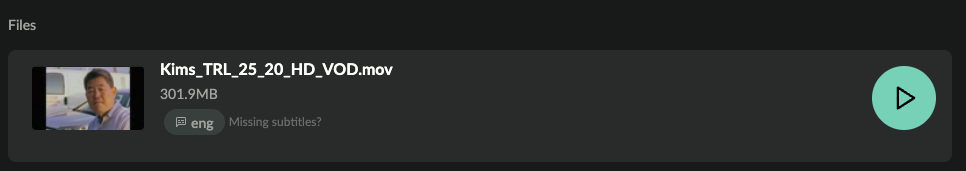

# Stream title media

This guide cover media streaming within the accsyn platform - send VOD web streams to user for playback in the web browser.

  

Note: Web streaming comes with an initial amount of free views, after which additional views are charged arrears. Check accsyn [pricing](https://accsyn.com/pricing) for more information.

## Prepare streaming

To be able to stream a title, the following criteria's must be fulfilled:

1. A title must have been [created](create.md).
2. Video media (Type tag set to value VID) must be [logged](log-media.md) on title.
3. If subtitles are to be supported, Content tag must be set and match subtitles. Subtitles must have Subtitles tag set.

## Create stream

1. Start by logging in to the accsyn Desktop app (and select a non BYOS workspace), as an employee or administrator.
2. Next choose the title you wish to stream, filter on "VOD" category, and choose the VOD media file(s) you wish to stream. You can actually stream any video file, in that case click the Video type filter.
3. Click the the Stream button, or right click media and choose Stream.
4. The VOD media is put into the streaming "cart" panel on the right hand side:

Screenshot showing a streamable media added to the cart ready to be submitted as a web stream delivery to recipients.

5. Continue to add additional media to the stream, and/or add additional files with the streaming delivery - user will be able to download these alongside watching the stream.

 6. Remove items from the cart by clicking the trashcan icon on the right hand side.

 7. When done, click NEXT-RECIPIENTS button at the bottom. If no HD HLS streamable proxy exists for the selected video file(s), they will start transcode on the farm at this point. A placeholder image will be displayed when recipient opens the stream until it has finished transcoding. 

A browser window will open, taking you to the accsyn standard delivery page were you can finish up the stream delivery - add recipients and set expiry date and access options. 

  

### Restricting download access

  

By default the download of the VOD media is disabled, meaning that recipients will only be able to watch the stream and not downloda it. Enable download by checking Enable media download option:

## Subtitles

  

The accsyn streaming platform supports subtitles, it does so by locating subtitles media asset matching the video Content tag and with Subtitles tag properly set to the corresponding language.

  

 Giving an example:

- You log the (textless) media file "Festival\_feature\_4444\_stream.mov" with tag Content = FTR (Feature).
- To make subtitles available to the user in the web stream player, log "Festival\_feature\_4444\_stream\_swe.srt" with tags Contentset toFTR (Feature) and Subtitles = swe.
- Repeat logging of subtitles until done.

  

In the web browser, available subtitles are listed on each playable media file. Example video with english subtitles:

Videos showing how to tag your media to support subtitles:

Find more detailed information on how to create deliveries in [this guide](../delivery/create.md), have your recipients follow [this guide](../delivery/receive.md) if they need to learn how to receive a stream.
